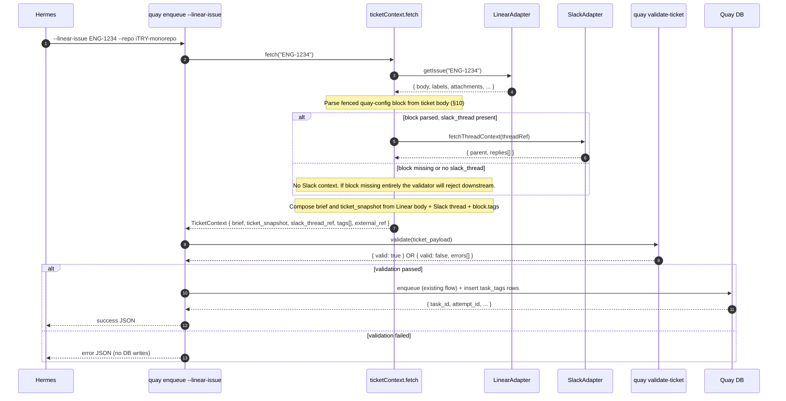

# Quay Spec: Deployment Adapters (Linear + Slack)

**Status:** Draft. Not locked. Third feature spec graduating from `docs/orchestrator-design-notes.md`. Companion to `docs/quay-spec-ticket-validation.md`. The prior PR-review companion spec has been superseded and moved to `docs/archive/quay-spec-pr-review.md`; a replacement spec is being drafted.

**Implementation order.** This spec **MUST land first** of the in-flight feature specs. The (forthcoming) replacement PR-review spec inherits the hard dependency on this one: its synthetic-task path will need the `ticketContext.fetch(...)` primitive defined here. (The archived prior draft made the same dependency explicit; the replacement preserves it.)

**Required reading:**
- `docs/quay-spec.md` — substrate spec (locked v1). The `tasks.slack_thread_ref` column and the `waiting_human` / `slack_reply_ingested` flow this spec builds on are defined there.
- `docs/quay-spec-ticket-validation.md` — the existing validator. This spec does not change the validator's contract; it changes *who calls it and when*.
- `docs/orchestrator-design-notes.md` §1, §2 — the broader rationale for keeping ticket-system knowledge bounded.

---

## 1. Goal

Move ticket-system knowledge (Linear + Slack thread context retrieval) from the orchestrator into Quay, behind an explicit adapter boundary. Specifically:

1. Ship `LinearAdapter` (new) and extend the existing `SlackAdapter` with a `fetchThreadContext` method, both gated behind opt-in config.
2. Add a `ticketContext.fetch(identifier)` core primitive that, given a Linear ticket identifier, returns the assembled context the rest of Quay needs to create a task: composed brief, ticket snapshot, derived `slack_thread_ref`, derived tags, derived `external_ref`.
3. Add `quay enqueue --linear-issue <id>` as a new CLI surface that wraps the existing `enqueue` flow with adapter-driven context assembly. The existing `--brief-file` form stays as the lower-level interface.
4. Hermes shrinks to a thin polling loop: watch Linear for tickets that are validated and Quay-eligible, call `quay enqueue --linear-issue`, exit. No ticket-assembly logic in Hermes.

That is the v1 contract of this spec. Two downstream features unlock as a consequence:

- **Reliable Slack escalation linkage.** Today `slack_thread_ref` is best-effort orchestrator-side parsing; this spec makes it deterministic adapter-side, closing the silent-escalation-drop gap (`src/core/tick.ts:1019` — "no thread to post into; nothing to do").
- **Synthetic-task PR-review enrichment.** The replacement PR-review spec (TBD) will reuse the same `ticketContext.fetch(...)` primitive to produce rich synthetic briefs and `task_tags` rows on adapter-enabled deployments. That work is gated on this spec landing first. (See archived prior draft `docs/archive/quay-spec-pr-review.md` §8 Path A for the historical framing; the replacement spec preserves the dependency but may change other shape.)

This spec is **opt-in by deployment config**. Deployments without Linear or Slack continue to operate exactly as they do today (Hermes-composed briefs passed via `--brief-file`); none of their code paths regress.

## 2. Scope and non-goals

### In scope (v1)

- `LinearPort` interface and `LinearAdapter` implementation. Backed by Linear's GraphQL API; bot token from `LINEAR_API_KEY`.
- `SlackPort` extension: new method `fetchThreadContext(threadRef): SlackThread` that returns the canonical thread (parent message + ordered replies) for inclusion in a brief. Distinct from the existing `listReplies` which is reply-listing for `waiting_human` ingestion.
- `ticketContext.fetch(identifier)` primitive in `src/core/ticket_context.ts`. Pure function over the adapter ports; returns a structured `TicketContext` (see §6). All Linear+Slack assembly lives here.
- `quay enqueue --linear-issue <id>` CLI. Internally: calls `ticketContext.fetch`, runs the existing validator against the assembled payload, calls the existing enqueue path with the assembled fields. Atomic; no partial DB state on adapter or validator failure.
- `quay-config` fenced-block contract (see §10). Linear tickets that are Quay-eligible carry a fenced block in their body containing the Quay-relevant fields (tags, slack_thread, authors). Quay parses the block; Linear's native `labels[]` are **not consulted** at all (and not fetched by the adapter — see §7) — Linear labels carry organizational semantics (bug / priority / team) that don't match Quay's tag intent (clustering for cross-task review-finding queries).
- Tag derivation: from the `quay-config` block's `tags:` list. One entry, one `task_tags` row.
- Slack thread linkage: from the `quay-config` block's `slack_thread:` field. Deterministic; no URL scraping.
- Configuration surface: `[adapters.linear]` and `[adapters.slack]` sections in `~/.quay/config.toml` with `enabled` flags and auth env-var pointers.
- Adapter availability check in `ticketContext.fetch`: fails closed (CLI error, no DB write) if a required adapter isn't enabled.
- Test infrastructure: mock Linear / Slack at the port boundary for unit and integration tests.

### Out of v1 scope

These are explicitly deferred:

- **Adapters for ticket systems other than Linear** (Jira, GitHub Issues, Notion, Plane). The port interface is shaped to accommodate them without breaking changes, but no implementations land in v1.
- **Adapters for chat systems other than Slack** (Discord, MS Teams). Same rationale.
- **Linear webhook ingestion.** Hermes still polls; Quay does not subscribe to Linear webhooks. Polling is the simpler shape and matches existing Hermes behavior.
- **Bidirectional Linear sync.** Quay does not write back to Linear (no status updates, no comments). Quay reads only.
- **Slack thread mutation by Quay outside the existing `waiting_human` flow.** The new `fetchThreadContext` method is read-only; the existing `post` / `listReplies` for escalation is unchanged.
- **`quay review-pr` synthetic-task adapter integration.** Lands as part of the (forthcoming) replacement PR-review spec, after this spec is in place. The archived prior draft is at `docs/archive/quay-spec-pr-review.md` §8 Path A.
- **Validator promotion into Quay's library code.** The validator stays a standalone CLI (per `docs/quay-spec-ticket-validation.md`); `quay enqueue --linear-issue` invokes it internally as a child process, preserving its standalone usability for the cron-pickup path. (See §11 "Validator integration".)
- **Adapter schema versioning.** v1 has one shape per adapter; if Linear's schema or Slack's API materially changes, the adapter is updated in place. No version pinning.
- **Auth methods other than env-var-supplied tokens.** No OAuth, no per-user creds, no AWS Secrets Manager integration. Bot tokens via env vars only.
- **Rate-limit-aware backoff inside the adapters.** The adapters call the APIs directly with the per-call timeout already used by `SlackAdapter` (`src/adapters/slack.ts:28-32`). If rate-limit errors surface in practice, revisit; v1 surfaces them as enqueue failures.

## 3. Architecture



The adapter pattern lives **inside Quay** but behind a port interface. `ticketContext.fetch` is the single place that knows "Linear ticket → Quay-shaped brief"; everything downstream (the existing `enqueue` flow, the existing `validate-ticket` CLI, the future PR-review spec) consumes the structured `TicketContext` it produces.

**Atomicity invariant.** The order is **strict**: `fetchTicketContext → validate → enter the existing enqueue core function`. The existing `enqueue` (`src/core/enqueue.ts`) is entered **only after** both adapter assembly and validation succeed. No substrate side-effects (worktree creation, git branch creation, DB writes, artifact files) start before that point. Failure on Linear fetch, Slack fetch, block parse, or validator → clean no-op, nothing to roll back.

Hermes's role collapses to: poll Linear for new tickets, call `quay enqueue --linear-issue`, log the result. Quay handles state writeback for the windows Linear's GitHub integration does not cover (see §4a below); other Linear-side transitions still live in the orchestrator if the deployment wants them.

### Linear state writeback

Linear's native GitHub integration moves the ticket to "In PR Review" on PR-open and "Done" on merge — those windows are covered for free and Quay does **not** write back on them (double-writing would race the integration). Three other windows are not covered, and Quay syncs them best-effort from the tick / cancel / claims emit sites:

| Quay state | Linear state |
| --- | --- |
| `queued` / `spawned` (post-enqueue, pre-PR) | `In Progress` |
| `waiting_human` (worker wrote `.quay-blocked.md`, Slack thread open) | `Waiting` |
| `waiting_human` → resumed (Slack reply ingested) | `In Progress` |
| `cancelled` (`quay cancel` or recovery finalizer) | `Canceled` |

**Required Linear workflow state names.** Every Linear team using Quay must have workflow states named exactly `In Progress`, `Waiting`, and `Canceled`. Renamed-or-missing states surface as an `unknown_state` warning on stderr; the tick continues — Quay's own state is the source of truth and a missing Linear writeback never fails a tick or rolls back a transition.

**Required API scope.** The writeback issues `issueUpdate(input: { stateId })` mutations, so the configured API key must include `write:issue` in addition to the read scopes. Read-only keys still work for `enqueue --linear-issue` (the fetch path) but every writeback will warn once and be skipped.

**Failure mode.** Best-effort: a Linear outage, timeout, or unknown-state error logs a single stderr line of shape `[linear-sync] failed to set state="..." on <IDENTIFIER>: <message>` (deduped per `(identifier, stateName)` per process), then the tick / cancel proceeds. Writeback HTTP round-trips run **outside** the supervisor lock — a slow Linear cannot extend the lock-held window or starve concurrent ticks.

## 4. Configuration surface

Adapters are opt-in via `~/.quay/config.toml`:

```toml
[adapters.linear]
enabled = true
api_key_env = "LINEAR_API_KEY"
# Required scopes on the Linear API key: `read:issue`, `read:comment`, and
# `write:issue` (the last for the §4a state writeback — see above; a
# read-only key still works but every writeback emits one warn-once
# stderr line).
# No workspace field needed: Linear's GraphQL Issue type surfaces the
# canonical `url` directly; no client-side construction. If the workspace
# key is ever needed for anything else, the adapter resolves it once at
# init via `viewer.organization.urlKey`.

[adapters.slack]
enabled = true
bot_token_env = "SLACK_TOKEN"
# Existing SLACK_TOKEN env-var convention from src/adapters/slack.ts is
# preserved; the only new thing is the [adapters.slack] section flag.
# Optional: cap on fetchThreadContext result size. Default 200.
# Threads above the cap are truncated to first half + last half with a
# `<!-- thread truncated: K intermediate messages omitted -->` marker between them.
# max_thread_messages = 200
```

Both flags are independent. Plausible deployments:

- **Both enabled.** Full adapter path. `quay enqueue --linear-issue` works end-to-end with rich brief.
- **Linear only.** `quay enqueue --linear-issue` works but the brief lacks Slack thread context; `slack_thread_ref` is populated only if the ticket carries one Quay can parse, but escalation can't post without `[adapters.slack].enabled = true` (existing constraint).
- **Slack only.** No `--linear-issue` form. The existing `--brief-file` enqueue path with explicit `--slack-thread-ref` continues to work.
- **Neither.** Status quo: orchestrator-composed briefs via `--brief-file`. No adapter code paths execute.

`ticketContext.fetch` returns a typed error if it would need an adapter that isn't enabled; the CLI surfaces the error and exits non-zero with no DB writes.

## 5. Schema additions

This spec owns one new table (`task_tags`) and one new column on the existing `tasks` table:

### `task_tags` (new table)

```sql
CREATE TABLE task_tags (
  task_id TEXT NOT NULL REFERENCES tasks(task_id),
  tag TEXT NOT NULL,
  created_at TEXT NOT NULL,
  PRIMARY KEY (task_id, tag)
);
CREATE INDEX task_tags_by_tag ON task_tags(tag);
```

Tags are **opaque strings** to Quay. Quay does not interpret, validate (beyond charset enforced by the ticket validator), or take action on tag values. One row per `tags:` entry from the `quay-config` block, deduped. Same shape as `external_ref` today.

(Cross-ref: the archived prior PR-review draft at `docs/archive/quay-spec-pr-review.md` referenced this table for `quay query-findings --tag` filtering and findings clustering. The replacement PR-review spec is expected to preserve that usage.)

### `tasks.authors_json` (new column)

```sql
ALTER TABLE tasks ADD COLUMN authors_json TEXT;
```

JSON-serialized `TicketAuthor[]` (`[{name, slack_id}, ...]` in block declaration order). Nullable. Populated on enqueue when the adapter path is used; `NULL` for tasks enqueued via the legacy `--brief-file` path. Tick reads this column when posting Slack escalations to construct `<@slack_id>` mentions (per §15 feature 3).

### Substrate fields populated by the adapter (no schema change)

These fields exist in the substrate today; the adapter just populates them deterministically from the block:

- `tasks.external_ref` ← Linear issue identifier (`ENG-1234`).
- `tasks.slack_thread_ref` ← derived from `quay-config.slack_thread`, normalized to `<channel>:<ts>`. Nullable (block field is optional).
- `artifacts` row of kind `ticket_snapshot` ← assembled snapshot; format defined in §6.
- `artifacts` row of kind `brief` ← assembled brief; format defined in §6.

### Migration ordering

This spec ships a single migration file (`migrations/0002_deployment_adapters.sql` or similar) containing both DDLs above. The PR-review spec's implementation depends on `task_tags` existing; that spec's migration assumes this one ran first.

## 6. The `TicketContext` primitive

```typescript
// src/ports/ticket_context.ts (new)
export interface TicketAuthor {
  name: string;
  slack_id: string;            // bare Slack user ID, e.g. "U06TDC56VJB"
}

export interface TicketContext {
  external_ref: string;        // Linear identifier, e.g. "ENG-1234"
  brief: string;               // composed brief content (the worker reads this)
  ticket_snapshot: string;     // composed snapshot (archival; full Linear payload + comments + parsed block)
  slack_thread_ref: string | null;  // <channel>:<ts> if parseable from Linear, else null
  tags: string[];              // from the quay-config block's `tags:` list, deduped, lower-cased, in declaration order
  authors: TicketAuthor[];     // from the quay-config block's `authors:` list, ordered by involvement (most-involved first)
}

// src/core/ticket_context.ts (new)
export interface TicketContextDeps {
  linear: LinearPort;
  slack: SlackPort;  // existing port, extended in §7
  config: { linearEnabled: boolean; slackEnabled: boolean };
}

export function fetchTicketContext(
  deps: TicketContextDeps,
  identifier: string,
): Promise<TicketContext>;
```

**Composition rules:**

- **`brief`** follows the canonical brief format defined in §6.1 below.
- **`ticket_snapshot`** is the canonical archival form: the full `LinearIssue` payload as fetched (identifier, url, title, body, state, comments) + the parsed `quay-config` block + the resolved Slack thread reference. One artifact row per task, per the substrate spec's `ticket_snapshot` convention.
- **`slack_thread_ref`** comes from `quay-config.slack_thread`, normalized to `<channel>:<ts>`. May be `null` if the block omits it.
- **`tags`** is `quay-config.tags`, deduped, lower-cased. Empty list permitted at this stage; the validator decides whether empty is acceptable for the deployment.
- **`authors`** is `quay-config.authors`, in declaration order (the human's intended ranking by involvement). Passed straight through to the validator's `authors` field (1:1 with the block — no field-shape munging), and used to construct `<@slack_id>` mentions when tick posts escalations into `slack_thread_ref` (see §15).
- **`external_ref`** is the canonical Linear identifier (`ENG-1234`), upper-cased.

**Linear comments fetch.** When fetching the issue, the adapter also fetches **all user comments** on the ticket (`LinearPort.getIssue` returns them as part of the `LinearIssue` payload — see §7). Comments are included in the brief under `## Ticket Comments` (see §6.1) and archived verbatim in `ticket_snapshot`. Rationale: humans frequently refine acceptance criteria, push back on scope, or surface edge cases in comments after the original description was written; without them, the worker is reviewing/implementing a stale spec.

**Failure modes:**

- Linear adapter not enabled → `QuayError("adapter_not_enabled", ...)`.
- Linear ticket not found (404) → `QuayError("ticket_not_found", ...)`.
- Linear API error (500, network) → `QuayError("adapter_error", ..., { adapter: "linear" })`.
- `quay-config` block missing from the ticket body → returned as a structured field on the `TicketContext` (`block: null`); the validator surfaces this as a validation error downstream. This makes "no Quay metadata" indistinguishable from any other validation failure (uniform handling on the cron-pickup path).
- `quay-config` block present but unparseable (malformed YAML, unknown required key) → `QuayError("ticket_block_invalid", ..., { detail })`. Distinct from "missing entirely" because it signals user intent to participate; surface clearly so the human can fix the block.
- Slack thread reference present but Slack adapter disabled → degrade to `slack_thread_ref = null` and proceed (no error). Brief omits the Slack Context section.
- Slack thread reference present, Slack enabled, fetch fails → `QuayError("adapter_error", ..., { adapter: "slack" })`. (We don't degrade silently here because if `[adapters.slack].enabled = true`, the deployment expects Slack reads to work.)

All errors propagate to the CLI with no DB writes (atomicity per §3).

### 6.1 Canonical brief format

The brief is the worker's only window onto upstream context. Its structure is a **contract** — the default reviewer preamble (`docs/quay-reviewer-preamble-default.md` "Use the brief; fetch only what's missing") and the future PR-review synthetic-task path (replacement spec TBD; archived prior draft at `docs/archive/quay-spec-pr-review.md` §8 Path A) both depend on stable section headings.

Brief composition lives inside `fetchTicketContext` (`src/core/ticket_context.ts`) — the same function that assembles the rest of the `TicketContext`. There is no separate brief-composer file or class; the composition is a private helper inside `fetchTicketContext`.

````markdown
# <LINEAR-ID> — <Ticket title>

## Contributors

- **<author[0].name>** (`<@U06TDC56VJB>`) *(primary)*
- **<author[1].name>** (`<@U07ABCDE>`)
- **<author[2].name>** (`<@U08XYZ>`)

## Ticket Context

<Linear ticket body verbatim, with the `quay-config` fenced block stripped.
If the body contains an `## Acceptance Criteria` heading, leave it inline —
no auto-extraction.>

## Ticket Comments

**<author-display-name>** — <ISO 8601 timestamp>:
<comment body>

**<author-display-name>** — <ISO 8601 timestamp>:
<comment body>

## Slack Context

> Original discussion thread.
> Channel: <name if resolvable, else channel id>
> Started: <ISO 8601 timestamp of parent message>

**<author-name-or-handle>** *(parent)*:
<parent message text>

**<author>**:
<reply text>

**<author>**:
<reply text>
````

**Composition rules:**

- **Top-level `# <ID> — <title>`** — exactly one H1; identifies the ticket.
- **`## Contributors`** — always emitted (block requires `authors` non-empty). One bullet per author in block-declared order. First author marked `*(primary)*`. The Slack mention is rendered with backticks around `<@...>` so the worker sees it as code, not as something to render — preserves the literal mention syntax for the worker to pass through verbatim if it ever needs to construct a Slack message.
- **`## Ticket Context`** — always emitted, even if body is short. Worker recognizes this exact heading. If body is empty, emit `_(no description)_` italicized placeholder; do not fail.
- **`## Ticket Comments`** — emitted when the Linear ticket has at least one user comment (excluding system/bot comments — see §7). Comments listed in chronological order. **Omitted entirely** (no heading) when no user comments exist.
- **`## Slack Context`** — **omitted entirely** (no heading, no placeholder) when `slack_thread_ref` is null OR when Slack adapter is disabled. Worker rule: section absent → no Slack context to consult.
- **Slack transcript format** — parent message marked `*(parent)*`; replies in chronological order; `**author**:` then text. Authors resolved to display name when `SlackPort.fetchThreadContext` provides one, else fall back to user ID. Bot messages flagged `*(bot)*` after the name.
- **Heading levels are H2 throughout** — H1 reserved for the title. Sub-headings inside `## Ticket Context` (e.g., the ticket body's own `## Acceptance Criteria`) appear at H2 in the brief because they're verbatim from the body; this is fine because the body's headings are already at H2 by Linear convention.
- **No automatic Acceptance Criteria extraction.** Linear surfaces ACs as a sub-heading inside the body, not as a separate field. v1 doesn't lift them out (would require fragile heading detection). If a deployment wants a dedicated AC heading, structure the ticket body that way and it appears verbatim under `## Ticket Context`.
- **Plain Markdown.** No fenced wrappers, no JSON envelope. The worker reads the brief as prose.
- **The `quay-config` block is stripped from the brief**; the original body (block intact) lives in `ticket_snapshot` for archival.
- **Section order is fixed:** Contributors → Ticket Context → Ticket Comments → Slack Context. Anything that's omitted (Comments, Slack) just doesn't appear; remaining sections close ranks.

**Why these specific choices:**

- **`## Ticket Context` is the contract surface.** The PR-review preamble's "brief is canonical context; only fetch identifiers the brief leaves unexpanded" rule keys on the presence of this heading followed by non-empty content. Locking the heading makes the rule testable.
- **Omitting empty sections beats placeholders.** Worker rule for Slack is "section absent → fetch identifiers yourself." A "(none)" placeholder would confuse that rule.
- **No AC extraction keeps the parser thin and predictable.** Heading detection on free-form ticket bodies is a reliability risk. Punt to ticket-authoring discipline.

This format is stable across the two implementation phases: phase-1 (this spec, hooked into `quay enqueue --linear-issue`) and phase-2 (PR-review synthetic-task Path A). The worker reads the same shape regardless of which path produced the brief.

## 7. Adapter contracts

### `LinearPort` (new)

```typescript
// src/ports/linear.ts
export interface LinearComment {
  id: string;
  authorName: string;          // resolved display name; "(unknown)" if unresolvable
  authorIsBot: boolean;        // true for system/integration comments
  body: string;                // markdown
  createdAt: string;           // ISO 8601
}

export interface LinearIssue {
  identifier: string;          // "ENG-1234"
  url: string;                  // canonical Linear URL (surfaced by Linear's API directly)
  title: string;
  body: string;                 // markdown; contains the quay-config fenced block
  comments: LinearComment[];   // all comments, chronological order; bot-authored comments retained
                                // in the array (with authorIsBot=true) and filtered at brief-compose time
}

// Fields deliberately not in v1 (and the rationale for each):
//
// - `labels`            — the quay-config block owns tags; Linear-native labels are not consulted
//                         by Quay and not archived (the block is the single source of truth).
// - `attachments`       — slack_thread comes from the quay-config block; URL scraping is gone.
// - `state`             — Quay does not filter by state; if a ticket has a valid quay-config block,
//                         it enqueues regardless of state. State-based pre-filtering is Hermes's
//                         concern (polling hygiene), not Quay's.
// - `createdBy` / `assignee` — superseded by quay-config block's `authors[]`.
// - `createdAt` / `updatedAt` — informational only; no Quay code path consumes them.
//
// Add fields here only when a concrete v1 use case demands them. The adapter is allowed to be lean.

export interface LinearPort {
  // Returns null on 404 (no such issue).
  // Throws on draft issues (`ticket_not_actionable`), 5xx (`adapter_error{retryable:false}`),
  // 429 (`adapter_error{retryable:true, retry_after}`), and network/auth errors.
  getIssue(identifier: string): Promise<LinearIssue | null>;
}
```

The Linear adapter implements `LinearPort` against Linear's GraphQL API. Bot token via `LINEAR_API_KEY`. Async, calling `fetch` in-process under an `AbortController` bounded by `QUAY_LINEAR_TIMEOUT_MS` (default 30s). An out-of-process spawn was tried first to keep the port synchronous, but `process.execPath` resolves to the compiled quay binary in a `bun build --compile` build — spawning `process.execPath -e <script>` re-enters the CLI dispatcher and fails (AST-85). The `SlackAdapter` retains the legacy spawn pattern for now and is broken the same way under a compiled binary; tracked separately as AST-86.

**Comments fetch.** `getIssue` returns the issue *and* all its comments in a single GraphQL query (Linear's GraphQL surfaces `comments` as a connected field on `Issue`, which is one round-trip with proper field selection). Comments are paginated under the hood; the adapter walks all pages and returns the full list, in chronological order. Bot/integration comments (e.g., GitHub-PR-link comments, Slack-link integrations) are returned with `authorIsBot: true`; the brief composer in §6.1 filters them out, but `ticket_snapshot` archives them all for traceability.

### `SlackPort` (extended)

The existing `SlackPort` (`src/ports/slack.ts`) gets one new method:

```typescript
export interface SlackThreadMessage {
  ts: string;
  authorBot: boolean;
  authorName: string | null;   // resolved display name when available
  text: string;
}

export interface SlackThread {
  parent: SlackThreadMessage;
  replies: SlackThreadMessage[];  // ordered by ts ascending
}

export interface SlackPort {
  // ... existing methods unchanged: post, fenceTs, searchByNonce, listReplies
  // Throws on thread-not-found, 4xx, 5xx, 429, and network/auth errors.
  // Caller (ticketContext.fetch) wraps as adapter_error{adapter:"slack"}.
  fetchThreadContext(threadRef: string): SlackThread;  // new
}
```

Distinct from `listReplies` because:
- `listReplies` filters to replies after a fence and is used for `waiting_human` ingestion of human answers to Quay's escalation.
- `fetchThreadContext` returns the *original* conversation (parent + every reply) for inclusion in a brief at enqueue time.

The existing `SlackAdapter` (`src/adapters/slack.ts`) gains a new method backed by `conversations.replies` with full pagination, returning the structured shape above.

**Pagination cap.** `fetchThreadContext` caps at `max_thread_messages` (default 200, configurable via `[adapters.slack].max_thread_messages`). Threads at or under the cap are returned in full. Threads above it are truncated to the first half + last half (e.g., first 100 + last 100 at the default), with a synthetic `SlackThreadMessage` inserted between them carrying `text: "<!-- thread truncated: K intermediate messages omitted -->"`, `authorBot: true`, `authorName: null`. The brief composer (§6.1) renders this marker verbatim so the worker sees the omission. Rationale: the load-bearing context in long threads is typically the original ask (start) and most recent decisions (end); truncation preserves both while keeping brief size bounded.

## 8. CLI surface

### `quay enqueue --linear-issue <id>` (new)

```
quay enqueue --repo <repo_id> --linear-issue <id> [--tag <name> ...]
```

- `--repo <repo_id>` — required, same as the existing `enqueue` form.
- `--linear-issue <id>` — Linear identifier, e.g. `ENG-1234`. **Mutually exclusive with** `--brief-file`, `--external-ref`, and `--slack-thread-ref` — the adapter derives the latter two from the Linear ticket and the `quay-config` block, and accepting explicit overrides on this path would create a two-sources-of-truth trap. Conflicts surface as usage errors before any adapter call (no network, no DB).
- `--tag <name>` — optional, repeatable. Tags supplied this way are *unioned with* the tags from the `quay-config` block (deduped). Useful for deployment-specific tagging (e.g., `--tag urgent` even though the Linear ticket's block doesn't list it).

Behavior:

1. Resolve `(repo_id)` against the existing repo config (same as today's enqueue).
2. Call `fetchTicketContext({linear, slack, config}, "ENG-1234")`.
3. Run the existing validator against the assembled payload. Fail closed on validation errors (no DB writes; surface error JSON to stdout).
4. Call the existing `enqueue` core function with the assembled fields:
   - `brief = TicketContext.brief`
   - `ticket_snapshot = TicketContext.ticket_snapshot`
   - `slack_thread_ref = TicketContext.slack_thread_ref`
   - `external_ref = TicketContext.external_ref`
5. **Inside the same transaction as the enqueue's writes**, insert `task_tags` rows for `TicketContext.tags ∪ --tag <name>` (deduped) and populate `tasks.authors_json` with `JSON.stringify(TicketContext.authors)`. Tags either land with the task or not at all (per §12 atomicity).
6. Return the same JSON shape as the existing `enqueue` (`task_id`, `state`, `branch_name`, `tmux_id`, `worktree_path`, `attempt_id`).

Idempotency: the existing `enqueue` is idempotent on `(repo_id, external_ref)`. Calling `--linear-issue ENG-1234` twice returns the same `task_id` both times (assuming no intervening cancellation).

### `quay enqueue --brief-file <path>` (existing, unchanged)

Stays exactly as it is today. Used by:
- Deployments without the Linear adapter.
- Callers that want full control over the brief composition (rare; mostly testing).
- The cron-pickup path defined in `docs/quay-spec-ticket-validation.md` §8.2 (humans filing tickets directly in Linear without Hermes — though this path can also migrate to `--linear-issue` once the adapter exists, which is a deployment choice).

### What's *not* on the v1 CLI

- `quay enqueue --jira-issue` / `--github-issue` / etc. — out of v1 scope.
- `quay refresh-ticket-context --task-id <id>` (re-fetch the Linear ticket and update `ticket_snapshot` / `slack_thread_ref` in place). Useful if a Linear ticket gets edited after enqueue, but no current use case demands it. Defer.

## 9. Tag derivation

Tags come from the `quay-config` block's `tags:` list (see §10). One entry, one `task_tags` row. Deduped. Lower-cased.

**Linear's native `labels[]` is not consulted** for `task_tags`, and **not fetched by the adapter at all** (per §7). Linear labels carry organizational semantics (`bug`, `priority/high`, `team/platform`, `quarter/Q1`, etc.) that humans use for project management; mixing them with Quay's clustering tags would pollute both vocabularies. They live in Linear and stay in Linear; the `quay-config` block is the single source of truth on Quay's side.

The validator may enforce that at least one tag is present (per `docs/quay-spec-ticket-validation.md` §8 — `tags(MIN_COUNT)` is the canonical example error). That enforcement happens against the *block*, not against Linear labels.

If `--tag <name>` is also supplied at the CLI, the resulting `task_tags` rows are the **union** of block-derived and CLI-supplied tags, deduped.

## 10. The `quay-config` fenced-block contract

Linear tickets that are Quay-eligible carry a single fenced block in their body containing the Quay-relevant fields. The block is Quay's namespace inside the human-authored ticket — same pattern as `quay-principle` blocks in PR review comments.

**Format** (YAML inside a fence labelled `quay-config`):

````
```quay-config
repo: iTRY-monorepo
tags:
  - auth-session
  - cache
slack_thread: https://inverter.slack.com/archives/C0123ABC/p1700000123000001
authors:
  - name: Fabian Scherer
    slack_id: U06TDC56VJB
  - name: Marvin Gross
    slack_id: U07ABCDE
```
````

**Fields (v1):**

| Field | Required | Type | Notes |
|---|---|---|---|
| `repo` | yes | string | Target repo ID, must match a repo registered with `quay repo add`. Charset is `[A-Za-z0-9._-]+` (same as the registry's `repo_id`); `.` and `..` are rejected as path-traversal sentinels. Lets `quay enqueue --linear-issue ENG-XXXX` work without an external "Linear team → repo" mapping; explicit `--repo` on the CLI still wins as an override. |
| `tags` | yes | list of strings | Parser only checks the type (list-of-strings). Charset (`lowercase_alphanum_dash`) and emptiness are checked **by the validator**, not the parser, so all tag-shape rules live in one place (`docs/quay-spec-ticket-validation.md` §6). Malformed tags surface as `validation_error` with field path `tags[i]`, not `ticket_block_invalid`. |
| `slack_thread` | no | URL string | Slack archive URL; parser converts to `<channel>:<ts>`. Omit when no thread is associated. |
| `authors` | yes | list of `{name, slack_id}` | Humans associated with the ticket, **ordered by involvement** (most-involved first). `name` is the human-readable display name; `slack_id` is the bare Slack user ID (e.g., `U06TDC56VJB`, no angle brackets, no `@`). Passed 1:1 to the validator's `authors` field (same shape, no munging) and used to enable `<@slack_id>` mentions when Quay posts escalations into `slack_thread`. Min 1 entry. |

**Block placement.** Anywhere in the ticket body. First occurrence wins if there's more than one (which would be a human mistake; validator can additionally reject duplicates if useful — see §17 open question).

**Parsing rule** (`src/core/quay_config_block.ts`):

1. Scan `linearIssue.body` for ```` ```quay-config ```` … ```` ``` ```` fences. Exactly one is permitted; if two or more are found, return `QuayError("ticket_block_invalid", ..., { detail: "multiple quay-config blocks found in ticket body; only one is permitted" })`. Most likely cause is a human paste accident; silent first-wins would hide that.
2. Parse the contents as YAML. On parse failure, return `QuayError("ticket_block_invalid", ..., { detail: "yaml parse: ..." })`.
3. Validate field types: `tags` is a list of strings; `slack_thread` is a string or absent; `authors` is a non-empty list of `{name: string, slack_id: string}` objects. Unknown keys are permitted but ignored (forward-compat for future fields).
4. For `slack_thread` (if present): match against `^https://[^.]+\.slack\.com/archives/([^/]+)/p(\d+)$`. Convert: `channel = capture[1]`, `ts = capture[2]` reformatted as `<first-10-digits>.<remaining-digits>` (Slack's `p1234567890123456` → `1234567890.123456`). Encode as `<channel>:<ts>` per the existing convention (`src/adapters/slack.ts:4`). On URL pattern mismatch, return `QuayError("ticket_block_invalid", ..., { detail: "slack_thread URL malformed" })`.
5. For `authors`: validate each `slack_id` matches `^U[A-Z0-9]+$` (bare Slack user-ID format). On mismatch, return `QuayError("ticket_block_invalid", ..., { detail: "authors[i].slack_id must be a bare Slack user ID like U06TDC56VJB" })`. Empty list rejects with `ticket_block_invalid`.
6. Return the parsed structure to `ticketContext.fetch`.

**Block strip from brief.** When composing `brief`, strip the `quay-config` fenced block from the ticket body so the worker doesn't see Quay metadata in its operating context. The block is preserved verbatim in `ticket_snapshot` for archival.

**Why a block instead of Linear-native fields:**

- **Decoupling from Linear's vocabulary.** Linear labels mean what the org wants them to mean; the block is Quay's namespace and means what Quay defines.
- **Single source of truth.** Tags + Slack thread + future fields all live in one place; nothing scattered across labels, attachments, custom fields, or body URL scraping.
- **Forward-extensible.** Adding a field (`preamble_override`, `repo_override`, etc.) is one new key in the block; no schema migration, no API change.
- **Validator-friendly.** The validator already expects a structured payload; extending it to require a parsed `quay-config` block is straightforward.
- **Mirrors the `quay-principle` pattern.** Same shape, same parsing discipline, same human-authoring story.

**For the cron-pickup path** (`docs/quay-spec-ticket-validation.md` §8.2): a hand-filed Linear ticket without a `quay-config` block fails validation just like any other malformed-input case. The cron logs and skips. A human (or Hermes) edits the ticket to add the block; next cron tick picks it up.

## 11. Validator integration

The validator (`docs/quay-spec-ticket-validation.md`) stays as a standalone CLI: `quay validate-ticket`. `quay enqueue --linear-issue` invokes it internally as a child process via the existing dispatch (`src/cli/dispatch.ts`).

Why not promote the validator into a library call?

- The validator's standalone usability is load-bearing for the cron-pickup path (`docs/quay-spec-ticket-validation.md` §8.2): a polling cron extracts fields from a hand-filed Linear ticket and runs `quay validate-ticket | quay enqueue --brief-file ...`. That pipeline must keep working.
- Promoting the validator into a library inside `enqueue` would create two code paths to maintain (CLI form vs library form) for one piece of logic. Keep one.
- Child-process invocation is fast (validator is pure JSON-in / JSON-out); the overhead is acceptable.

The shape inside `quay enqueue --linear-issue`:

1. **Build the validator payload from `TicketContext`** with this explicit mapping:

   ```typescript
   const validatorPayload = {
     body: linearIssue.body,                  // raw Linear ticket body, quay-config block intact
     repo: ticketContext.repo,                // from the quay-config block; required
     tags: ticketContext.tags,                // already deduped, lower-cased
     authors: ticketContext.authors,          // 1:1, no munging
     external_ref: ticketContext.external_ref,
     // slack_thread is OPTIONAL; only included when slack_thread_ref is non-null
     ...(ticketContext.slack_thread_ref ? { slack_thread: ticketContext.slack_thread_ref } : {}),
   };
   ```

   Note the `body` field carries the **raw Linear ticket body** (block intact), not the composed brief. Validator checks structural fields; the brief is for the worker. Note also that `slack_thread` is omitted entirely from the payload when `slack_thread_ref` is null (Slack disabled or block omits it) — the validator's schema declares it `[optional]` so absence is acceptable.

2. **Spawn `quay validate-ticket`** with the JSON-encoded payload on stdin.

3. **Parse the validator's JSON output.** On `valid: true`, proceed to enter the existing `enqueue` core function. On `valid: false`, surface the errors verbatim to stdout and exit non-zero. No DB writes (per §3 atomicity).

If the validator is ever promoted to a library, step 2 becomes a function call instead of a child process; the rest is unchanged.

## 12. Failure modes and atomicity

`quay enqueue --linear-issue` is **all-or-nothing**, with a strict ordering invariant: `fetchTicketContext → validate → enter the existing enqueue core function`. The existing `enqueue` (which creates the worktree, the git branch, and the DB rows) is entered **only after** both adapter assembly and validation succeed. Any failure in the adapter, parser, or validator surfaces *before* substrate side-effects begin — there is nothing to roll back because nothing was started.

| Failure point | Surface | DB state |
|---|---|---|
| `[adapters.linear].enabled = false` | `adapter_not_enabled` error JSON | unchanged |
| `LINEAR_API_KEY` env var missing | `adapter_not_configured` error JSON | unchanged |
| Linear ticket 404 | `ticket_not_found` error JSON | unchanged |
| Linear ticket is a draft (uncommitted) | `ticket_not_actionable` error JSON | unchanged |
| Linear API timeout / 5xx | `adapter_error{adapter:"linear", retryable: false}` | unchanged |
| Linear API 429 (rate limited) | `adapter_error{adapter:"linear", retryable: true, retry_after: <secs|null>}` | unchanged |
| Slack thread parsed, Slack disabled | proceed with `slack_thread_ref = null` | normal commit |
| Slack thread parsed, Slack enabled, fetch fails | `adapter_error{adapter:"slack", retryable: false}` | unchanged |
| Slack API 429 (rate limited) | `adapter_error{adapter:"slack", retryable: true, retry_after: <secs|null>}` | unchanged |
| Validator returns errors | `validation_error` with errors[] | unchanged |
| Existing `enqueue` rolls back (substrate failure) | substrate-defined error | unchanged (substrate handles rollback) |

The `task_tags` insert in step 5 of §8 happens *inside* the same transaction as the existing enqueue's writes (the substrate's `enqueue` function takes a callback for post-commit work, or this spec extends `enqueue` to accept `tags: string[]` directly — implementation choice, behavior is the same: tags either land with the task or not at all).

## 13. Worked example

A team uses Linear (workspace `inverter`) and Slack. Hermes is configured to poll Linear for tickets labeled `quay-eligible` that pass validation.

### Step 1: Hermes claims a ticket

Hermes's polling loop sees a new Linear ticket `ENG-1276`. The ticket carries a Linear label `bug` for the team's project-management view, but that's irrelevant to Quay. What matters is the `quay-config` block in the ticket body:

````markdown
## Context

We're seeing stale auth sessions when multiple devices invalidate the cache
concurrently. Need to nail down the invalidation propagation timing.

## Acceptance Criteria

- [ ] Cached values invalidate within 5 minutes of the underlying state changing.
- [ ] No race conditions under concurrent invalidation.

```quay-config
repo: iTRY-monorepo
tags:
  - auth-session
  - cache
slack_thread: https://inverter.slack.com/archives/C0123ABC/p1700000123000001
authors:
  - name: Fabian Scherer
    slack_id: U06TDC56VJB
  - name: Marvin Gross
    slack_id: U07ABCDE
```
````

The ticket also has two user comments, added after the original description:

> **Marvin Gross** — 2026-04-25T14:02:00Z: Worth confirming whether read replicas need same-tick invalidation, or whether eventual consistency is acceptable.
>
> **Fabian Scherer** — 2026-04-25T14:18:00Z: Good question. Default to same-tick for safety; we can relax later if perf shows up.

Hermes calls:

```bash
quay enqueue --linear-issue ENG-1276
```

(The target repo `iTRY-monorepo` comes from the ticket's `repo:` field — no external mapping needed. An operator could pass `--repo <id>` to override for a one-off run.)

### Step 2: Quay assembles context

`fetchTicketContext({linear, slack, config}, "ENG-1276")`:

1. `linear.getIssue("ENG-1276")` returns `{identifier: "ENG-1276", url: "https://linear.app/inverter/issue/ENG-1276/...", title: "Cache invalidation under concurrent updates", body: "## Context\n\n...```quay-config\n...```", state: "in_progress", comments: [<Marvin>, <Fabian>]}`.
2. `quay-config` block parser extracts `{tags: ["auth-session", "cache"], slack_thread: "https://...", authors: [{name: "Fabian Scherer", slack_id: "U06TDC56VJB"}, {name: "Marvin Gross", slack_id: "U07ABCDE"}]}`. Slack URL converts to `slack_thread_ref = "C0123ABC:1700000123.000001"`.
3. `slack.fetchThreadContext("C0123ABC:1700000123.000001")` returns `{parent: {...}, replies: [...]}` — the original discussion.
4. Compose `brief` (with the `quay-config` block stripped, in canonical §6.1 format):
   ```markdown
   # ENG-1276 — Cache invalidation under concurrent updates

   ## Contributors

   - **Fabian Scherer** (`<@U06TDC56VJB>`) *(primary)*
   - **Marvin Gross** (`<@U07ABCDE>`)

   ## Ticket Context

   <Linear body verbatim, quay-config block removed>

   ## Ticket Comments

   **Marvin Gross** — 2026-04-25T14:02:00Z:
   Worth confirming whether read replicas need same-tick invalidation, or whether
   eventual consistency is acceptable.

   **Fabian Scherer** — 2026-04-25T14:18:00Z:
   Good question. Default to same-tick for safety; we can relax later if perf shows up.

   ## Slack Context

   <parent + replies, formatted as a transcript>
   ```
5. Compose `ticket_snapshot`: the `LinearIssue` payload as fetched (body intact, including the original `quay-config` block) + all comments (including any bot-authored ones, filtered out of the brief) + parsed block + Slack thread + `slack_thread_ref`. Linear-native fields not in the v1 `LinearIssue` set (labels, attachments, createdBy, etc.) are not fetched and not archived.
6. Return `TicketContext { external_ref: "ENG-1276", brief, ticket_snapshot, slack_thread_ref: "C0123ABC:1700000123.000001", tags: ["auth-session", "cache"], authors: [<Fabian>, <Marvin>] }`.

### Step 3: Quay validates and enqueues

1. Spawn `quay validate-ticket` with the assembled payload on stdin. Validator returns `{valid: true}`.
2. Call existing `enqueue` core function with the assembled fields. Inside the same transaction, insert two `task_tags` rows (one for `auth-session`, one for `cache`) and populate `tasks.authors_json`.
3. Commit. Return:

```json
{
  "task_id": "task-xyz789",
  "state": "queued",
  "branch_name": "task/eng-1276-cache-invalidation",
  "tmux_id": "...",
  "worktree_path": "...",
  "attempt_id": 1
}
```

### Step 4: Worker spawns

Tick promotes `queued → running`, spawns the worker. Worker reads the brief (Linear body + Slack thread + ACs all inlined). Begins implementation.

### Step 5: Worker escalates

Worker hits a question it can't resolve. Writes `.quay-blocked.md`:

```markdown
## Question

Should the cache invalidation propagate to read replicas immediately, or is
eventual consistency (next read-through) acceptable?
```

Tick observes, transitions to `waiting_human`, posts the question into `slack_thread_ref = "C0123ABC:1700000123.000001"` — *which is set because step 2 populated it* — and **@-mentions the authors from `authors[]`** so they get a notification. The original Slack thread (where this work was discussed) gets a reply:

> <@U06TDC56VJB> <@U07ABCDE> [Quay] Question on ENG-1276: Should the cache invalidation propagate to read replicas immediately, or is eventual consistency (next read-through) acceptable?

A human replies in the thread. Tick ingests the reply. Orchestrator composes the next brief with the answer folded in. Worker resumes.

The escalation lands in the right place because the linkage was deterministic, not best-effort orchestrator-side parsing.

## 14. Test plan (red tests)

### Adapter contracts

| Test name | Proves |
|---|---|
| `test_linear_adapter_get_issue_returns_structured_payload` | `LinearAdapter.getIssue("ENG-1234")` against a fake Linear server returns a `LinearIssue` with all required fields. |
| `test_linear_adapter_get_issue_returns_null_on_404` | 404 surfaces as `null`, not an exception. |
| `test_linear_adapter_throws_on_500_with_useful_message` | 5xx errors surface as a thrown error including the response body for debugging. |
| `test_slack_adapter_fetch_thread_context_returns_parent_and_replies` | `fetchThreadContext("C123:1700.001")` returns the parent message and ordered replies. |
| `test_slack_adapter_fetch_thread_context_paginates` | Threads with > 1 page of replies return all of them in order, up to the cap. |
| `test_slack_adapter_fetch_thread_context_truncates_above_cap` | Thread with 500 replies and `max_thread_messages = 200` → returned shape is first 100 + truncation-marker message + last 100; intermediate K = 300. |
| `test_slack_adapter_fetch_thread_context_respects_config_override` | `max_thread_messages = 50` → cap takes effect; 60-message thread returned as first 25 + marker + last 25. |
| `test_linear_adapter_does_not_fetch_labels_field` | The Linear GraphQL query the adapter issues against `getIssue` does not select the `labels` field — verified by inspecting the query string. (Belt-and-braces: even if it did, downstream code never reads it.) |
| `test_linear_adapter_rejects_draft_issues` | If Linear returns an issue with the draft flag set, the adapter throws `ticket_not_actionable`; no enqueue side-effects. |

### `quay-config` block parser

| Test name | Proves |
|---|---|
| `test_quay_config_block_parses_tags_and_slack_thread` | Well-formed block returns parsed `tags` list and converted `slack_thread_ref`. |
| `test_quay_config_block_returns_null_when_block_missing` | Ticket body without a `quay-config` fence → parsed result is `null` (downstream validator surfaces this as a validation error, not as a parse error). |
| `test_quay_config_block_errors_on_malformed_yaml` | Block fence present but YAML inside is invalid → `ticket_block_invalid` with `detail` containing parse hint. |
| `test_quay_config_block_errors_on_unknown_required_field_type` | `tags` not a list, `slack_thread` not a string → `ticket_block_invalid`. |
| `test_quay_config_block_ignores_unknown_keys` | Extra keys (`preamble_override: ...` before that field exists) don't fail parsing — forward-compat. |
| `test_quay_config_block_decodes_slack_p_format_correctly` | `p1700000123000001` → `1700000123.000001`, encoded as `<channel>:<ts>`. |
| `test_quay_config_block_errors_on_malformed_slack_url` | `slack_thread` present but not matching the expected URL pattern → `ticket_block_invalid` with `detail: "slack_thread URL malformed"`. |
| `test_quay_config_block_rejects_duplicate_blocks` | Two `quay-config` fences in the body → `ticket_block_invalid` with `detail` mentioning "multiple quay-config blocks". |
| `test_quay_config_block_strips_from_brief` | The composed brief omits the fenced block; `ticket_snapshot` retains it. |
| `test_quay_config_block_parses_authors_in_order` | Block with `authors: [{name: A, slack_id: U001}, {name: B, slack_id: U002}]` → `TicketContext.authors` is exactly `[{name: A, slack_id: U001}, {name: B, slack_id: U002}]`. |
| `test_quay_config_block_errors_on_empty_authors` | `authors: []` → `ticket_block_invalid` (min one entry required). |
| `test_quay_config_block_errors_on_malformed_slack_id` | `authors[0].slack_id = "@fabian"` (not bare ID format) → `ticket_block_invalid` with `detail` referencing `authors[0].slack_id`. |
| `test_quay_config_block_errors_on_missing_authors` | Block missing the `authors:` key entirely → `ticket_block_invalid` (required field). |

### `ticketContext.fetch`

| Test name | Proves |
|---|---|
| `test_fetch_ticket_context_assembles_full_brief_when_both_adapters_enabled` | Linear ticket + Slack thread → composed brief contains both. |
| `test_fetch_ticket_context_omits_slack_section_when_no_thread_ref_parsed` | No Slack link in the ticket → brief has no Slack Context section. |
| `test_fetch_ticket_context_degrades_when_slack_disabled_but_link_parsed` | Link parses but `[adapters.slack].enabled = false` → `slack_thread_ref = null` (parsed value discarded), brief has no Slack Context. |
| `test_fetch_ticket_context_fails_closed_when_linear_disabled` | `[adapters.linear].enabled = false` → `adapter_not_enabled` error. |
| `test_fetch_ticket_context_fails_closed_on_linear_api_error` | Linear 5xx → `adapter_error{adapter:"linear"}`. |
| `test_fetch_ticket_context_fails_closed_on_slack_fetch_error_when_enabled` | Slack thread parsed, Slack enabled, fetch fails → `adapter_error{adapter:"slack"}`. |
| `test_fetch_ticket_context_returns_tags_in_block_order` | The `quay-config` block's `tags:` list preserves order through to the `TicketContext.tags` array. |
| `test_fetch_ticket_context_returns_authors_in_block_order` | `TicketContext.authors` preserves block declaration order (most-involved first). |
| `test_fetch_ticket_context_includes_user_comments_in_brief` | Linear ticket with two non-bot comments → brief contains a `## Ticket Comments` section with both, in chronological order, with author names and ISO timestamps. |
| `test_fetch_ticket_context_omits_comments_section_when_no_user_comments` | Linear ticket with zero user comments (or only bot comments) → brief has no `## Ticket Comments` heading. |
| `test_fetch_ticket_context_filters_bot_comments_from_brief` | Linear ticket with a bot-authored integration comment + one user comment → brief shows only the user comment; `ticket_snapshot` archives both. |
| `test_fetch_ticket_context_brief_section_order_is_canonical` | Sections appear in the order: Contributors → Ticket Context → Ticket Comments → Slack Context. Omitted sections close ranks. |
| `test_fetch_ticket_context_validator_payload_passes_authors_through` | The validator payload built from `TicketContext` has `authors` exactly equal to `TicketContext.authors` (no field-shape munging). |

### `quay enqueue --linear-issue`

| Test name | Proves |
|---|---|
| `test_enqueue_linear_issue_end_to_end` | Full flow against fake Linear + Slack: ticket fetched, thread fetched, validator runs, task inserted, `task_tags` rows inserted, `slack_thread_ref` populated. |
| `test_enqueue_linear_issue_validation_failure_writes_no_db_state` | Validator rejects → no rows in `tasks`, `task_tags`, or `artifacts`. |
| `test_enqueue_linear_issue_combines_with_cli_tags` | `--linear-issue ENG-1276 --tag urgent` → `task_tags` rows are union of `quay-config.tags` + `urgent`, deduped. |
| `test_enqueue_linear_issue_idempotent_on_external_ref` | Second call with same `--linear-issue` returns the same `task_id`. |
| `test_enqueue_linear_issue_mutually_exclusive_with_brief_file` | `--linear-issue ENG-1276 --brief-file foo.md` → usage error before any adapter call. |
| `test_enqueue_linear_issue_mutually_exclusive_with_external_ref` | `--linear-issue ENG-1276 --external-ref FOO-99` → usage error before any adapter call (no network, no DB). |
| `test_enqueue_linear_issue_mutually_exclusive_with_slack_thread_ref` | `--linear-issue ENG-1276 --slack-thread-ref C111:222.333` → usage error before any adapter call. |
| `test_enqueue_brief_file_form_unchanged_when_adapters_disabled` | The existing `--brief-file` form behaves identically with both adapters off. |

### Slack escalation (regression)

| Test name | Proves |
|---|---|
| `test_slack_escalation_uses_adapter_populated_thread_ref` | A task enqueued via `--linear-issue` whose ticket carried a parseable Slack link — when escalated, posts to the parsed thread. |
| `test_slack_escalation_no_op_when_thread_ref_null` | Existing behavior preserved: `slack_thread_ref = null` → silent no-op (no regression vs. `tick.ts:1019`). |
| `test_slack_escalation_at_mentions_authors` | Tasks enqueued via `--linear-issue` carry the `authors[]` Slack IDs; on escalation, tick prepends `<@U...>` mentions for each author so the original contributors get a Slack notification. |

## 15. What this enables downstream

This spec is a substrate change. Three downstream features unlock as direct consequences:

1. **Hermes shrinks to a polling loop.** ~80% of Hermes's current responsibilities (Linear fetch, ticket assembly, Slack-link extraction, validator invocation, brief composition) move into Quay. Hermes becomes: poll Linear → call `quay enqueue --linear-issue` → log result. A handful of lines instead of a service.
2. **PR-review synthetic-task path gains adapter-driven enrichment.** The forthcoming replacement PR-review spec will become implementable: dispatcher parses identifiers from the PR, calls the same `ticketContext.fetch(...)` primitive, composes a rich synthetic brief, attaches the `quay-config` block's `tags:` as `task_tags` rows. Eliminates the "synthetic reviews are context-thin" limitation. (Archived prior framing: `docs/archive/quay-spec-pr-review.md` §8 Path A.)
3. **Slack escalation @-mentions the right humans.** Today tick posts escalation questions into `slack_thread_ref` without addressing anyone in particular; the message reaches the thread but doesn't notify specific people. With the `authors[]` field carried through from the `quay-config` block, tick prepends `<@U...>` mentions for each author when posting an escalation — the original contributors get a Slack ping, dramatically reducing time-to-response. Implementation lands in tick's `processWaitingHumanTask` (`src/core/tick.ts:1015`) reading a new `authors` field on the task row (or persisting them as a JSON column populated by the adapter at enqueue time — implementation choice).

Features 1 and 2 are *out of scope* for this spec — they're implemented under their own spec docs after this one lands. Feature 3 is small enough that it can land alongside this spec's implementation; capture it explicitly here so it's not forgotten.

## 16. Out of v1 scope (deferred)

- **Adapters for non-Linear ticket systems.** The `LinearPort` interface is shaped to accommodate them (the `LinearIssue` type would generalize to `Ticket`), but no implementations land in v1.
- **Adapters for non-Slack chat systems.** Similar.
- **Linear webhook ingestion in Quay.** Hermes still polls.
- **Bidirectional Linear sync.** Quay reads ticket bodies / comments and writes back ticket state on the windows Linear's GitHub integration does not cover (see §4a "Linear state writeback"); it does **not** sync titles, bodies, comments, labels, assignees, or anything else back to Linear.
- **`quay refresh-ticket-context`.** No use case demands it yet.
- **Validator promotion to library.** Validator stays as a CLI invoked via child process.
- **Per-deployment custom field mappings** (e.g., "auto-derive a tag from Linear's `priority` field"). v1 reads only the `quay-config` block; no Linear-native field interpretation. Keeps the contract single-sourced.
- **Caching of Linear / Slack responses across enqueue calls.** Each `quay enqueue --linear-issue` does a fresh fetch. If perf becomes an issue, revisit.
- **Worker access to the adapters at runtime** (e.g., a worker calling Quay's Linear adapter to fetch a related ticket mid-task). Workers stay outside Quay's adapter boundary; they bring their own MCP / API tooling per the existing preamble.
- **Multi-Linear-workspace deployments.** One Linear API key implicitly scopes to one workspace (per #2 resolution); v1 supports exactly one Linear workspace per Quay deployment. No multi-instance adapter config, no workspace-prefixed identifiers, no routing logic. If multi-workspace ever becomes a real need, that's a future spec — not currently on the roadmap.

## 17. Open questions

- ~~**Always-validate vs `--skip-validation` for trusted callers.**~~ Resolved: always-on. `quay enqueue --linear-issue` always invokes the validator after `ticketContext.fetch` assembly. Hermes-authored tickets pre-validated their drafts at write time, so re-validation is defense-in-depth (catches post-write hand-edits in Linear); the validator is fast enough that always-on is the simpler contract.
- ~~**Validator integration shape.**~~ Resolved: child process. Inside `quay enqueue --linear-issue`, after `ticketContext.fetch` assembles the JSON and before entering the existing `enqueue` core function, invoke `quay validate-ticket` as a child process (`spawn`, payload piped to stdin). Library promotion is deferred unless benchmarks later show the subprocess fork is measurable against the Linear+Slack round-trip already on the critical path. Reasoning: preserves the validator's standalone CLI usability for the legacy cron path, and keeps one code path for one piece of logic.
- ~~**Workspace identifier source.**~~ Resolved: dropped from config entirely. Linear's GraphQL `Issue.url` is the canonical URL, no client-side construction needed. If the workspace key is ever required for another purpose, the adapter resolves it once at init via `viewer.organization.urlKey`. `[adapters.linear]` config is now just `enabled` + `api_key_env`.
- ~~**`LinearIssue` field set.**~~ Resolved: minimum lean set — `identifier, url, title, body, comments` (with the `LinearComment` substructure). Everything else (`state`, `labels`, `attachments`, `createdBy`, `assignee`, `createdAt`, `updatedAt`) is **deliberately not fetched** because the `quay-config` block is the single source of truth for tags / slack thread / authors, Quay doesn't filter by state (per the Hermes-contract resolution below), and no other v1 code path consumes the rest. The adapter's GraphQL query is correspondingly narrow. Add fields here only when a concrete v1 use case demands them.
- ~~**Hermes's polling-loop contract post-adapter.**~~ Resolved: Option B. Hermes calls `quay enqueue --linear-issue` against every ticket it deems worth checking; Quay rejects on missing or invalid `quay-config` block. Hermes is free to pre-filter on cheap predicates (state, recently-updated, etc.) for polling hygiene, but eligibility itself stays Quay-side and block-driven. No Linear-label convention required by the spec.
- ~~**Linear ticket state filtering.**~~ Resolved: no state filtering on Quay's side. A ticket with a valid `quay-config` block enqueues regardless of state (closed/cancelled/done included). Reasoning: keeps Quay opaque to Linear's workflow lifecycle, and respects the "block is the only Quay-side eligibility signal" principle. Deployments that don't want closed tickets enqueued filter at the Hermes layer. The two error codes Quay returns are `ticket_block_invalid` (no block, or block malformed) and `validation_error` (validator rejection on the assembled JSON).
- ~~**Atomicity boundary precision.**~~ Resolved: lock the order as `fetchTicketContext → validate → enter enqueue`. The existing `enqueue` core function (`src/core/enqueue.ts`) is entered only after both the adapter assembly and the validator return success; before that point no substrate side-effects (worktree creation, git branch creation, DB writes, artifact files) start. This means failure on any of A) Linear fetch, B) Slack fetch, C) block parse, D) validator → leaves the system in a clean no-op state, with no rollback logic to write because nothing was started. §3's diagram and §12's failure table are accurate as written under this resolution; this entry is just lifting the implicit invariant into an explicit one.
- ~~**Duplicate `quay-config` blocks in a ticket body.**~~ Resolved: reject. The parser surfaces `ticket_block_invalid` with `detail: "multiple quay-config blocks found in ticket body; only one is permitted"`. Forward-compat for hypothetical "two blocks for two purposes" can be handled by adding namespaced fence labels (`quay-foo`, `quay-bar`) when a real use case appears; for v1, ambiguity is a clear human error and should fail loudly.
- ~~**`quay-config` block placement (body vs custom field).**~~ Resolved: body-only for v1. Body placement works zero-config — any contributor can paste the block into any ticket on any team without Linear admin involvement. Custom-field placement would require an admin to define the field workspace-wide and Quay to be told which field to read from; not worth the friction until a team explicitly asks for it. Future spec can add custom-field support as additive (existing body-based deployments continue to work).
- ~~**Tag character-set enforcement at the block-parse layer.**~~ Resolved: validator-layer only. The block parser checks structure (list-of-strings); the validator owns charset rules (`lowercase_alphanum_dash`) and emptiness rules. Malformed tags surface as `validation_error` with `tags[i]` field path. Single source of truth for tag-shape rules; no duplication. No changes needed in the validator spec — it already defines the charset.
- ~~**Flag interactions when `--linear-issue` is used.**~~ Resolved: `--linear-issue` is mutually exclusive with `--brief-file`, `--external-ref`, and `--slack-thread-ref`. Conflicts surface as usage errors before any adapter call (no network, no DB). `--tag` stays as **union semantics** — additive deployment-specific tags (e.g., a CI workflow passing `--tag urgent` based on workflow context) layer on top of the block's `tags:` list, deduped.
- ~~**Slack `fetchThreadContext` pagination cap.**~~ Resolved: cap at **200 messages total** (default; configurable via `[adapters.slack].max_thread_messages = N`). Threads ≤ cap are returned in full. Threads exceeding the cap are truncated to **first 100 + last 100** with a marker `<!-- thread truncated: K intermediate messages omitted -->` between them (literal `K` substituted for the omitted count). Rationale: relevant context in long threads is typically at the start (the original ask) and the end (most recent decisions); preserving both keeps brief size bounded without losing the load-bearing parts. The truncation happens inside `SlackAdapter.fetchThreadContext`, not at brief-compose time, so the truncation marker is part of the `SlackThread.replies` payload.
- ~~**Adapter test fixtures.**~~ Resolved: in-process fakes implementing `LinearPort` and the extended `SlackPort`, matching the existing `src/adapters/github.ts` test pattern. Tests stay fast, deterministic, and trivially editable. No HTTP cassettes; no live API in CI. Optional manual contract tests against real Linear/Slack sandboxes can be added later if drift becomes an issue, but they're opt-in (not in CI).
- ~~**Linear API permissions / scopes.**~~ Resolved: minimum read-only scopes — `read:issue` (for the `LinearIssue` fields locked at #3) plus `read:comment` (for the `comments` array). No write scopes; the adapter never writes to Linear (state transitions live in Hermes per the §3 atomicity discussion). Documented at the top of `src/adapters/linear.ts` and in the `[adapters.linear]` config section so deployments know what to ask their Linear admin for. The implementation pins the exact scope strings against Linear's current API surface; intent is "minimum read access, no write."
- ~~**Rate-limit handling.**~~ Resolved: surface as retryable. Adapter catches 429s from Linear or Slack and surfaces `QuayError("adapter_error", { adapter, retryable: true, retry_after: <seconds-from-Retry-After-header-or-null> })`. CLI exits non-zero with no DB writes. Hermes (the polling layer) decides whether to retry now, back off, or skip this cycle. Reasoning: Hermes is the natural retry layer (already polling); blocking the CLI for 60+ seconds inside Quay would surprise callers; smarter policies (back off the whole loop, not just one ticket) belong upstream. v2 can add in-Quay backoff if Hermes-side retry proves insufficient.
- ~~**Linear draft issues.**~~ Resolved: defensive reject. If Linear's API surfaces a draft flag on the issue payload, the adapter checks it and rejects with `ticket_not_actionable` (a draft is by definition "not committed by the human"; Quay must not spawn workers on it). If Linear's API instead returns 404 for drafts on the `issue(id: ...)` query, the existing `ticket_not_found` path handles it. Either way, drafts never lead to enqueued tasks. Mostly defensive — Hermes shouldn't be polling drafts in the first place. Implementation pins the exact draft-detection field against Linear's current API.

## 18. References

- `docs/quay-spec.md` — substrate spec (locked v1). `tasks.slack_thread_ref`, `task_tags` (referenced from PR-review spec), `waiting_human` flow.
- `docs/quay-spec-ticket-validation.md` — the validator this spec invokes.
- `docs/archive/quay-spec-pr-review.md` — archived prior PR-review draft (superseded). Replacement spec is being drafted; it inherits the downstream-consumer relationship with `ticketContext.fetch` and the "this spec lands first" sequencing.
- `docs/orchestrator-design-notes.md` §1, §2 — broader rationale.
- `src/adapters/slack.ts` — existing Slack adapter; this spec extends `SlackPort` with `fetchThreadContext`.
- `src/ports/slack.ts` — port interface to extend.
- `src/core/enqueue.ts` — existing enqueue function; this spec wraps it via `quay enqueue --linear-issue`.
- `src/core/tick.ts:1015-1242` — existing Slack escalation/reply flow. This spec changes only the `slack_thread_ref` source (becomes deterministic), not the escalation mechanism.
- `https://developers.linear.app/` — Linear GraphQL API reference.
- `https://api.slack.com/methods/conversations.replies` — Slack API for `fetchThreadContext`.

---

## Status of this document

Draft, implementation-ready. All §17 open questions resolved (decisions captured inline as `~~Question.~~ Resolved: ...` entries). Cross-spec consistency with `docs/quay-spec-ticket-validation.md` confirmed (slack_thread optional in both; validator payload mapping explicit; task_tags table SQL owned here). Graduates to "locked v1" once an implementation prototype confirms §3 / §6 / §7 / §8 hold against real Linear/Slack APIs.
