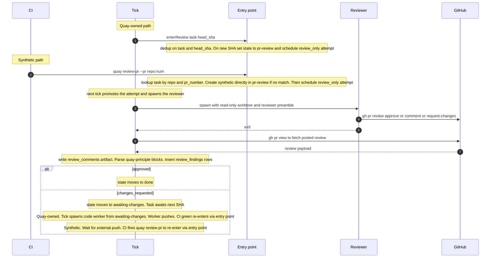

# Quay Spec: PR Review (`pr-review` state + Quay-spawned reviewer)

**Status:** Draft. Not locked. Replaces the superseded earlier draft at `docs/archive/quay-spec-pr-review.md`. Second feature spec graduating from `docs/orchestrator-design-notes.md`.

**Implementation order / hard dependency.** This spec **MUST NOT be implemented before** `docs/quay-spec-deployment-adapters.md` lands and is hooked into the task-creation path. Reasoning: the synthetic-task path benefits from rich brief composition (Linear ticket body + tags + Slack thread context) when adapters are available; without adapters, the synthetic path falls back to a thin brief from `gh pr view` and relies on the worker self-serving context.

**Required reading:**
- `docs/quay-spec.md` — substrate spec (locked v1).
- `docs/quay-spec-deployment-adapters.md` — Linear + Slack adapter contract (must land first).
- `docs/orchestrator-design-notes.md` §3.1, §3.2, §5, §7 — broader rationale.
- `docs/archive/quay-spec-pr-review.md` — the superseded prior draft. Still the source for design pieces this spec carries forward (synthetic `task_id` identity, `(task_id, head_sha)` dedup, `review_findings` table + FTS5, the `quay-principle` fenced-block contract, force-push handling, v1/v2 graduation).

---

## 1. Goal

Make PR review a **first-class state in Quay's task lifecycle**, entered by every PR — whether Quay opened the PR or a human did. While a task is in the new `pr-review` state, Quay spawns its own reviewer worker (same substrate as a code worker: worktree, tmux, supervisor lock; read-only worktree, reviewer preamble). The reviewer posts a real GitHub PR review via `gh pr review`. Tick observes the posted review, parses it, and writes structured rows into a `review_findings` table.

An **approved review is required** for a task to reach `done`. Until the reviewer approves, the task stays in the review loop: changes-requested keeps the task waiting for a new SHA, and every new SHA triggers a fresh review attempt.

The state machine is **identical for Quay-owned and synthetic tasks**. Only one thing differs by task kind: who produces the next SHA after CHANGES_REQUESTED — a Quay code worker (Quay-owned) or the external author (synthetic).

## 2. Scope and non-goals

### In scope (v1)

- Two new top-level task states: `pr-review` (reviewer running or queued) and `awaiting-changes` (post-CHANGES_REQUESTED, waiting for the next SHA). Entry into `pr-review` is gated on PR open + CI green for Quay-owned tasks; synthetic tasks are created directly in `pr-review` by the entry point and skip `queued` / `pr-open` entirely (those states represent Quay-authoring stages synthetic tasks don't have).
- Single idempotent entry point — internal function — that moves a task into `pr-review` and schedules a review-only attempt at the current head SHA. Two callers: tick (for Quay-owned tasks, when the precondition is met) and the new `quay review-pr` CLI (for synthetic tasks, called by CI). Dedup on `(task_id, head_sha)`: repeat calls at the same SHA are no-ops.
- New attempt reason `review_only`, distinguishing reviewer attempts from code-worker attempts. New column `attempts.head_sha` for SHA-level dedup.
- Reviewer-as-Quay-worker, single per-PR worker (N=1). Spawned by tick like any other worker; reviewer preamble stored in the existing `preambles` SQL table (new `kind = 'review'` row), seeded from a TS constant whose prose mirrors `docs/quay-reviewer-preamble-default.md`. Same storage and override pattern as code-worker preambles.
- Separate concurrency cap `max_concurrent_review_runs` (default 15), independent of `max_concurrent` for code workers.
- Approval gate on `done`: a task reaches `done` only when an approved review has been filed at the current head SHA.
- CHANGES_REQUESTED handling, unified: task transitions `pr-review → awaiting-changes`. For Quay-owned tasks, tick then spawns a code worker (from `awaiting-changes`, the same way it spawns from `queued`); for synthetic tasks, tick does nothing and the task waits. Either way, the next new SHA flows back into `pr-review` via the same entry point.
- Synthetic-task identity: deterministic `task_id = "pr-review-" + slug(repo_id) + "-" + pr_number`, one synthetic task per human PR forever (carried forward from the archive).
- `quay review-pr --pr <repo>:<num>` as the single CI-callable entry point. Fire-and-forget — returns once the review attempt is scheduled.
- Findings storage: `review_findings` SQL table + FTS5 virtual table over `principle` and `comment_body`. `quay-principle` fenced-block contract parsed from posted review bodies and inline comments (carried forward from the archive).
- `task_tags` table and `--tag` flag on `quay enqueue` (carried forward from the archive; tags cluster findings for cross-task queries).
- `quay query-findings` read CLI with filters for file, directory, tag, repo, recency, principle-only, and FTS5 keyword match (carried forward from the archive).
- Cron cadence config (recommended 30 s for review-running deployments).

### Out of v1 scope

- **Closing the loop / brief enrichment.** Findings are *captured and stored*; they are not yet injected into anything. External consumers can build over `quay query-findings`.
- **Multi-model panel review.** N=1 single reviewer only.
- **Blocking mode (`--wait` / `--timeout`).** `quay review-pr` is fire-and-forget. CI sees the verdict on GitHub when the reviewer posts it.
- **Validation evidence on findings.** No `addressed_by_commit_sha` / re-review delta logic.
- **Multi-repo principles.** Findings scoped per-repo by their task's repo via JOIN.
- **Auto-comment-back to GitHub on review failure.** Worker either posts a review or writes a blocker file; no GitHub-comment loop.
- **PR conversation-tab comments and review-comment replies.** Quay observes only `gh pr review` payloads (review body + inline comments). General PR comments and reply threads are not ingested.
- **Consultation of GitHub's review-request state.** Quay does not look at whether a review has been "re-requested" on GitHub. The SHA is the only trigger.
- **Reviewer self-improvement loop.** No agent-vs-human review divergence capture.

## 3. Architecture



The dispatch decision is **internal to the entry point**: it looks up `(repo_id, pr_number)` against `tasks`, and either uses the matching row (Quay-owned) or creates a synthetic task. CI doesn't need to know which path it's on; tick doesn't need to call out to CI. Both go through the same door.

## 4. State machine

### New top-level states: `pr-review` and `awaiting-changes`

**Schematic.** The diagram below is a simplified view of the task lifecycle focused on the Quay reviewer path. Existing substrate states that don't participate in the review loop are omitted: `waiting_human` (Slack escalation), `non_budget_loop` (parked after too many non-budget respawns), `worktree_error`, terminal `cancelled`. The existing detours into those states from `running`, `pr-open`, and the new review states are unchanged by this spec and not redrawn here. Arrows added by this spec are annotated **NEW**.

Not drawn: the human-CHANGES_REQUESTED edge that can move a Quay-owned task from **any non-terminal state** (including `done`) into `awaiting-changes`. That edge is observed by the existing `non_budget_respawn` path and is described in prose below under "Human reviews coexist with the Quay reviewer."

```mermaid
stateDiagram-v2
    [*] --> queued: Quay-owned task created
    [*] --> pr_review: synthetic task created by entry point (NEW)
    queued --> running: tick spawns code worker (existing)
    running --> pr_open: worker pushes and opens PR (existing)
    pr_open --> pr_review: tick observes CI green and calls entry point (NEW; replaces pr_open to done)
    pr_review --> done: reviewer posts approved review (NEW)
    pr_review --> awaiting_changes: reviewer posts changes-requested (NEW)
    awaiting_changes --> running: Quay-owned, tick spawns code worker (NEW)
    awaiting_changes --> pr_review: synthetic, new SHA arrives via CI re-trigger (NEW)
    done --> [*]

    note right of awaiting_changes
      Quay-owned: tick spawns a code worker
      from awaiting_changes the same way it
      spawns from queued. Worker reads the brief
      and feedback artifact, pushes a fix.
      Lifecycle returns through running to pr-open
      to pr-review.

      Synthetic: tick does nothing. Task waits
      for the external author to push. CI fires
      quay review-pr; entry point dedup unlocks
      on the new SHA; task re-enters pr-review.

      State machine does not branch on task kind.
      Only tick's worker-spawn logic does.
    end note

    note right of pr_review
      A review-only attempt is running or queued
      at the attempts table level. Reviewer is
      read-only on the worktree. The PR head SHA
      at attempt-schedule time is captured on
      attempts.head_sha.
    end note
```



The pre-existing `pr-open → done` transition (CI green and no review feature enabled) is replaced by `pr-open → pr-review` for deployments that enable the reviewer. Deployments without the reviewer enabled keep the existing path. See §4 "Approval gate on `done`" below for the precise contract and rollout note.

**Why two states, not one.** Reusing `queued` for the post-CHANGES_REQUESTED wait would overload it: today `queued` means "task created, first code worker needed" and tick's worker-spawn pass (`src/core/tick.ts:345`) reads it with that meaning. Putting synthetic tasks into `queued` would either incorrectly invite a code-worker spawn or force tick to learn task-kind discriminators in the worker-spawn path. A dedicated `awaiting-changes` state keeps the existing `queued` semantics intact and locates the kind-aware logic in exactly one place: how tick treats `awaiting-changes`.

**Why synthetic tasks skip `queued` and `pr-open`.** Those states represent stages of Quay-authoring work (waiting for a code worker; PR has been opened by a code worker). Synthetic tasks have no Quay-authoring stage — the human author already opened the PR. The entry point creates synthetic tasks directly in `pr-review` with a `review_only` attempt staged at the PR's current head SHA. The **review loop itself** (`pr-review ↔ awaiting-changes → done`) is identical for both kinds — that's the part the unified state machine guarantees.

### Entry into `pr-review`

A single idempotent function (called here `enterReview(task_id, head_sha)`) is the only way a task enters `pr-review`. Two callers:

1. **Tick** — for Quay-owned tasks. Trigger: task is in `pr-open`, CI is green at the current head SHA, no terminal review-only attempt exists for `(task_id, head_sha)`.
2. **`quay review-pr --pr <repo>:<num>` (called by CI)** — for human-authored PRs. The CLI fetches the PR's current head SHA, resolves or creates the synthetic task, then calls `enterReview`. Safe to call redundantly for Quay-owned PRs too; the lookup-then-dedup makes it a no-op if tick already moved the task.

`enterReview` semantics:

1. Resolve `task_id`: look up `(repo_id, pr_number)` in `tasks`. If found, use it. Else compute the synthetic `task_id` (`pr-review-<slug(repo_id)>-<pr_number>`); if no row exists, create one **directly in `pr-review`** with a thin synthetic brief composed from `gh pr view`. Synthetic tasks never pass through `queued` or `pr-open`.
2. Dedup on `(task_id, head_sha)` against the `attempts` table:
   - If a `review_only` attempt exists at this SHA in any state — return its id, do nothing.
   - If not — transition the task into `pr-review` if it isn't already there (valid source states: `pr-open` for Quay-owned, `awaiting-changes` for either kind; synthetic tasks created in step 1 are already in `pr-review`). Insert a `review_only` attempt row in the attempts table, with `head_sha` populated and the attempt in `queued` (attempt-level "queued", not the task state).
3. Return.

Note: "attempt queued" is the attempt's own state inside the `attempts` table, independent of the task's lifecycle state. Tick picks up the queued attempt on its next pass, sets it `running`, and spawns the reviewer.

Tick promotes the queued review-only attempt to `running` on its next pass and spawns the reviewer worker (separate `max_concurrent_review_runs` cap).

### Exit from `pr-review`

Tick observes the reviewer worker terminate, fetches the posted review via `gh pr view`, and:

| Reviewer verdict | Task transition |
|---|---|
| `APPROVED` | `pr-review → done` |
| `CHANGES_REQUESTED` | `pr-review → awaiting-changes` |
| `COMMENT` only (no verdict) | `pr-review → awaiting-changes` — treated as "no decision yet"; next SHA re-enters review. Same shape as CHANGES_REQUESTED for state purposes; findings still stored. |
| Worker errored before posting | `pr-review → awaiting-changes` — next SHA re-enters review. Worker writes `.quay-blocked.md` on force-push or hard error; tick reads it as the exit reason. |

In every non-approved case, the task lands in `awaiting-changes` and waits for the next new SHA. The kind-aware behavior lives entirely in how tick handles `awaiting-changes`: spawn a code worker (Quay-owned) or do nothing (synthetic).

### Approval gate on `done`

A Quay-owned task can only reach `done` via the `pr-review → done` arrow above. The pre-existing CI-green path that today moves a task to `done` becomes the precondition for entering `pr-review`, not for reaching `done` directly. Concretely: a Quay-owned task with green CI and no approved review stays in `pr-review` (or in `awaiting-changes` after a CHANGES_REQUESTED), not in `done`.

This is a substantive change from current behavior. Two implications worth noting:

- **The Quay reviewer is now load-bearing on merge.** A false-positive `CHANGES_REQUESTED` keeps the task out of `done` until the next SHA approves. There is no in-spec human-override switch in v1; deployments that need one will need to add it before turning the feature on, or accept the risk while reviewer accuracy is being measured.
- **Tasks that today reach `done` purely on CI green will, post-spec, need a review pass.** The migration path is operational, not schema: deployments enable the reviewer when they're ready for the new gate, not as a flag-day. Existing tasks already in `done` are unaffected (no retroactive review).

### GitHub review-request state is not consulted

The trigger for a fresh review attempt is purely **a new head SHA** observed at the entry point. Whether GitHub considers a prior review "stale" or "re-requested" is not consulted. Practical effects:

- A human clicking "Re-request review" on a Quay-reviewed PR is a no-op for Quay.
- A Quay-owned worker pushing a new commit doesn't need to do anything on GitHub's side; tick observes the new SHA and re-enters review.
- A synthetic PR receiving a force-push triggers a fresh review via the next CI `quay review-pr` call (CI runs on `pull_request: synchronize`).

### Human reviews coexist with the Quay reviewer

The Quay reviewer is not the only review signal Quay observes. The existing path in `src/core/non_budget_respawn.ts` polls `gh pr view` for human reviews on Quay-owned PRs and, on a new `CHANGES_REQUESTED` (deduped on `tasks.last_review_id_acted_on`), writes a `review_comments` artifact and respawns a code worker. That path **stays.** The two signals are independent and additive:

| Signal | Source | Effect on state | Cap |
|---|---|---|---|
| Quay reviewer posts `APPROVED` | `review_only` attempt's `review_verdict` set by tick | `pr-review → done` | n/a |
| Quay reviewer posts `CHANGES_REQUESTED` | `review_only` attempt's `review_verdict` set by tick | `pr-review → awaiting-changes` | counts toward `non_budget_respawns_consumed` (because it will trigger a code-worker respawn from `awaiting-changes`) |
| Human posts `CHANGES_REQUESTED` (Quay-owned PR) | `non_budget_respawn` poll, deduped on `last_review_id_acted_on` | **From any non-terminal state** → `awaiting-changes`. Writes `review_comments` artifact. | counts toward `non_budget_respawns_consumed` |
| Human posts `APPROVED` (Quay-owned PR) | observed but not acted on | No state change. Quay reviewer's approval is still the gate. | n/a |
| Human posts `COMMENT` only | observed but not acted on | No state change. | n/a |

A human's `CHANGES_REQUESTED` overrides a prior Quay approval: if the task is in `done` (Quay approved at the current SHA) and a human then leaves changes-requested, the task transitions `done → awaiting-changes` and a code worker is spawned to address the human's feedback (existing behavior, preserved). Once the worker pushes a fix, the lifecycle returns through `running → pr-open → pr-review`, where the Quay reviewer reviews the new SHA and the cycle continues.

Human approvals are **advisory only in v1.** A human approving doesn't transition state and doesn't substitute for Quay's gate. Rationale: the Quay reviewer's false-positive rate is unmeasured; letting a human approval shortcut Quay's gate makes the contract conditional on the reviewer's accuracy, which we want to keep separate from this spec. If a "human can override" escape valve becomes needed (e.g., on observed Quay-reviewer flakiness), it can be added as an additive transition (`pr-review → done` on human approval) without renaming or removing anything in v1.

Both Quay-reviewer-driven and human-driven respawns share the existing `non_budget_respawns_consumed` cap (default 20). After 20 respawns from `awaiting-changes` (regardless of which signal caused them), the task parks in `non_budget_loop` — same terminal as today. This prevents runaway loops where Quay and a human keep producing fresh CHANGES_REQUESTED on every iteration.

Synthetic tasks observe only the Quay reviewer signal in v1 — the existing human-review respawn path is Quay-PR-specific (it's keyed on having a code worker to respawn, which synthetic tasks don't). Humans reviewing a synthetic-task PR are just reviewing it on GitHub; Quay doesn't ingest their reviews into the state machine, since there's no worker to act on the feedback.

### Synthetic-task identity and reopen

Synthetic `task_id = "pr-review-" + slug(repo_id) + "-" + pr_number`. One synthetic task per human PR, forever. New SHAs become new `attempts` rows on the same task. (Carried forward from the archive §4 "Synthetic task identity"; the only change is that synthetic tasks now flow through the same top-level states as Quay-owned ones, with `done` as the unified terminal once approval lands.)

### Force-pushes mid-review

If a PR is force-pushed while a review attempt is `running`, the worker's worktree no longer matches the new head SHA. Per the reviewer preamble, the worker writes `.quay-blocked.md` and exits without posting. Tick treats this as a worker-errored exit: task → `awaiting-changes`. The next entry-point call (tick for Quay-owned, CI for synthetic) at the new SHA flows through dedup normally and schedules a fresh attempt.

## 5. Schema delta

The `tasks.state` and `attempts.reason` columns are free-form `TEXT` with no `CHECK` constraint (see `migrations/0001_init.sql`), so new enum values land via code changes only. New columns and new tables require a migration.

### 5.1 New enum values (code only, no migration)

- `tasks.state` gains `pr-review` and `awaiting-changes`.
- `attempts.reason` gains `review_only` (the Quay reviewer worker's attempt kind).

The existing `attempts.reason = 'review'` value, set by `src/core/non_budget_respawn.ts` when a human posts CHANGES_REQUESTED on a Quay-owned PR, **stays**. It and `review_only` denote two different attempt kinds (human-driven code-worker respawn vs. Quay reviewer worker) that coexist. See §4 "Human reviews coexist with the Quay reviewer" below for how the two signals interact at the state-machine level.

### 5.2 `attempts.head_sha`

```sql
ALTER TABLE attempts ADD COLUMN head_sha TEXT;
-- Populated only for review_only attempts. Captures the PR head SHA at the
-- time the review attempt was scheduled by the entry point. Used by the
-- entry-point dedup to skip spawning a second review on the same SHA.
-- NULL for non-review attempts.

CREATE INDEX attempts_review_dedup_idx
  ON attempts(task_id, head_sha)
  WHERE head_sha IS NOT NULL;
```

The existing `attempts.remote_sha_at_spawn` is **not reused** for this purpose. That column records what the substrate observed when a code worker spawned (may differ from what the worker pushes); `head_sha` records what was promised to be reviewed. Different meaning, different column.

### 5.3 `attempts.review_verdict`

```sql
ALTER TABLE attempts ADD COLUMN review_verdict TEXT;
-- Set by tick when the reviewer worker exits and the posted review is
-- fetched via gh pr view. One of: 'approved', 'changes_requested',
-- 'commented', 'errored'. NULL for non-review attempts and for review
-- attempts that have not yet ended. Drives the state transition out of
-- pr-review (see §4 exit table).
```

Not reused: `attempts.exit_kind` records *how* the worker terminated (clean exit, killed, etc.); `review_verdict` records *what the worker did*. Both are needed independently — a worker can exit cleanly with `errored` verdict (worktree force-pushed under it → blocked file written → clean exit) or exit dirty with an approved review already posted.

### 5.4 `preambles.kind`

```sql
ALTER TABLE preambles ADD COLUMN kind TEXT NOT NULL DEFAULT 'code';
-- Distinguishes code-worker preambles ('code') from reviewer preambles ('review').
-- Existing rows backfill to 'code' via the DEFAULT clause.
-- Reviewer preambles ('review') are seeded on first reviewer spawn from a TS
-- constant whose prose mirrors docs/quay-reviewer-preamble-default.md.

CREATE INDEX preambles_kind_idx ON preambles(kind);
```

`attempts.preamble_id` already references `preambles(preamble_id)`; it carries the kind transitively via the referenced row. A code-worker attempt references a `kind = 'code'` preamble; a review-only attempt references a `kind = 'review'` preamble. Tick selects the preamble at spawn time by querying for the latest row of the matching kind:

```sql
SELECT preamble_id FROM preambles WHERE kind = ? ORDER BY preamble_id DESC LIMIT 1
```

This mirrors the existing `ensurePreambleId` flow in `src/core/preamble.ts:16` exactly, with `kind` as an added filter. Deployments override either preamble by inserting a new row of the appropriate `kind`; the new row becomes the latest and is picked up on the next spawn.

Forward compatibility: v2's `reviewer_preambles` table (per `docs/orchestrator-design-notes.md` §7) graduates out of `preambles` by copying `kind = 'review'` rows. The `kind` column itself can stay or be dropped at that point; v1's choice is additive.

### 5.5 `task_tags`

Carried forward verbatim from the archive (`docs/archive/quay-spec-pr-review.md` §5). Provided here for self-containment.

```sql
CREATE TABLE task_tags (
  task_id TEXT NOT NULL REFERENCES tasks(task_id),
  tag TEXT NOT NULL,
  created_at TEXT NOT NULL,
  PRIMARY KEY (task_id, tag)
);
CREATE INDEX task_tags_by_tag ON task_tags(tag);
```

Tags are opaque strings to Quay. Populated by `quay enqueue --tag <name>` and by the deployment-adapters spec (Linear `quay-config` block's `tags:` list, applied at synthetic-task creation). Used for clustering findings in `quay query-findings --tag`.

### 5.6 `review_findings` + FTS5

Carried forward from the archive (`docs/archive/quay-spec-pr-review.md` §5) with the same shape. Provided here for self-containment.

```sql
CREATE TABLE review_findings (
  finding_id INTEGER PRIMARY KEY AUTOINCREMENT,
  task_id TEXT NOT NULL REFERENCES tasks(task_id),
  attempt_id INTEGER REFERENCES attempts(attempt_id),
  review_id TEXT NOT NULL,         -- GH review id (numeric, stringified)
  principle TEXT,                  -- prose extracted from quay-principle fenced block; NULL when absent
  comment_body TEXT NOT NULL,      -- full original comment body (or review body for review-body findings)
  file_path TEXT,                  -- from the GH line comment; NULL for review-body findings
  line_number INTEGER,             -- from the GH line comment; NULL for review-body findings
  source_url TEXT NOT NULL,        -- deep link to the comment / review on GitHub
  captured_at TEXT NOT NULL
);
CREATE INDEX review_findings_by_principle ON review_findings(principle);
CREATE INDEX review_findings_by_task ON review_findings(task_id);
CREATE INDEX review_findings_by_file ON review_findings(file_path);

CREATE VIRTUAL TABLE review_findings_fts USING fts5(
  principle,
  comment_body,
  content='review_findings',
  content_rowid='finding_id'
);

CREATE TRIGGER review_findings_ai AFTER INSERT ON review_findings BEGIN
  INSERT INTO review_findings_fts(rowid, principle, comment_body)
  VALUES (new.finding_id, new.principle, new.comment_body);
END;
CREATE TRIGGER review_findings_ad AFTER DELETE ON review_findings BEGIN
  INSERT INTO review_findings_fts(review_findings_fts, rowid, principle, comment_body)
  VALUES ('delete', old.finding_id, old.principle, old.comment_body);
END;
CREATE TRIGGER review_findings_au AFTER UPDATE ON review_findings BEGIN
  INSERT INTO review_findings_fts(review_findings_fts, rowid, principle, comment_body)
  VALUES ('delete', old.finding_id, old.principle, old.comment_body);
  INSERT INTO review_findings_fts(rowid, principle, comment_body)
  VALUES (new.finding_id, new.principle, new.comment_body);
END;
```

One `review_findings` row per inline comment plus one row per review-body finding (where applicable). Rows are inserted by tick at review-ingestion time, after the reviewer worker exits and `gh pr view` returns the posted review payload.

### 5.7 `artifacts.kind = 'review_comments'`

No schema change to the `artifacts` table — `kind` is free-form TEXT. The existing `review_comments` artifact kind (today written by `non_budget_respawn` to capture human-review feedback for the next code-worker pass) is reused: tick writes one `review_comments` artifact per `review_only` attempt that finishes with `changes_requested`. The artifact is what the next code worker reads to address the feedback (Quay-owned tasks); the structured `review_findings` rows are what cross-task queries hit.

### 5.8 Synthetic task discriminator

No new column. Synthetic tasks are identified by `task_id LIKE 'pr-review-%'`. Code paths that need the distinction (tick's worker-spawn decision in `awaiting-changes`; the entry point's lookup-or-create branch) match on this prefix.

Trade-off considered: a `tasks.is_synthetic` BOOLEAN column would be slightly faster to query and self-documenting at the row level. But the prefix is already a hard invariant (it's how the synthetic `task_id` is derived); a column would be duplicate state and would need a CHECK constraint to stay consistent with the prefix. Stick with derivation.

### 5.9 Migration order

One migration file, applied as a single transaction:

1. `ALTER TABLE attempts ADD COLUMN head_sha TEXT`.
2. `ALTER TABLE attempts ADD COLUMN review_verdict TEXT`.
3. `CREATE INDEX attempts_review_dedup_idx ...`.
4. `ALTER TABLE preambles ADD COLUMN kind TEXT NOT NULL DEFAULT 'code'`.
5. `CREATE INDEX preambles_kind_idx ...`.
6. `CREATE TABLE task_tags ...` + index.
7. `CREATE TABLE review_findings ...` + indexes.
8. `CREATE VIRTUAL TABLE review_findings_fts ...` + triggers.

No backfill required: pre-existing attempts have `head_sha = NULL` and `review_verdict = NULL` (both valid for non-review attempts), existing `preambles` rows backfill to `kind = 'code'` via the column default, no `review_findings` rows exist for old tasks, no `task_tags` rows exist until `quay enqueue --tag` or the adapter-path enqueue runs.

The first reviewer spawn after migration triggers seeding of the default `kind = 'review'` preamble row, analogous to how `ensurePreambleId` seeds the first `kind = 'code'` row in `src/core/preamble.ts:16` today.

## 6. Reviewer worker

The reviewer is a Quay worker, spawned by tick through the same substrate as a code worker (tmux session + supervisor lock). Three differences from a code worker: read-only worktree, reviewer preamble, separate concurrency cap.

### 6.1 Spawn trigger

A `review_only` attempt with `spawned_at IS NULL` (attempt-level "queued"), combined with capacity-cap headroom (§6.4), causes tick to:

1. Promote the attempt: set `spawned_at`, `tmux_session`.
2. Load the reviewer preamble (§6.3).
3. Spawn the worker via the existing tmux + supervisor substrate.

Tick polls for review-only attempts in the same pass as code-worker attempts. The two caps are checked independently; a saturated code-worker pool does not block reviewer spawns and vice versa.

### 6.2 Worktree access — read-only

The reviewer reads the worktree but does not modify it. The worker contract (enforced by preamble prose) forbids:

- `git commit`, `git push`, branch creation, or any write to the git index.
- Package installs or any command that mutates `node_modules` / `vendor` / etc.
- Any file write **except** `.quay-blocked.md` (the substrate-level blocker file, treated by tick as a clean blocker-exit signal).

Concurrent code-worker activity on the same worktree is uncommon (substrate already serializes worktree-creating events) but not impossible. If a force-push or worktree-mutating event changes the working tree under a running reviewer, the worker writes `.quay-blocked.md` and exits — same handling as the force-pushes-mid-review case in §4.

No new worktree lock is introduced. The existing exclusive lock held by code workers is sufficient: a code worker holding the lock blocks reviewer spawn; tick retries the reviewer spawn on the next pass. Reviewers themselves don't take an exclusive lock — they only need a stable read view, and the substrate's existing serialization is enough for v1.

### 6.3 Reviewer preamble

Reviewer preambles use the same storage pattern as code-worker preambles: rows in the `preambles` SQL table, distinguished by the new `kind` column added in §5.4 (`'code'` vs `'review'`).

Spawn-time selection:

```sql
SELECT preamble_id, body FROM preambles
WHERE kind = 'review'
ORDER BY preamble_id DESC LIMIT 1
```

If no `kind = 'review'` row exists, the seeder inserts one whose body is sourced from a TS constant `DEFAULT_REVIEWER_PREAMBLE_BODY` defined alongside the existing `DEFAULT_PREAMBLE_BODY` (`src/core/preamble.ts:4`). The constant's prose mirrors `docs/quay-reviewer-preamble-default.md` — that markdown file is the human-readable source-of-truth, inlined into the TS constant at edit time. (Trade-off: edits to the markdown file require a corresponding edit to the constant. The alternative — reading the markdown at runtime — adds I/O and a packaging concern for no real benefit; the existing code-worker preamble uses the inline-constant pattern, and reviewer preambles match it.)

The reviewer attempt's `attempts.preamble_id` references the selected row, exactly as a code-worker attempt's `preamble_id` references its `kind = 'code'` preamble. This gives prompt-version correlation for free: a future analysis can join `attempts` to `preambles` to ask "which findings came out of which reviewer prompt?"

Deployment override: a deployment customizes the reviewer preamble by inserting a new `kind = 'review'` row (typically via a migration in the deployment's own repo, or a one-off SQL command at install time). The new row becomes the latest and is picked up on the next reviewer spawn. The current row stays in the table — `preambles` is append-only, so historical attempts retain their reference to the prompt-version they actually ran with.

No `[reviewer].preamble_path` config key. The storage mechanism is the database, identical to code workers; deployments don't manage two preamble systems.

The preamble carries the entirety of the reviewer-worker contract surface: what the worker reads, how it composes findings, the `quay-principle` fenced-block format, posting via `gh pr review`. The contract pieces themselves are enumerated in §7.1; the prose enforcing them lives in `docs/quay-reviewer-preamble-default.md` (the source-of-truth) and is mirrored verbatim in `DEFAULT_REVIEWER_PREAMBLE_BODY` in the source.

### 6.4 Capacity cap

```toml
[capacity]
max_concurrent = 8            # existing — code workers
max_concurrent_review_runs = 15   # new — reviewer workers
```

Reviewer workers consume `max_concurrent_review_runs` (default 15), independent of `max_concurrent`. Tick promotes `review_only` attempts only up to this cap.

Rationale: reviewers are read-only on the worktree and don't compete with code workers for substrate write-paths; a shared cap would let a burst of reviews starve code workers (or vice versa). Two caps keep the throttles independent. The 15 default is a starting point; deployments tune up or down based on the observed reviewer-worker latency profile.

### 6.5 Worker contract (summary)

By the end of its run, the worker must:

1. Either post **exactly one** review via `gh pr review` (`--approve` / `--request-changes` / `--comment`), OR write `.quay-blocked.md` describing the blocker. Not both, not neither.
2. Not modify the worktree (per §6.2).
3. Exit cleanly.

If the worker exits without posting a review and without writing a blocker file, tick treats it as `review_verdict = 'errored'` and transitions per §4 exit table.

The detailed contract pieces — use the brief, fetch only what's missing, `quay-principle` fenced-block format for generalizable rules, review-comment formatting — are enforced by the preamble prose, not by tick. See §7.1 for the full contract list and `docs/quay-reviewer-preamble-default.md` for the enforcing prose.

### 6.6 Worker exit and tick observation

When the supervisor reports the worker has terminated, tick performs the following sequence (single pass, per-attempt):

1. **Check for blocker file.** If `.quay-blocked.md` exists in the worktree: set `attempts.review_verdict = 'errored'`, capture the blocker text as a `review_blocker` artifact, transition task `pr-review → awaiting-changes`. Done.
2. **Fetch the posted review** via `gh pr view --json reviews`, filtering to reviews authored by the bot account at the current head SHA. (The bot account is the identity of the `GH_TOKEN` the worker used; deployments configure it.)
   - **Found** → set `attempts.review_verdict` from the review's `state` (`APPROVED → 'approved'`, `CHANGES_REQUESTED → 'changes_requested'`, `COMMENTED → 'commented'`). Write the `review_comments` artifact (review body + inline comments). Parse `quay-principle` blocks (§8.2) and insert `review_findings` rows. Transition task per §4 exit table.
   - **Not found** → set `attempts.review_verdict = 'errored'`, log diagnostic ("worker exited cleanly but no review posted at head_sha"), transition task `pr-review → awaiting-changes`.
3. Mark the attempt ended (`ended_at`, `exit_kind`).

Steps 1 and 2 are mutually exclusive — the worker contract says "exactly one." If both a blocker file and a posted review are present (worker bug), the blocker file wins and the posted review is logged but not actioned: deployments noticing this signal should fix the preamble.

## 7. Worker contract and CLI

This section lists the contract the reviewer worker must satisfy and pins the `quay review-pr` CLI shape.

### 7.1 Worker contract

The contract pieces are **enforced by preamble prose, not by tick.** Tick observes outcomes (review posted or blocker file present) and does not validate the worker's adherence to individual pieces. Drift in preamble fidelity surfaces as observable signals: malformed reviews, missing fenced blocks, unparseable findings. The contract:

1. **Use the brief, then the diff.** Read the task brief (`.quay-prompt.md` or equivalent — same location as for code workers) before doing anything else. Read the diff via `gh pr diff` or by inspecting the worktree against the base branch. Don't repeat work the brief already did.
2. **Fetch only what's missing.** If the brief contains unexpanded identifiers (synthetic-task path on adapter-less deployments — see `docs/quay-spec-deployment-adapters.md` §6.1), follow them via available tooling (Linear MCP, web fetch, etc.) before composing findings.
3. **Post exactly one review.** Call `gh pr review <pr> --approve | --request-changes | --comment` once. Include the review body with `--body` or `-F`. Inline comments are posted as part of the same review via the file's GraphQL payload, not as separate `gh pr comment` calls.
4. **Wrap generalizable rules in `quay-principle` fenced blocks.** For findings that state a rule applicable beyond the immediate change (e.g., "all callers of `assertOwner` must run under a Quay claim"), append a fenced block to the comment body:
   ````
   ```quay-principle
   Callers of assertOwner must run under a Quay claim. Otherwise concurrent
   ticks can each pass the check and race on substrate writes.
   ```
   ````
   Tick parses these blocks (§8.2) and stores the prose in `review_findings.principle`. Locus-bearing findings without a generalizable rule omit the block; tick still stores them in `review_findings` with `principle = NULL`.
5. **Inline comments where the issue has a locus.** A finding tied to specific code lives as an inline comment with `path` + `line`. A finding about the change as a whole lives in the review body. Don't smear locus-bearing findings into the body; don't manufacture line refs for body-level findings.
6. **Read-only on the worktree.** No commits, no pushes, no installs, no file writes except `.quay-blocked.md`. (Substrate-level constraint from §6.2; restated here so the contract list is complete.)
7. **Exit cleanly when done.** Either a review is posted or `.quay-blocked.md` is written; then exit. Don't loop, don't sleep waiting for input, don't poll GitHub for further state.

The default preamble at `docs/quay-reviewer-preamble-default.md` enforces all seven pieces in prose. Deployments overriding the preamble (via a new `kind = 'review'` row in `preambles`; §6.3) are responsible for preserving the pieces tick depends on — specifically (3), (4), (6), and (7). Pieces (1), (2), and (5) affect review quality but not Quay's machinery.

### 7.2 `quay review-pr` CLI

```
quay review-pr --pr <repo>:<num> [--head-sha <sha>]
```

**Arguments:**
- `--pr <repo>:<num>` — required. Format matches existing Quay PR identifiers (e.g., `acc/quay:47`). The repo is resolved against `repos.repo_url` to find a `repos.repo_id`.
- `--head-sha <sha>` — optional. If supplied, used as the dedup key directly. If omitted, the CLI calls `gh pr view --json headRefOid` and uses that.

**Behavior:** the CLI is a thin wrapper around the entry-point function (`enterReview` per §4):

1. Resolve `repo_id` from `--pr` against the `repos` table. If not found → exit non-zero with `repo_not_configured`.
2. Resolve `head_sha`: from `--head-sha` if provided, else from `gh pr view`. If `gh pr view` fails → exit non-zero with `pr_not_found` or `github_unreachable`.
3. Call `enterReview(repo_id, pr_number, head_sha)`. The function handles task-id resolution (existing Quay-task vs. new synthetic) and `(task_id, head_sha)` dedup internally.
4. Print a single line of structured output to stdout (see §7.4) and exit 0.

**Fire-and-forget.** The CLI returns immediately after `enterReview` returns. It does not wait for the reviewer worker to spawn, run, or post. CI sees the review on GitHub when the worker posts it; there is no `--wait` flag in v1 (see §2 out-of-scope).

**Safe to call redundantly.** A CI workflow that fires on every `pull_request: synchronize` event calls `quay review-pr` regardless of whether the task is Quay-owned or synthetic. The entry point's lookup-then-dedup makes the call a no-op if tick has already moved the task or if a review-only attempt for `(task_id, head_sha)` exists.

### 7.3 Idempotency boundary

The entry point's dedup is the only idempotency guarantee:

- **`(task_id, head_sha)` dedup** holds across all callers and all retries. Tick can call the entry point; CI can call it for the same PR; both can fire concurrently. The first call that wins the row-insert race schedules the attempt; the rest return its id.
- **Concurrency:** the entry point uses a transaction with the lookup-then-insert sequenced; concurrent callers serialize on the `attempts_review_dedup_idx` unique-ish view. (Implementation note for §11: a partial unique index on `(task_id, head_sha) WHERE reason = 'review_only' AND head_sha IS NOT NULL` provides DB-level enforcement.)
- **No external dedup:** Quay does **not** consult GitHub for "is there already a Quay review on this SHA?" before scheduling. The `attempts` table is the single source of truth. GitHub-side state (deleted reviews, restored reviews, manually filed bot reviews) is not consulted.

### 7.4 CLI output and exit codes

stdout, one line, plain text (machine-parseable):

```
task_id=<id> attempt_id=<n> state=<task-state> review_verdict=<verdict|none>
```

- `attempt_id` is the scheduled-or-already-existing review-only attempt at the requested SHA.
- `state` is the task's state after the call (`pr-review`, or unchanged if dedup hit a non-terminal existing attempt).
- `review_verdict` is the attempt's `attempts.review_verdict` — `none` until the reviewer has run.

Exit codes:

| Code | Meaning |
|---|---|
| 0 | Entry point succeeded. Attempt is either newly scheduled or already present at this SHA. |
| 2 | Argument or config error (`repo_not_configured`, malformed `--pr`). |
| 3 | GitHub-side error (`pr_not_found`, `github_unreachable`). |
| 4 | Quay-side error (DB unreachable, unexpected state). |

CI workflows treat exit 0 as "review will eventually appear on GitHub" and exit non-zero as "Quay couldn't accept this trigger; investigate." There is no exit code for "review filed" — that information lives on GitHub, not in this CLI.

## 8. Findings ingestion

After the reviewer worker exits and tick fetches the posted review (per §6.6 step 2), tick parses the review payload into `review_findings` rows. This section pins what gets parsed and how.

### 8.1 What becomes a finding

One `review_findings` row per **inline comment** (a GitHub review comment with `path` and `line` fields), plus optionally one row for the **review body** if it contains substantive content:

| Source | Row produced? | `file_path` | `line_number` |
|---|---|---|---|
| Inline comment (`path` + `line` set) | Always | from GH | from GH |
| Review body, non-empty and non-trivial | Yes (one row) | NULL | NULL |
| Review body, empty or boilerplate-only | No row | — | — |
| `gh pr comment` (PR conversation tab) | Not ingested (per §2 out-of-scope) | — | — |

"Substantive" for the review body means: contains at least one non-whitespace character after stripping the conventional GitHub auto-summary lines (`> N issues found`, `> Approved`, etc.). If the body is purely procedural — "Approved." or "Requesting changes per inline comments" — no body-level finding is created; the verdict already carries that information. Implementation: strip trailing whitespace and trivial-decision phrases, then check the remainder length.

The body-level finding (when present) carries the body prose in `comment_body`; the `principle` column is populated only if the body contains a `quay-principle` fenced block.

### 8.2 `quay-principle` fenced-block parsing

The block format (worker contract piece §7.1 #4):

````
```quay-principle
<one or more lines of prose stating the generalizable rule>
```
````

Parser rules:

1. **Detection.** Match the fence regex `^```quay-principle\s*$` to `^```\s*$` (non-greedy across newlines). Standard markdown fenced-block syntax; the info-string is exactly `quay-principle` (case-sensitive, no language hint after).
2. **Multiple blocks in one comment.** If a comment body contains more than one `quay-principle` block, the **first** is taken and the rest are ignored (logged as a parse warning). Rationale: one comment = one principle; if the worker really wants to state two rules they should be separate comments. Keeps `review_findings.principle` 1:1 with the row.
3. **Block content.** Whatever lies between the fences, with leading/trailing whitespace stripped. Empty blocks (only whitespace between fences) produce `principle = NULL` and a parse warning.
4. **No block.** Comment body without any `quay-principle` block produces `principle = NULL`. The finding is still stored; it's just locus-bearing-only with no generalizable rule attached.
5. **`comment_body` preserves the fenced block.** The parser does not strip the block from `comment_body` — the column stores the full original prose. Queries that want "the rule prose alone" use `principle`; queries that want "the full author voice" use `comment_body`.

The parser is pure (no DB access, no GitHub access); it takes a string and returns `{principle: string | null, warnings: string[]}`. Living in its own module makes it testable in isolation and reusable by the future `quay query-findings` CLI for re-parsing.

### 8.3 `source_url` composition

The `source_url` column links each finding back to its GitHub origin:

- **Inline comment finding:** `<pr_url>#discussion_r<comment_id>` (GitHub's canonical deep-link to a review comment).
- **Review body finding:** `<pr_url>#pullrequestreview-<review_id>` (canonical deep-link to a review).

`pr_url` is taken from `tasks.pr_url`. The numeric ids are taken from the `gh pr view` payload. Quay does not construct URLs from `<repo>/<num>` — it uses the payload-supplied PR url verbatim to avoid mismatches between configured base URLs and what GitHub canonicalizes to.

### 8.4 Transaction boundary

All findings for a single review attempt are inserted in **one SQLite transaction**, alongside the `attempts.review_verdict` update and the task-state transition. If the transaction fails (e.g., a parser exception on one comment), no findings are inserted, the verdict is not set, and the task stays in `pr-review`. Tick retries on the next pass: the worker exit is observable, the review payload is re-fetchable from `gh pr view`, and the parser is pure — the operation is idempotent at the cost of one extra GitHub round-trip.

The transaction also writes the `review_comments` artifact (free-form text blob for the next code worker, per §5.7). Both inserts succeed or both roll back; the code worker reading the artifact and a `quay query-findings` consumer see consistent state.

### 8.5 Error handling

| Error | Behavior |
|---|---|
| `gh pr view` returns no review for the bot at this SHA | `review_verdict = 'errored'`, no findings inserted, task → `awaiting-changes`. Diagnostic logged. |
| GraphQL fetch for inline comments fails | Transaction aborted, retried next tick. After 3 retries, `review_verdict = 'errored'` and findings ingestion abandoned for this attempt; review still visible on GitHub. |
| `quay-principle` block malformed (unclosed fence, invalid UTF-8) | Comment's `principle = NULL`, warning logged, parsing continues for other comments. Never blocks ingestion. |
| Two `quay-principle` blocks in one comment | First wins, warning logged. |
| Empty review body that GitHub still surfaces as a review | No body-level finding, no error. Inline findings still ingested. |

The principle: **partial failure on parsing produces partial results, not zero results.** A single malformed comment doesn't lose the rest of the review's findings. A complete fetch failure does block ingestion and surfaces as `review_verdict = 'errored'`, which the state machine handles cleanly (task back to `awaiting-changes`).

## 9. `quay query-findings` CLI

The single self-serve read surface over stored findings. Used by workers (to look up prior findings on files they're touching), by humans (debugging, exploration), and by any external consumer that wants to build over `review_findings`.

### 9.1 Signature

```
quay query-findings [filters...] [output...] [pagination...]
```

**Filters** (combinable; all conditions AND-ed together):

| Flag | Effect | Example |
|---|---|---|
| `--file PATH` | Exact match on `review_findings.file_path`. | `--file src/core/tick.ts` |
| `--dir PATH` | Prefix match on `file_path` (trailing slash optional). | `--dir src/core/` |
| `--tag NAME` | Inner-join `task_tags`, filter on tag. Repeatable: multiple `--tag` are OR-ed. | `--tag auth --tag billing` |
| `--repo REPO_ID` | Inner-join `tasks`, filter on `tasks.repo_id`. | `--repo acc-quay` |
| `--task-id ID` | Direct match on `review_findings.task_id`. | `--task-id pr-review-acc-quay-847` |
| `--since DURATION` | `captured_at >= now() - DURATION`. Accepts `7d`, `30d`, `12h`, or an ISO-8601 date. | `--since 14d` |
| `--principle-only` | `WHERE principle IS NOT NULL`. Filters to findings with a generalizable rule. | |
| `--match QUERY` | FTS5 MATCH against `review_findings_fts` (covers `principle` and `comment_body`). Standard SQLite FTS5 query syntax. | `--match "claim AND lock"` |

**Output:**

| Flag | Effect |
|---|---|
| `--json` | Emit one JSON object per line (newline-delimited JSON). Default is human-readable text (see §9.3). |
| `--format <text\|json\|tsv>` | Same as `--json` but explicit; `tsv` for spreadsheet pipelines. |

**Pagination:**

| Flag | Effect |
|---|---|
| `--limit N` | Cap results. Default **50**, max 1000. |
| `--order <recent\|oldest\|task>` | Sort key. Default `recent` (`captured_at DESC`). `task` groups by `task_id` then orders by `captured_at DESC` within each. |

No `--offset`. Pagination beyond `--limit` is out of v1 scope; callers needing deep paging use `--since` with successive time windows.

### 9.2 Filter semantics

- **All filters AND.** Specifying `--file src/core/tick.ts --tag auth` returns findings on `tick.ts` that *also* belong to tasks tagged `auth`.
- **`--tag` is the one exception:** repeated `--tag` flags within one invocation are OR-ed (matches any of the named tags). To require *all* tags, run the query multiple times and intersect externally; this is rare enough to not justify a flag in v1.
- **No filter = no filter.** `quay query-findings` with no flags returns the most recent 50 findings across the deployment, ordered by `captured_at DESC`. Useful sanity check; not a recommended workflow.
- **`--match` plays with FTS5 ranking.** When `--match` is supplied, results are ordered by FTS5 rank by default (not `captured_at`). `--order` overrides; `--order recent` falls back to date ordering at the cost of relevance.

### 9.3 Output formats

**Text (default):**

```
finding_id=42 task=pr-review-acc-quay-847 file=src/core/tick.ts:312
  source: https://github.com/acc/quay/pull/847#discussion_r1234567
  principle: Callers of assertOwner must run under a Quay claim.
  comment: The call on line 312 isn't claim-wrapped. ...
  captured: 2026-05-08T14:32:11Z

finding_id=41 task=...
```

Each finding is one stanza with blank-line separators. The `comment` field truncates at 200 chars with `...` in text mode; full prose is available via `--json`.

**JSON (`--json`):**

Newline-delimited JSON — one finding per line:

```json
{"finding_id":42,"task_id":"pr-review-acc-quay-847","attempt_id":91,"review_id":"5523112201","principle":"Callers of assertOwner must run under a Quay claim.","comment_body":"The call on line 312 isn't claim-wrapped. ...","file_path":"src/core/tick.ts","line_number":312,"source_url":"https://github.com/acc/quay/pull/847#discussion_r1234567","captured_at":"2026-05-08T14:32:11Z"}
```

NDJSON (not a JSON array) so it streams cleanly through pipes and stays useful at any result count.

**TSV (`--format tsv`):**

Tab-separated, one header line then one finding per line. Columns: `finding_id`, `task_id`, `file_path`, `line_number`, `principle`, `captured_at`, `source_url`. `comment_body` omitted (would break TSV with embedded newlines); callers needing body prose use `--json`.

### 9.4 Exit codes

| Code | Meaning |
|---|---|
| 0 | Query succeeded. Zero matching rows is still exit 0 (empty output). |
| 2 | Argument error (malformed `--since`, unknown `--format`, etc.). |
| 4 | Quay-side error (DB unreachable, schema mismatch). |

No exit code for "no results" — that's a query outcome, not an error.

### 9.5 Intended use cases

The CLI is the **single read surface** the spec ships. Three intended consumers:

1. **Reviewer worker, looking up prior findings on touched files.** The reviewer reads the diff, then runs `quay query-findings --file <path>` (or `--dir`) per touched path, folds the results into its own context, and reviews with that history available. Loop-closing is left to whoever owns the worker preamble — Quay just makes the data queryable.
2. **Code worker, before pushing a fix.** Same shape, different consumer. A worker addressing CHANGES_REQUESTED can query prior findings on the same area before composing the fix.
3. **Humans, ad-hoc.** `quay query-findings --match "race" --since 30d` to look up recent findings about race conditions. `quay query-findings --task-id <id>` to see one task's full review history. `quay query-findings --tag auth --principle-only` for the curated rules in a clustered area.

No other read surface ships. Web UIs, dashboards, Slack bots — all build over this CLI (or directly over the `review_findings` schema, which is part of the substrate contract).

## 10. References, dependencies, and forward compatibility

### 10.1 Hard dependency

This spec **MUST NOT be implemented before** `docs/quay-spec-deployment-adapters.md` has landed and is wired into the task-creation path (`quay enqueue --linear-issue`). Concrete dependency points:

- The **synthetic-task path** composes a thin brief from `gh pr view` when adapters are absent, and a rich brief via `ticketContext.fetch(identifier)` when adapters are present. The latter requires the adapter spec's primitive.
- The **`task_tags` table** is shared between adapter-enabled enqueue (Linear `quay-config` block → tags) and this spec's `--tag` flag on `quay enqueue` and `quay query-findings --tag`. Whichever migration lands first should create the table; this spec assumes it's available.
- The **rich brief structure** (per `docs/quay-spec-deployment-adapters.md` §6.1) is a contract the reviewer worker depends on for adapter-enabled deployments — its preamble references the section headings the adapter spec pins.

Adapter-less deployments (no Linear, no Slack) can still ship this spec; the synthetic path falls back to the thin `gh pr view` brief and the worker self-serves any external context per §7.1 piece 2.

### 10.2 Preserved code paths (nothing removed)

This spec **adds** the Quay-spawned reviewer alongside the existing human-review respawn loop in `src/core/non_budget_respawn.ts`. Nothing is removed:

- The existing `attempts.reason = 'review'` value (used by `non_budget_respawn.ts` when a human posts CHANGES_REQUESTED) stays. It is distinct from the new `reason = 'review_only'` (the Quay reviewer worker) — see §5.1.
- The existing `tasks.last_review_id_acted_on` dedup (`migrations/0001_init.sql:50`) stays and continues to drive human-review respawns.
- The existing `non_budget_respawns_consumed` cap and `non_budget_loop` terminal state stay; both Quay-reviewer-driven and human-driven respawns count toward the same cap (§4 "Human reviews coexist with the Quay reviewer").

Migration of behavior is **opt-in per deployment.** Deployments without the reviewer enabled (no `kind = 'review'` row in `preambles`, or feature flag off) keep the legacy `pr-open → done` path on CI green. Deployments with the reviewer enabled get the new `pr-open → pr-review → done | awaiting-changes` flow. The substrate carries both shapes.

### 10.3 Related specs

- `docs/quay-spec.md` — substrate spec (locked v1). Source of the existing state machine, worker substrate (tmux + supervisor + worktree), `attempts` table, `tasks.head_sha`, `tasks.last_review_id_acted_on`, `non_budget_respawns_consumed` counter.
- `docs/quay-spec-ticket-validation.md` — `quay validate-ticket` library/CLI. Independent of this spec; validates ticket-shape, not review activity.
- `docs/quay-spec-deployment-adapters.md` — Linear + Slack adapters. Hard dependency for synthetic-task rich-brief composition (§10.1).
- `docs/archive/quay-spec-pr-review.md` — superseded prior draft. Source for the still-valid design pieces this spec carries forward verbatim (synthetic `task_id` identity, `(task_id, head_sha)` dedup, `review_findings` schema, `quay-principle` contract, force-push handling).
- `docs/orchestrator-design-notes.md` §3.1, §3.2, §5, §7 — broader rationale, v2+ shape, deferred-work catalogue.
- `docs/quay-reviewer-preamble-default.md` — human-readable source-of-truth for the default reviewer preamble. Inlined verbatim into the `DEFAULT_REVIEWER_PREAMBLE_BODY` constant at edit time (§6.3).

### 10.4 Forward compatibility / v2 graduation

Every additive piece this spec defers is designed to land **without rewriting v1 data.**

| v2 feature | Cutover path |
|---|---|
| **Multi-model panel review** (`review_runs`, `review_panelists`, consolidator) | New tables added. v1 `review_only` attempts stay valid; v2 backfills them as N=1 runs into the new `review_runs` table keyed `(repo_id, pr_number, head_sha)`. |
| **`reviewer_preambles` SQL table** with named, append-only versioning | Copy `preambles WHERE kind = 'review'` rows over. v1's `preambles.kind` column can stay or be dropped. `attempts.preamble_id` references graduate to per-panelist `reviewer_preamble_id`. |
| **Blocking mode** (`quay review-pr --wait --timeout`) | Two CLI flags added. v1's `(task_id, head_sha)` dedup graduates to run-level `UNIQUE(repo_id, pr_number, head_sha)` on `review_runs`. |
| **Reviewer-improvement loop** (agent-vs-human divergence capture) | Nullable column adds on `attempts` (or per-run on `review_runs`); new artifact kind `agent_review`. v1 data is honest about borderline cases — nothing to backfill. |
| **Brief enrichment / loop closing** (principle injection into future briefs) | External consumer over `quay query-findings`. Quay-side: optional `--enrich-principles` flag on `enqueue`. v1 `review_findings` rows are valid input verbatim. |
| **Human approval as an override for Quay's gate** | Additive `pr-review → done` arrow gated on a new human-approval observation. v1's "advisory only" semantics stay valid as the default. |
| **Multi-repo principles** | Optional `scope TEXT` column on `review_findings`. v1 rows backfill to per-task-repo via JOIN. |

The forward-compatible naming choice in v1: this spec uses **`review_only`** for the attempt reason rather than `review_run` or `panel_review`, so when `review_runs` lands as a table the namespace is unclaimed.

### 10.5 Open questions

- ~~**State-machine shape.**~~ Resolved: `pr-review` as a new top-level state; `awaiting-changes` as the post-CHANGES_REQUESTED wait. Synthetic tasks share the review loop, skip `queued` / `pr-open`. §4.
- ~~**Approval gate semantics.**~~ Resolved: strict gating on Quay reviewer approval for `done`. Human approvals are advisory in v1 (§4 "Human reviews coexist with the Quay reviewer").
- ~~**Trigger uniformity.**~~ Resolved: single idempotent entry point (`enterReview`); both tick and `quay review-pr` call it. Dedup on `(task_id, head_sha)`.
- ~~**Reviewer preamble storage.**~~ Resolved: `preambles` SQL table with new `kind` column (`'code'` / `'review'`). Mirrors existing code-worker preamble pattern.
- **Per-deployment reviewer-disable flag.** Should a deployment be able to suppress the `pr-open → pr-review` transition (effectively reverting to today's `pr-open → done` on CI green) via config rather than by withholding the `kind = 'review'` preamble row? Probably yes; nice to have but not required for v1. Implementation: `[reviewer].enabled` boolean in `~/.quay/config.toml`, checked by tick before the entry-point call.
- **Reviewer concurrency starvation.** If `max_concurrent_review_runs` is set too low and the deployment has many open PRs, review attempts will queue indefinitely. The v1 design does not include a backpressure signal back to CI. Whether to add one (and what shape — exit code, message in stdout, separate poll endpoint) is deferred until measured behavior justifies it.
- **`quay query-findings` access control.** v1 has no auth on this CLI — anyone with shell access to the Quay host can query any finding. Multi-tenant deployments may want per-repo scoping; not in v1. The schema supports it (`task_tags`, `tasks.repo_id`), so adding a `--as-repo <id>` filter constrained by config is additive.

### 10.6 External references

- `https://docs.github.com/en/rest/pulls/reviews` — GitHub REST docs for `gh pr review` payload shape; consulted by tick's review-fetch step (§6.6 step 2).
- `https://www.sqlite.org/fts5.html` — SQLite FTS5 docs; FTS5 MATCH syntax used by `quay query-findings --match` (§9.1).
- `https://cli.github.com/manual/gh_pr_view` — `gh pr view` CLI used by both worker (per-review fetching) and tick (verdict polling).
