# Quay Spec: PR Review (`pr-review` state + Quay-spawned reviewer)

**Status:** Draft. Not locked. Replaces the superseded earlier draft at `docs/archive/quay-spec-pr-review.md`. Second feature spec graduating from `docs/orchestrator-design-notes.md`.

**Implementation order / soft dependency.** This spec can ship without the deployment adapters being fully wired into task creation. The adapters migration is already in place and owns `task_tags`; when Linear/Slack adapters are available the synthetic-task path can compose richer briefs, but without adapters it falls back to a thin brief from `gh pr view` and relies on the worker self-serving context.

**Required reading:**
- `docs/quay-spec.md` — substrate spec (locked v1).
- `docs/quay-spec-deployment-adapters.md` — Linear + Slack adapter contract; improves synthetic-task brief richness but does not gate this v1.
- `docs/orchestrator-design-notes.md` §3.1, §3.2, §5, §7 — broader rationale.
- `docs/archive/quay-spec-pr-review.md` — the superseded prior draft. Still useful for design history (synthetic `task_id` identity, SHA dedup, force-push handling, and the deferred findings/search shape).

---

## 1. Goal

Make PR review a **first-class state in Quay's task lifecycle**, entered by every PR — whether Quay opened the PR or a human did. While a task is in the new `pr-review` state, Quay spawns its own reviewer worker (same substrate as a code worker: tmux, supervisor lock; the worker doesn't modify code or git state, only the reviewer signal files and the substrate's own `.quay-*` files). The reviewer writes `.quay-review-result.json`; tick validates and stores that raw result, posts a real GitHub PR review through Quay's GitHub adapter and reviewer token path, captures the verdict on the attempt row, stores the posted review body as a `review_comments` artifact, and transitions the task based on the verdict.

An **approved review is required** for a task to reach `done`. Until the reviewer approves, the task stays in the review loop: changes-requested keeps the task waiting for a new SHA, and every new SHA triggers a fresh review attempt.

The review loop is conceptually the same for both task kinds (review → approved/changes-requested → on changes, wait for next SHA → review again), but the *resources* differ: Quay-owned tasks have a code worker that can produce the next SHA; synthetic tasks have only the external human author. v1 reflects that honestly with one shared "in review" state (`pr-review`) and a separate state for the synthetic post-feedback wait (`waiting_external_changes`), while Quay-owned tasks reuse the existing `queued` state for their post-feedback wait via the existing respawn path.

## 2. Scope and non-goals

### In scope (v1)

- Two new top-level task states: `pr-review` (reviewer running or queued for this PR) and `waiting_external_changes` (synthetic-only; post-CHANGES_REQUESTED wait for the external author to push).
- Entry into `pr-review` is gated on PR open + CI green for Quay-owned tasks; synthetic tasks are created directly in `pr-review` by the entry point and skip `queued` / `pr-open` (those represent Quay-authoring stages synthetic tasks don't have).
- Single idempotent entry point — internal function — that moves a task into `pr-review` and schedules a review-only attempt at the current head SHA. Callers: tick for Quay-owned tasks when the precondition is met; tick for enrolled synthetic tasks when PR-number polling observes a new head SHA; and `quay review-pr` as the CI/webhook/manual enrollment and latency-helper poke. Active attempts dedup on `(task_id, head_sha)`: repeat calls at the same SHA are no-ops when a review is already active or already reached a real verdict; errored attempts may be retried at the same SHA by the bounded infra-failure retry path.
- New attempt reason `review_only`. New columns: `attempts.head_sha` (dedup), `attempts.review_verdict` (state-transition driver), `attempts.review_id` (GitHub review id for traceability).
- Reviewer-as-Quay-worker, single per-PR worker (N=1). Spawned by tick like any other worker; reviewer preamble stored in the existing `preambles` SQL table (new `kind = 'review'` row), seeded from a TS constant whose prose mirrors `docs/quay-reviewer-preamble-default.md`.
- **Separate reviewer concurrency cap.** New top-level config key `max_concurrent_reviewers` (default 2). Independent of the existing `max_concurrent` (code-worker cap). Code-worker `countRunning()` stays unchanged; reviewer spawn-pass uses its own count over `review_only` attempts with `spawned_at IS NOT NULL AND ended_at IS NULL`.
- Two-flag rollout control:
  - `[reviewer].enabled` — whether the reviewer subsystem runs at all (synthetic review CLI + Quay-owned review trigger). Default false.
  - `[reviewer].gate_quay_owned_done` — whether Quay-owned tasks require an approved Quay review to reach `done`. Default false. Off → pre-existing `pr-open → done` path on CI green remains. On → only `pr-review → done` (via approval) advances Quay-owned tasks.
- CHANGES_REQUESTED handling:
  - **Quay-owned**: write `review_comments` artifact and transition `pr-review → queued`, reusing the existing `non_budget_respawn` logic in `src/core/non_budget_respawn.ts:191`. Tick spawns a code worker from `queued` via the existing path. Counts toward `non_budget_respawns_consumed`.
  - **Synthetic**: write `review_comments` artifact and transition `pr-review → waiting_external_changes`. No code worker to spawn; tick keeps polling the enrolled synthetic task by `pr_number` until the PR is merged/closed or a new head SHA appears. A new SHA triggers `waiting_external_changes → pr-review` with a fresh attempt. CI/webhook/manual `quay review-pr` calls remain safe idempotent pokes, not the required owner of the lifecycle.
- Supersession on new SHA: if a `review_only` attempt is pending or running at SHA A and `enterReview` arrives at SHA B (≠ A), the SHA A attempt is cancelled (`ended_at` set, `review_verdict = 'superseded'`). The migration also tightens `one_pending_attempt_per_task` to ignore ended pending attempts, so superseded pending rows do not block new attempts. This guarantees "one active reviewer per PR at any time."
- Synthetic-task identity: deterministic `task_id = "pr-review-" + slug(repo_id) + "-" + pr_number`, one synthetic task per human PR forever.
- `quay review-pr --pr <repo>:<num>` as the external-callable enrollment/poke entry point. Fire-and-forget.
- `--tag` flag on `quay enqueue` and `quay review-pr` populating the existing `task_tags` table (already in `migrations/0002_deployment_adapters.sql:12`).
- Cron cadence config (recommended 30 s for review-running deployments).
- Storage of the posted review as a `review_comments` artifact (already a kind today). Plus `attempts.review_id` for the GitHub review id and `attempts.head_sha` for the SHA reviewed. Quay also parses the top-level `.quay-review-result.json` `findings` array into `review_findings` rows for durable structured findings and human follow-up automation.

### Out of v1 scope

- **`quay-principle` fenced-block parser, FTS5 search, `quay query-findings` CLI.** Deferred. The v1 flow stores the raw posted review as an artifact + `review_id` / `head_sha` / `review_verdict` columns and parses the top-level JSON `findings` array into `review_findings`. Search and body-block backfill remain future work.
- **Closing the loop / brief enrichment.** Findings aren't injected into future briefs in v1 (depends on the deferred storage).
- **Multi-model panel review.** N=1 single reviewer only.
- **Blocking mode (`--wait` / `--timeout`).** `quay review-pr` is fire-and-forget. CI sees the verdict on GitHub when the reviewer posts it.
- **Auto-comment-back to GitHub on review failure.** Worker either posts a review or writes a blocker file; no GitHub-comment loop.
- **PR conversation-tab comments and review-comment replies.** Quay stores only the review body it posts from `.quay-review-result.json` in this path. General PR comments and reply threads are not ingested.
- **Consultation of GitHub's review-request state.** Quay does not look at whether a review has been "re-requested" on GitHub. The SHA is the only trigger.
- **Reviewer self-improvement loop.** No agent-vs-human review divergence capture.

## 3. Architecture

```mermaid
sequenceDiagram
    autonumber
    participant CI
    participant Tick
    participant Entry as Entry point
    participant Worker as Reviewer
    participant GH as GitHub

    Note over Tick: Quay-owned path
    Tick->>Entry: enterReview task head_sha
    Note over Entry: dedup on task and head_sha. On new SHA set state to pr-review and schedule review_only attempt

    Note over CI: Synthetic path
    CI->>Entry: quay review-pr --pr repo:num
    Note over Entry: lookup task by repo and pr_number. Create synthetic directly in pr-review if no match. Then schedule review_only attempt

    Note over Tick: next tick promotes the attempt and spawns the reviewer
    Tick->>Worker: spawn with reviewer preamble. Worker doesn't modify code or git
    Worker->>Tick: .quay-review-result.json
    Worker-->>Tick: exit
    Tick->>GH: create PR review via GitHub adapter
    GH-->>Tick: review payload
    Note over Tick: set attempts.review_verdict and review_id. Write review_result and review_comments artifacts

    alt approved
        Note over Tick: state moves to done
    else changes_requested Quay-owned
        Note over Tick: call existing non_budget_respawn. State moves to queued. Tick spawns code worker. CI green re-enters via entry point
    else changes_requested synthetic
        Note over Tick: state moves to waiting_external_changes. Tick polls PR by number; a new head SHA re-enters review. CI/webhook review-pr calls are optional pokes
    end
```

The dispatch decision is **internal to the entry point**: it looks up `(repo_id, pr_number)` against `tasks`, and either uses the matching row (Quay-owned) or creates a synthetic task. CI doesn't need to know which path it's on; tick doesn't need to call out to CI. After a synthetic task is enrolled once, tick owns PR-number polling until merge/close; later CI/webhook/manual `review-pr` calls are just idempotent latency helpers. Both tick and external callers still go through the same deduped door.

## 4. State machine

### New top-level states: `pr-review` and `waiting_external_changes`

**Schematic.** The diagram below is a simplified view of the task lifecycle focused on the Quay reviewer path. Existing substrate states that don't participate in the review loop are omitted: `waiting_human` (Slack escalation), `non_budget_loop`, `worktree_error`, terminal `cancelled`. Arrows added by this spec are annotated **NEW**.

Not drawn: the human-CHANGES_REQUESTED edge that can move a Quay-owned task from **any non-terminal state** (including `done`) back to `queued`. That edge is observed by the existing `non_budget_respawn` path and is described in prose below under "Human reviews coexist with the Quay reviewer."

```mermaid
stateDiagram-v2
    [*] --> queued: Quay-owned task created
    [*] --> pr_review: synthetic task created by entry point (NEW)
    queued --> running: tick spawns code worker (existing)
    running --> pr_open: worker pushes and opens PR (existing)
    pr_open --> pr_review: tick observes CI green and calls entry point (NEW; only when gate_quay_owned_done is on)
    pr_open --> done: tick observes CI green (existing; only when gate_quay_owned_done is off)
    pr_review --> done: reviewer posts approved review (NEW)
    pr_review --> queued: Quay-owned, reviewer posts changes-requested (NEW; via existing non_budget_respawn path)
    pr_review --> waiting_external_changes: synthetic, reviewer posts changes-requested (NEW)
    waiting_external_changes --> pr_review: synthetic, tick observes new SHA by PR number (NEW)
    done --> pr_review: synthetic, tick observes new SHA by PR number (NEW)
    done --> [*]: PR merged/closed cleanup

    note right of pr_review
      A review_only attempt is queued or running
      at the attempts table level. The reviewer
      does not modify code or git state. The PR
      head SHA at attempt-schedule time is on
      attempts.head_sha.
    end note

    note right of waiting_external_changes
      Synthetic only. Task is parked because
      Quay has no worker to spawn for a
      human-authored PR — the external author
      must push. Tick polls by pr_number and
      schedules a new attempt when the PR head
      SHA changes. External review-pr calls
      may poke the same path but are optional.
    end note
```



The pre-existing `pr-open → done` transition stays in place for deployments where `[reviewer].gate_quay_owned_done = false` (the default). Turning the gate on swaps that arrow for `pr-open → pr-review`. The `[reviewer].enabled` flag is separate: it controls whether the reviewer subsystem runs at all (see §6.8).

**Why asymmetric for the post-CHANGES_REQUESTED wait.** Quay-owned tasks have a code worker that can address feedback; synthetic tasks don't. Quay-owned CHANGES_REQUESTED reuses the existing `non_budget_respawn` path (`src/core/non_budget_respawn.ts:191`), which writes the `review_comments` artifact and sets the task to `queued` so the existing code-worker spawn picks it up. Synthetic tasks have no respawn target, so they need an explicit waiting state. Using `pr-review` for both would overload its meaning (running review vs. waiting for author); `waiting_external_changes` names the synthetic case honestly.

**Why synthetic tasks skip `queued` and `pr-open`.** Those represent Quay-authoring stages (waiting for a code worker; worker has opened a PR). Synthetic tasks have no Quay-authoring stage — the human already opened the PR. The entry point creates synthetic tasks directly in `pr-review` with a `review_only` attempt staged at the current head SHA.

### Entry into `pr-review`

A single idempotent function (`enterReview(task_id, head_sha)`) is the only way a task enters `pr-review`. Callers:

1. **Tick** — for Quay-owned tasks. Trigger: `[reviewer].gate_quay_owned_done = true` and `[reviewer].enabled = true`, task is in `pr-open`, CI is green at the current head SHA, no terminal `review_only` attempt exists for `(task_id, head_sha)`.
2. **Tick** — for enrolled synthetic tasks. Trigger: `[reviewer].enabled = true`, task id is synthetic, state is `pr-review`, `done`, or `waiting_external_changes`, and PR-number polling observes an open PR whose head SHA lacks an active or terminal real review verdict. Tick also uses the same PR-number poll to terminal-clean merged/closed synthetic PRs.
3. **`quay review-pr --pr <repo>:<num>`** — for any PR. This is the CI/webhook/manual enrollment and poke surface. Only requires `[reviewer].enabled = true`; works regardless of `gate_quay_owned_done`. Safe to call redundantly. If the PR resolves to a Quay-owned task while `gate_quay_owned_done = false`, the CLI returns a no-op result and leaves the legacy `pr-open → done` path untouched; synthetic PRs still schedule reviews when needed, but an already-enrolled synthetic PR no longer depends on repeated external calls for re-review.

`enterReview` semantics:

1. **Resolve `task_id`**, first hit wins:
   1. **By `(repo_id, pr_number)`** in `tasks`. Fast path once tick's `persistPrMetadata` (`src/core/tick.ts:587`) has run.
   2. **By `(repo_id, branch_name)`** matching the PR's `headRefName` (from the same `gh pr view` call that supplies `head_sha`). Closes the race window before `persistPrMetadata` runs.
   3. **Synthetic.** Both lookups missed. Compute the synthetic `task_id` (`pr-review-<slug(repo_id)>-<pr_number>`). If no row exists, create one directly in `pr-review` with a thin synthetic brief composed from `gh pr view`. Synthetic tasks never pass through `queued` or `pr-open`. (Worktree materialization: §6.7.)
2. **Supersede stale active attempts.** Before insert, cancel any `review_only` attempt with `head_sha ≠ <new>` that is still pending or running for this task: set `ended_at = now()`, `review_verdict = 'superseded'`. This works with the revised `one_pending_attempt_per_task` index (§5.2), which ignores ended pending attempts, and enforces "one active reviewer per PR at any time" even when SHAs change rapidly.
3. **Dedup / retry on `(task_id, head_sha)`** against the `attempts` table:
   - If an **active** `review_only` attempt exists at this SHA → return its id, do nothing.
   - If a terminal `review_only` attempt at this SHA has `review_verdict IN ('approved', 'changes_requested')` → return its id, do nothing. A real verdict has already been recorded for this SHA.
   - If only terminal `errored` or `superseded` attempts exist at this SHA → a retry may insert a fresh `review_only` attempt, subject to the infra-failure cap (§4).
   - Else → transition the task to `pr-review` (from `pr-open` for Quay-owned, from `done` or `waiting_external_changes` for synthetic — synthetic tasks created in step 1.3 are already there). Insert a `review_only` attempt with `head_sha` populated and `spawned_at IS NULL`.
4. Return the `attempt_id`.

**Edge case explicitly not handled in v1:** a fork PR whose `headRefName` happens to collide with an existing Quay task's `branch_name` on the same repo would be mis-classified. Worst case is one wrong-respawn cycle parking in `non_budget_loop`; a `isCrossRepository` check on the `gh pr view` response is the trivial fix if it ever shows up.

### Exit from `pr-review`

When the reviewer worker terminates, the reaper (§6.6) reads `.quay-review-result.json`, posts the GitHub review, and runs:

| Reviewer outcome | Quay-owned task transition | Synthetic task transition |
|---|---|---|
| `APPROVED` | `pr-review → done` (if `gate_quay_owned_done = true`; otherwise no change — task should already be in `done` via the legacy CI-green path) | `pr-review → done` |
| `CHANGES_REQUESTED` | `pr-review → queued` via the existing `non_budget_respawn` path (writes `review_comments` artifact, sets state, counts toward `non_budget_respawns_consumed`) | `pr-review → waiting_external_changes` (writes `review_comments` artifact for forensics; nothing to respawn) |
| `COMMENTED` | Contract violation (§7.1 piece 3). See "Reviewer infrastructure failures" below. | Same. |
| Worker errored before result/posting (blocker file, missing or malformed result, network error posting) | See "Reviewer infrastructure failures" below. | Same. |

### Reviewer infrastructure failures

Infrastructure failures — worker crash, missing posted review, contract violations like `COMMENTED`, transient network errors — are **not** author feedback. Stranding the task in a "wait for changes" state would be wrong (especially synthetic, where there's nobody to push a fix). Instead:

- Set `attempts.review_verdict = 'errored'` on the failed attempt and let it terminate normally.
- New `tasks.review_infra_failures_consecutive INTEGER NOT NULL DEFAULT 0` and `tasks.review_infra_failure_head_sha TEXT` columns track consecutive failures at one SHA. On an `errored` exit, if `review_infra_failure_head_sha` equals the attempt's `head_sha`, increment the counter; otherwise set the SHA column to this `head_sha` and reset the counter to 1.
- Retry at the same `head_sha`: leave the task in `pr-review` and schedule a fresh `review_only` attempt for `(task_id, head_sha)`. The active-attempt unique partial index allows this because the prior attempt is terminal (`ended_at IS NOT NULL`).
- After **3 consecutive failures** at the same SHA, park the task: set `tasks.tick_error` with a diagnostic message and transition the task to `non_budget_loop`. Surfaces to humans via the existing escalation surface.
- A successful review at the same SHA (any verdict) resets the counter to 0 and clears `review_infra_failure_head_sha`.

This is parallel to the existing `claim_expirations_consecutive` / `spawn_failures_consecutive` patterns — bounded retry with eventual parking. No new state.

### Approval gate on `done` (conditional)

When `[reviewer].gate_quay_owned_done = true`, the pre-existing `pr-open → done` transition is replaced by `pr-open → pr-review` for Quay-owned tasks; `done` is only reachable through `pr-review → done` on approval. When the flag is `false` (the default), the legacy `pr-open → done` path is unchanged. `quay review-pr` still schedules synthetic reviews, but returns a no-op for Quay-owned PRs so the reviewer never affects Quay-owned merges while the gate is off.

Rollout: land the migration with both flags false; enable synthetic review by flipping `[reviewer].enabled = true`; validate reviewer quality on synthetic PRs (no Quay-owned merges affected); when confident, flip `gate_quay_owned_done = true`. Reversible by flipping back.

### GitHub review-request state is not consulted

The trigger for a fresh review attempt is purely a new head SHA observed by tick or passed to the entry point. GitHub's "Re-request review" button is not consulted. A Quay-owned worker pushing a new commit needs to do nothing on GitHub's side; tick observes the new SHA and re-enters review. A synthetic PR receiving a force-push also needs no external re-entry after enrollment: tick polls the PR by `pr_number`, observes the new head SHA, and schedules exactly one new `review_only` attempt unless that SHA already has an active or real terminal verdict. CI/webhook/manual `quay review-pr` calls on `pull_request: synchronize` remain useful to reduce latency and to enroll tasks that do not exist yet, but they are not required for lifecycle ownership.

### Human reviews coexist with the Quay reviewer

The existing path in `src/core/non_budget_respawn.ts` polls `gh pr view` for human reviews on Quay-owned PRs and, on a new `CHANGES_REQUESTED` (deduped on `tasks.last_review_id_acted_on`), writes a `review_comments` artifact and respawns a code worker. That path **stays.** It's the same code path the Quay-reviewer reaper now calls for Quay-owned `CHANGES_REQUESTED` (§4 exit table).

| Signal | Source | Effect | Cap |
|---|---|---|---|
| Quay reviewer `APPROVED` | `review_only` attempt verdict | Quay-owned: `pr-review → done` (if gate on). Synthetic: `pr-review → done`. | n/a |
| Quay reviewer `CHANGES_REQUESTED` | `review_only` attempt verdict | Quay-owned: `pr-review → queued` via `non_budget_respawn`. Synthetic: `pr-review → waiting_external_changes`. | non_budget_respawns_consumed (Quay-owned only) |
| Human `CHANGES_REQUESTED` (Quay-owned PR) | `non_budget_respawn` poll, dedup on `last_review_id_acted_on` | From any non-terminal state → `queued` via `non_budget_respawn`. Writes `review_comments` artifact. | non_budget_respawns_consumed |
| Human `APPROVED` / `COMMENT` | observed but not acted on | No state change. | n/a |

Human approvals are **advisory only in v1.** They don't substitute for the Quay reviewer gate when `gate_quay_owned_done = true`. If an escape valve becomes needed, it can be added later as a `pr-review → done` arrow on human approval.

Synthetic tasks observe only the Quay reviewer signal in v1 — the existing human-review respawn path is Quay-PR-specific (no worker to respawn for synthetic).

### Synthetic-task identity and reopen

Synthetic `task_id = "pr-review-" + slug(repo_id) + "-" + pr_number`. One synthetic task per human PR, forever. New SHAs become new `attempts` rows on the same task. (Carried forward from the archive §4 "Synthetic task identity"; the key lifecycle change is that `done` is an approved-but-still-tracked state until the PR is merged or closed, not a state that stops synthetic PR-number polling.)

### Force-pushes mid-review

If a PR is force-pushed while a review attempt is `running`, the worker's worktree no longer matches the new head SHA. Per the reviewer preamble, the worker writes `.quay-blocked.md` and exits without posting. Tick treats this as a reviewer infrastructure failure (above). Tick's synthetic lifecycle poll or an external entry-point poke at the new SHA flows through dedup normally, supersedes any active attempt at the old SHA, and resets the infra-failure counter to the new SHA if a retry is needed there.

## 5. Schema delta

The `tasks.state` and `attempts.reason` columns are free-form `TEXT` with no `CHECK` constraint (see `migrations/0001_init.sql`), so new enum values land via code changes only. New columns and new tables require a migration.

### 5.1 New enum values (code only, no migration)

- `tasks.state` gains `pr-review` and `waiting_external_changes` (synthetic-only).
- `attempts.reason` gains `review_only` (the Quay reviewer worker's attempt kind).

The existing `attempts.reason = 'review'` value, set by `src/core/non_budget_respawn.ts` when a human posts CHANGES_REQUESTED on a Quay-owned PR, **stays**. It and `review_only` denote two different attempt kinds (human-driven code-worker respawn vs. Quay reviewer worker) that coexist. See §4 "Human reviews coexist with the Quay reviewer" below for how the two signals interact at the state-machine level.

### 5.2 `attempts.head_sha`

```sql
ALTER TABLE attempts ADD COLUMN head_sha TEXT;
-- Populated only for review_only attempts. Captures the PR head SHA at the
-- time the review attempt was scheduled by the entry point. Used by the
-- entry-point dedup to skip spawning a second review on the same SHA.
-- NULL for non-review attempts.

CREATE UNIQUE INDEX attempts_review_dedup_idx
  ON attempts(task_id, head_sha)
  WHERE reason = 'review_only'
    AND head_sha IS NOT NULL
    AND ended_at IS NULL;
```

The index is **unique** and partial: it enforces "at most one active `review_only` attempt per `(task_id, head_sha)`" at the DB level, so concurrent `enterReview` callers serialize on the insert. Terminal attempts are deliberately excluded so reviewer infrastructure failures can retry the same SHA after the failed attempt has `ended_at` set. Non-review attempts are excluded entirely — they neither have `head_sha` set nor compete on this dedup constraint.

This migration also replaces the existing pending-attempt invariant so superseded pending review attempts do not block a new pending attempt:

```sql
DROP INDEX one_pending_attempt_per_task;
CREATE UNIQUE INDEX one_pending_attempt_per_task
  ON attempts(task_id)
  WHERE spawned_at IS NULL AND ended_at IS NULL;
```

The existing `attempts.remote_sha_at_spawn` is **not reused** for this purpose. That column records what the substrate observed when a code worker spawned (may differ from what the worker pushes); `head_sha` records what was promised to be reviewed. Different meaning, different column.

### 5.3 `attempts.review_verdict` and `attempts.review_id`

```sql
ALTER TABLE attempts ADD COLUMN review_verdict TEXT;
-- Set by the reaper when the reviewer worker exits and the posted review is
-- fetched. One of: 'approved', 'changes_requested', 'errored', 'superseded'.
-- NULL for non-review attempts and for review attempts that have not yet
-- ended. Drives the state transition out of pr-review (§4 exit table).
-- 'commented' is not a value — §7.1 piece 3 forbids --comment.
-- 'superseded' is set by enterReview when a new SHA arrives before the
-- prior attempt completed (§4 enterReview semantics, step 2).

ALTER TABLE attempts ADD COLUMN review_id TEXT;
-- GitHub review id (numeric, stringified) of the posted review. Populated
-- by the reaper on a successful fetch. NULL for non-review attempts and
-- for review attempts that errored before posting. Used for traceability
-- (e.g., linking back to the GH review URL) and as a stable handle for any
-- future findings-storage backfill.
```

Not reused: `attempts.exit_kind` records *how* the worker terminated (clean exit, killed, etc.); `review_verdict` records *what the worker did*. Both are needed independently.

### 5.4 `preambles.kind`

```sql
ALTER TABLE preambles ADD COLUMN kind TEXT NOT NULL DEFAULT 'code';
-- Distinguishes code-worker preambles ('code') from reviewer preambles ('review').
-- Existing rows backfill to 'code' via the DEFAULT clause.
-- Reviewer preambles ('review') are seeded on first reviewer spawn from a TS
-- constant whose prose mirrors docs/quay-reviewer-preamble-default.md.

CREATE INDEX preambles_kind_idx ON preambles(kind);
```

`attempts.preamble_id` already references `preambles(preamble_id)`; it carries the kind transitively via the referenced row. A code-worker attempt references a `kind = 'code'` preamble; a review-only attempt references a `kind = 'review'` preamble. Tick selects the preamble at spawn time by querying for the latest row of the matching kind:

```sql
SELECT preamble_id FROM preambles WHERE kind = ? ORDER BY preamble_id DESC LIMIT 1
```

This mirrors the existing `ensurePreambleId` flow in `src/core/preamble.ts:16` exactly, with `kind` as an added filter. Deployments override either preamble by inserting a new row of the appropriate `kind`; the new row becomes the latest and is picked up on the next spawn.

Forward compatibility: v2's `reviewer_preambles` table (per `docs/orchestrator-design-notes.md` §7) graduates out of `preambles` by copying `kind = 'review'` rows. The `kind` column itself can stay or be dropped at that point; v1's choice is additive.

### 5.5 `task_tags` (already exists)

The `task_tags` table is **already created** by `migrations/0002_deployment_adapters.sql:12`. This spec does not recreate it; it depends only on that migration having run, not on the full deployment-adapters behavior being wired into task creation.

Shape (for reference; authoritative definition in 0002):

```sql
CREATE TABLE task_tags (
  task_id TEXT NOT NULL REFERENCES tasks(task_id),
  tag TEXT NOT NULL,
  created_at TEXT NOT NULL,
  PRIMARY KEY (task_id, tag)
);
CREATE INDEX task_tags_by_tag ON task_tags(tag);
```

What this spec **adds** around `task_tags`:

- A `--tag <name>` flag on `quay enqueue` (manual/CI deployments that want to attach tags outside the Linear adapter path). Repeatable. Inserts rows at enqueue time, deduped on `(task_id, tag)`.
- Synthetic-task tagging: a `--tag` flag on `quay review-pr` (same shape) so CI workflows can attach tags to synthetic tasks at creation time.

Tags are opaque strings to Quay. In v1 they're carried through but not yet queried by Quay itself; a future findings/search spec is where they earn their keep.

### 5.6 `tasks.review_infra_failures_consecutive` and `tasks.review_infra_failure_head_sha`

```sql
ALTER TABLE tasks ADD COLUMN review_infra_failures_consecutive INTEGER NOT NULL DEFAULT 0;
ALTER TABLE tasks ADD COLUMN review_infra_failure_head_sha TEXT;
-- Counts consecutive reviewer infrastructure failures (worker crash, missing
-- posted review, contract violations like COMMENTED, transient errors fetching
-- the review) at the same head SHA. The SHA column records which head SHA the
-- counter applies to; a failure at a new SHA resets the counter to 1 for that
-- SHA. Any successful review verdict resets the counter to 0 and clears the
-- SHA. After 3 consecutive failures at the same SHA, the task is parked in
-- non_budget_loop. Parallel to existing claim_expirations_consecutive /
-- spawn_failures_consecutive patterns.
```

### 5.7 `artifacts.kind = 'review_comments'`

No schema change to the `artifacts` table — `kind` is free-form TEXT. The existing `review_comments` artifact kind (today written by `non_budget_respawn` to capture human-review feedback for the next code-worker pass) is reused:

- On Quay-owned `CHANGES_REQUESTED` from the Quay reviewer: the reaper calls the existing `non_budget_respawn` path, which writes the artifact and respawns. Same artifact shape, same consumer (next code worker).
- On synthetic `CHANGES_REQUESTED`: the reaper writes the artifact for forensics (nothing to respawn).

The raw posted review (body + inline comments) is preserved in the artifact. Combined with `attempts.review_id` / `head_sha` / `review_verdict`, that's a complete record of what the reviewer said — enough to drive the state machine and to feed any future structured-findings backfill.

### 5.8 Synthetic task discriminator

No new column. Synthetic tasks are identified by `task_id LIKE 'pr-review-%'`. Code paths that need the distinction (the reaper's branch between non_budget_respawn vs. `waiting_external_changes`; the entry point's lookup-or-create branch) match on this prefix.

Trade-off considered: a `tasks.is_synthetic` BOOLEAN column would be slightly faster to query and self-documenting at the row level. But the prefix is already a hard invariant (it's how the synthetic `task_id` is derived); a column would be duplicate state. Stick with derivation.

### 5.9 Migration order

One migration file (after `migrations/0002_deployment_adapters.sql`), applied as a single transaction:

1. `ALTER TABLE attempts ADD COLUMN head_sha TEXT`.
2. `ALTER TABLE attempts ADD COLUMN review_verdict TEXT`.
3. `ALTER TABLE attempts ADD COLUMN review_id TEXT`.
4. `CREATE UNIQUE INDEX attempts_review_dedup_idx ...` (partial, on active `review_only` rows with non-NULL `head_sha`).
5. `DROP INDEX one_pending_attempt_per_task`; recreate it as `WHERE spawned_at IS NULL AND ended_at IS NULL`.
6. `ALTER TABLE preambles ADD COLUMN kind TEXT NOT NULL DEFAULT 'code'`.
7. `CREATE INDEX preambles_kind_idx ...`.
8. `ALTER TABLE tasks ADD COLUMN review_infra_failures_consecutive INTEGER NOT NULL DEFAULT 0`.
9. `ALTER TABLE tasks ADD COLUMN review_infra_failure_head_sha TEXT`.

`task_tags` is **not** in this list — it is owned by 0002. No new tables, no FTS5, no triggers (deferred — see §2 out-of-scope).

Config-schema update (`src/cli/config.ts`, not in the SQL migration):

- Add `reviewer: ReviewerConfigSchema.optional()` with `enabled: z.boolean().optional()` and `gate_quay_owned_done: z.boolean().optional()`.

Add a new top-level key `max_concurrent_reviewers: positiveInt.optional()` (default 2) — see §6.4.

No backfill required: pre-existing attempts have all new columns NULL; existing `preambles` rows backfill to `kind = 'code'`; existing tasks get `review_infra_failures_consecutive = 0` and `review_infra_failure_head_sha = NULL`.

The first reviewer spawn after migration triggers seeding of the default `kind = 'review'` preamble row, analogous to how `ensurePreambleId` seeds the first `kind = 'code'` row in `src/core/preamble.ts:16` today.

## 6. Reviewer worker

The reviewer is a Quay worker, spawned by tick through the same substrate as a code worker (tmux session + supervisor lock). Differences from a code worker: it doesn't modify code or git state, it uses a different preamble (`kind = 'review'`), on a synthetic task its worktree is materialized lazily via `gh pr checkout`, and it uses the separate `max_concurrent_reviewers` cap.

### 6.1 Spawn trigger — reusing the existing scheduler

The reviewer's spawn path is the existing scheduler (`promoteAndSpawn`, `tick.ts:1726`) **parameterized**, not a new subsystem. The substrate that does the actual work — atomic promotion transaction, tmux spawn, agent-identity probe, prompt loading from `preambles` — is reused as-is. What differs is the predicate, a couple of formatting / state-transition arguments, and the post-exit reaper.

The existing scheduler reads:

```sql
SELECT ... FROM tasks WHERE state = 'queued'
```

…and calls `promoteAndSpawn` per row, gated by `max_concurrent`. The reviewer scheduler does the same shape, with a different predicate and a different cap:

```sql
SELECT a.attempt_id, a.task_id, a.head_sha, a.preamble_id, t.repo_id, t.branch_name, ...
  FROM attempts a
  JOIN tasks t ON t.task_id = a.task_id
 WHERE a.reason = 'review_only'
   AND a.spawned_at IS NULL
   AND t.state = 'pr-review'
 ORDER BY a.attempt_id
```

…subject to `max_concurrent_reviewers` (§6.4).

Per-row processing reuses `promoteAndSpawn`'s flow with these parameter changes:

| Step | Code-worker today | Reviewer (this spec) |
|---|---|---|
| Worktree precondition | Already materialized in `queued` | Ensure materialized at `head_sha` (§6.7) — new step for synthetic tasks |
| Preamble load | `kind = 'code'` (implicit) | `kind = 'review'` (explicit arg; §6.3) |
| Session name | `quay-task-<tmux_id>-<n>` | `quay-review-<repo_id>-<pr_number>-<n>` |
| Promotion txn | `task: queued → running`, attempt: `spawned_at = now` | attempt: `spawned_at = now`. Task stays in `pr-review` (no state transition). |
| Tmux spawn | Same substrate | Same substrate (`deps.tmux.spawn(...)`) |

The implementation choice — generalize `promoteAndSpawn` to take a "scheduler profile" arg vs. add a parallel `promoteAndSpawnReviewer` function that shares helpers — is left to the implementer.

**The reaper is materially new.** Code-worker exit feeds `pr-open` snapshot polling, classifier logic, conflict detection, CI status. Reviewer exit feeds a different chain (§6.6): blocker-file check → fetch posted review → set `review_verdict` / `review_id` / write `review_comments` artifact → kind-aware state transition. Genuinely separate code, not a parameterization of the existing reaper.

### 6.2 Worktree access — no code or git mutation

The reviewer doesn't modify code or git state, but it isn't truly "read-only" — the tmux substrate writes `.quay-prompt.md`, `.quay-session.log`, and `.quay-exit-code` into the worktree as part of every spawn (`src/adapters/tmux.ts`). The contract is more honest as **"no code or git mutation"**:

- No `git commit`, `git push`, branch creation, or any write to the git index.
- No package installs or any command that mutates `node_modules` / `vendor` / etc.
- No file writes to repo paths. The substrate's own `.quay-*` files (set by tmux + supervisor) are fine; the worker writes `.quay-review-result.json` when it completes the review or `.quay-blocked.md` if it can't proceed.

Concurrent code-worker activity on the same worktree is uncommon (substrate serializes worktree-creating events) but not impossible. If a force-push or worktree-mutating event changes the working tree under a running reviewer, the worker writes `.quay-blocked.md` and exits — same handling as force-pushes mid-review in §4.

No new worktree lock is introduced. A code worker holding the exclusive lock blocks reviewer spawn; tick retries on the next pass. Reviewers themselves don't take the exclusive lock — they only need a stable read view, and the substrate's existing serialization is enough for v1.

### 6.3 Reviewer preamble

Reviewer preambles use the same storage pattern as code-worker preambles: rows in the `preambles` SQL table, distinguished by the new `kind` column added in §5.4 (`'code'` vs `'review'`).

Spawn-time selection:

```sql
SELECT preamble_id, body FROM preambles
WHERE kind = 'review'
ORDER BY preamble_id DESC LIMIT 1
```

If no `kind = 'review'` row exists, the seeder inserts one whose body is sourced from a TS constant `DEFAULT_REVIEWER_PREAMBLE_BODY` defined alongside the existing `DEFAULT_PREAMBLE_BODY` (`src/core/preamble.ts:4`). The constant's prose mirrors `docs/quay-reviewer-preamble-default.md` — that markdown file is the human-readable source-of-truth, inlined into the TS constant at edit time. (Trade-off: edits to the markdown file require a corresponding edit to the constant. The alternative — reading the markdown at runtime — adds I/O and a packaging concern for no real benefit; the existing code-worker preamble uses the inline-constant pattern, and reviewer preambles match it.)

The reviewer attempt's `attempts.preamble_id` references the selected row, exactly as a code-worker attempt's `preamble_id` references its `kind = 'code'` preamble. This gives prompt-version correlation for free: a future analysis can join `attempts` to `preambles` to ask "which findings came out of which reviewer prompt?"

Deployment override: a deployment customizes the reviewer preamble by inserting a new `kind = 'review'` row (typically via a migration in the deployment's own repo, or a one-off SQL command at install time). The new row becomes the latest and is picked up on the next reviewer spawn. The current row stays in the table — `preambles` is append-only, so historical attempts retain their reference to the prompt-version they actually ran with.

No `[reviewer].preamble_path` config key. The storage mechanism is the database, identical to code workers; deployments don't manage two preamble systems.

The preamble carries the entirety of the reviewer-worker contract surface: what the worker reads, how it composes the review body, severity, line-number accuracy, the verdict mapping (`approved` vs. `changes_requested` only — no comment-only), and writing `.quay-review-result.json` for Quay to post. The contract pieces themselves are enumerated in §7.1; the prose enforcing them lives in `docs/quay-reviewer-preamble-default.md` (the source-of-truth) and is mirrored verbatim in `DEFAULT_REVIEWER_PREAMBLE_BODY` in the source. The preamble also asks the worker to write optional `quay-principle` fenced blocks for generalizable rules; v1 stores the blocks verbatim in the `review_comments` artifact but doesn't parse them — that's deferred to the future findings/search spec.

### 6.4 Capacity cap (separate)

Reviewers have their own cap, independent of `max_concurrent` (code workers):

```toml
# ~/.quay/config.toml
max_concurrent = 8              # existing — code workers
max_concurrent_reviewers = 2    # new — reviewer workers (default 2)
```

Schema addition in `src/cli/config.ts`'s strict top-level `ConfigSchema`:

```ts
max_concurrent_reviewers: positiveInt.optional(),
```

The reviewer spawn-pass counts its own running attempts:

```sql
SELECT COUNT(*) FROM attempts
 WHERE reason = 'review_only'
   AND spawned_at IS NOT NULL AND ended_at IS NULL
```

The existing code-worker `countRunning()` (`state = 'running'`) stays unchanged — reviewer attempts don't put their task into `running`, so they're naturally invisible to it.

**Default is intentionally conservative (2).** Reviewers can be I/O-heavy (gh API calls, `gh pr checkout`) and they're new in the system. Two parallel reviewer workers is enough to keep an ordinary review queue moving without surprising the host on day one. Deployments with measured headroom can tune up.

Rationale for two caps over one: separating them keeps code-worker scheduling exactly as today (no `countRunning()` change required) and gives operators an independent throttle for the new, less-characterized workload. The cost is one extra config key.

### 6.5 Worker contract (summary)

By the end of its run, the worker must:

1. Either write **exactly one** `.quay-review-result.json` with a **definite verdict** (`approved` or `changes_requested`), OR write `.quay-blocked.md` describing the blocker. Not both, not neither. Comment-only verdicts are not allowed (§7.1 piece 3).
2. Not modify code or git state (§6.2).
3. Exit cleanly.

If the worker exits without writing a valid result and without writing a blocker file, the reaper records `review_verdict = 'errored'` and follows the infrastructure-failure handling in §4 ("Reviewer infrastructure failures").

Contract details (use the brief, post inline comments where the issue has a locus, etc.) are enforced by preamble prose, not by tick — see §7.1.

### 6.6 Worker exit and reaper

When the supervisor reports the worker has terminated, the reaper runs per attempt:

1. **Check for blocker file.** If `.quay-blocked.md` exists in the worktree: set `attempts.review_verdict = 'errored'`, write a `review_blocker` artifact with the blocker text, increment `tasks.review_infra_failures_consecutive`, follow §4 "Reviewer infrastructure failures" (retry at same SHA up to 3 times, then park in `non_budget_loop`). Done.
2. **Fetch the posted review** via `gh pr view --json reviews`, filtering to reviews authored by the bot account at `attempts.head_sha`.
   - **Found, definite verdict** (`APPROVED` or `CHANGES_REQUESTED`):
     - Set `attempts.review_verdict` (`approved` or `changes_requested`) and `attempts.review_id`.
     - Reset `tasks.review_infra_failures_consecutive = 0` and clear `tasks.review_infra_failure_head_sha`.
     - On `APPROVED`: transition per §4 exit table (Quay-owned to `done` if `gate_quay_owned_done = true`; synthetic to `done`).
     - On `CHANGES_REQUESTED`:
       - **Quay-owned**: write the `review_comments` artifact and call the existing `non_budget_respawn` path (`src/core/non_budget_respawn.ts:191`) — same code that already handles human CHANGES_REQUESTED. Sets the task to `queued` and counts toward `non_budget_respawns_consumed`.
       - **Synthetic**: write the `review_comments` artifact (forensics only — no respawn target) and transition `pr-review → waiting_external_changes`.
   - **Found, COMMENTED**: contract violation (§7.1 piece 3 forbids `--comment`). Set `review_verdict = 'errored'`, follow §4 "Reviewer infrastructure failures."
   - **Not found** at `head_sha`: set `review_verdict = 'errored'`, follow §4 "Reviewer infrastructure failures."
3. Mark the attempt ended (`ended_at`, `exit_kind`).

Steps 1 and 2 are mutually exclusive — the worker contract says "exactly one." If both a blocker file and a posted review are present (worker bug), the blocker file wins and the posted review is logged but not actioned.

### 6.7 Synthetic worktree materialization

Quay-owned tasks already have a worktree (created during the code-worker lifecycle). Synthetic tasks don't, so this spec adds the small amount of substrate needed.

**At synthetic-task creation** (step 1.3 of `enterReview`): set the schema-required columns to deterministic values:
- `branch_name = quay-review/<pr_number>` (doesn't collide with code-worker branches, which follow `quay-task/<task_id>`)
- `worktree_path = <worktree_root>/quay-review/<repo_id>/<pr_number>`
- `tmux_id = quay-review-<repo_id>-<pr_number>`

The worktree itself is **not** created here — that's lazy at spawn.

**At reviewer spawn** (§6.1 step 1): ensure the worktree exists at `worktree_path` and is checked out to `attempts.head_sha`. Use `gh pr checkout <pr_number>` — it handles fork PRs, same-repo PRs, and new commits since the last spawn uniformly. If the SHA can't be fetched (PR closed and ref deleted, fork removed), the spawn fails and the reaper records `review_verdict = 'errored'` per §4 "Reviewer infrastructure failures."

Force-push, new SHA, and reopen are handled by re-running the same step on the next spawn. No special-case logic.

**Cleanup** is deferred to a future `quay gc` (out of v1 scope). Synthetic worktrees are cheap and re-materializing has higher cost than retaining.

### 6.8 Rollout: two flags, separated

The spec uses two config flags so the reviewer subsystem and the `done`-gating change can roll out independently.

```toml
# ~/.quay/config.toml
[reviewer]
enabled = false                # default. Whether the reviewer subsystem runs at all.
gate_quay_owned_done = false   # default. Whether Quay-owned done requires an approved Quay review.
# Preferred reviewer token source is the tick process environment:
# QUAY_REVIEWER_GH_TOKEN=<reviewer-app-token>. Quay validates it and exports
# it as GH_TOKEN only for reviewer panes; worker panes use QUAY_WORKER_GH_TOKEN
# or worker.gh_token_file. GitHub blocks self-review, so missing reviewer auth
# is a hard `spawn_substrate_failed` before the review attempt is promoted.
#
# Migration fallback: path to a file (mode 0600) whose contents tick exports
# as GH_TOKEN in the reviewer tmux pane when QUAY_REVIEWER_GH_TOKEN is unset.
gh_token_file = "/run/hermes/reviewer-gh-token"
```

Schema addition (`src/cli/config.ts`):

```ts
const ReviewerConfigSchema = z.object({
  enabled: z.boolean().optional(),
  gate_quay_owned_done: z.boolean().optional(),
  gh_token_file: z.string().min(1).optional(),
}).strict();
// add to top-level ConfigSchema:
//   reviewer: ReviewerConfigSchema.optional(),
```

Behavior matrix:

| `enabled` | `gate_quay_owned_done` | Effect |
|---|---|---|
| false | (any) | Reviewer subsystem off. `quay review-pr` returns an error. Reviewer-spawn pass is a no-op. Tick doesn't call the entry point. Pre-existing `pr-open → done` path unchanged. |
| true | false | Synthetic review works after enrollment (`quay review-pr` creates/pokes the synthetic task; tick then polls by PR number until merge/close and schedules new-head reviews). Quay-owned tasks still reach `done` via the legacy `pr-open → done` path on CI green. Reviewer never affects Quay-owned merges. |
| true | true | Synthetic review works (same as above). For Quay-owned tasks, tick calls the entry point on `pr-open` + CI green; only `pr-review → done` on approval reaches `done`. |

Rollout sequence:

1. Land the migration; both flags default to `false` — nothing changes.
2. Flip `enabled = true` to validate the reviewer on synthetic PRs (no Quay-owned work is gated).
3. Measure false-positive rate. When confident, flip `gate_quay_owned_done = true`.
4. Reversible: flipping `gate_quay_owned_done` back to `false` lets in-flight Quay-owned tasks reach `done` via the legacy path on their next CI-green observation.

## 7. Worker contract and CLI

This section lists the contract the reviewer worker must satisfy and pins the `quay review-pr` CLI shape.

### 7.1 Worker contract

The contract pieces are **enforced by preamble prose, not by tick.** Tick observes outcomes (review posted or blocker file present) and does not validate the worker's adherence to individual pieces. Drift in preamble fidelity surfaces as observable signals: malformed reviews, missing fenced blocks, unparseable findings. The contract:

1. **Use the brief, then the diff.** Read the task brief (`.quay-prompt.md` or equivalent — same location as for code workers) before doing anything else. Read the diff via `gh pr diff` or by inspecting the worktree against the base branch. Don't repeat work the brief already did.
2. **Fetch only what's missing.** If the brief contains unexpanded identifiers (synthetic-task path on adapter-less deployments — see `docs/quay-spec-deployment-adapters.md` §6.1), follow them via available tooling (Linear MCP, web fetch, etc.) before composing findings.
3. **Write exactly one structured result with a definite verdict.** Write `.quay-review-result.json` once with `verdict` equal to `approved` or `changes_requested`, a non-empty `body`, and a `findings` array. Do not call `gh pr review`. Comment-only verdicts are forbidden because they strand the PR (Quay's gate requires `approved` to advance to `done`, and `changes_requested` is the only signal that re-engages the code worker).
4. **Inline comments where the issue has a locus.** A finding tied to specific code lives as an inline comment with `path` + `line`. A finding about the change as a whole lives in the review body. Don't smear locus-bearing findings into the body; don't manufacture line refs for body-level findings.
5. **No code or git mutation.** No commits, no pushes, no installs, no file writes to repo paths. The substrate's own `.quay-*` files are fine; write `.quay-review-result.json` when the review is complete or `.quay-blocked.md` if you can't proceed. (Substrate-level constraint from §6.2; restated here so the contract list is complete.)
6. **Exit cleanly when done.** Either `.quay-review-result.json` or `.quay-blocked.md` is written; then exit. Don't loop, don't sleep waiting for input, don't poll GitHub for further state.

The default preamble at `docs/quay-reviewer-preamble-default.md` enforces all six pieces in prose. Deployments overriding the preamble (via a new `kind = 'review'` row in `preambles`; §6.3) are responsible for preserving the pieces tick depends on — specifically (3), (5), and (6). Pieces (1), (2), and (4) affect review quality but not Quay's machinery.

(A `quay-principle` fenced-block contract for tagging generalizable rules in review comments was specced in earlier drafts. It's deferred to the future findings/search spec — see §2 out-of-scope and the archived prior draft in `docs/archive/quay-spec-pr-review.md` §5 for the prior shape.)

### 7.2 `quay review-pr` CLI

```
quay review-pr --pr <repo>:<num> [--head-sha <sha>]
```

**Arguments:**
- `--pr <repo>:<num>` — required. Format matches existing Quay PR identifiers (e.g., `acc/quay:47`). The repo is resolved against `repos.repo_url` to find a `repos.repo_id`.
- `--head-sha <sha>` — optional. If supplied, used as the dedup key directly. If omitted, the CLI calls `gh pr view --json headRefOid` and uses that.

**Behavior:** the CLI is a thin wrapper around the entry-point function (`enterReview` per §4):

1. Resolve `repo_id` from `--pr` against the `repos` table. If not found → exit non-zero with `repo_not_configured`.
2. Resolve `head_sha`: from `--head-sha` if provided, else from `gh pr view`. If `gh pr view` fails → exit non-zero with `pr_not_found` or `github_unreachable`.
3. Call `enterReview(repo_id, pr_number, head_sha)`. The function handles task-id resolution (existing Quay-task vs. new synthetic), active-attempt dedup, same-SHA retry eligibility, and Quay-owned no-op behavior when `gate_quay_owned_done = false`.
4. Print one JSON object to stdout (see §7.4) and exit 0.

**Fire-and-forget enrollment/poke.** The CLI returns immediately after `enterReview` returns. It does not wait for the reviewer worker to spawn, run, or post. When work is scheduled, CI sees the review on GitHub when the worker posts it; there is no `--wait` flag in v1 (see §2 out-of-scope). For synthetic PRs, one successful call enrolls the task; tick owns polling after that.

**Safe to call redundantly.** A CI workflow that fires on every `pull_request: synchronize` event can still call `quay review-pr` regardless of whether the task is Quay-owned or synthetic. The entry point's lookup-then-dedup makes the call a no-op if tick has already moved the task, if an active review-only attempt for `(task_id, head_sha)` exists, or if that SHA already has a real terminal verdict. These calls are latency helpers and enrollment fallbacks, not the lifecycle driver for already-enrolled synthetic PRs.

### 7.3 Idempotency boundary

The entry point's dedup is the only idempotency guarantee:

- **Active `(task_id, head_sha)` dedup** holds across all callers. Tick can call the entry point; CI can call it for the same PR; both can fire concurrently. The first call that wins the active-row insert race schedules the attempt; the rest return its id.
- **Terminal verdict no-op:** a prior terminal `approved` or `changes_requested` attempt at the same SHA is also a no-op. A prior terminal `errored` attempt may be retried under the bounded infra-failure policy.
- **Concurrency:** the entry point uses a transaction with the lookup-then-insert sequenced; concurrent callers serialize on the active `attempts_review_dedup_idx` unique partial index (§5.2).
- **No external dedup:** Quay does **not** consult GitHub for "is there already a Quay review on this SHA?" before scheduling. The `attempts` table is the single source of truth. GitHub-side state (deleted reviews, restored reviews, manually filed bot reviews) is not consulted.

### 7.4 CLI output and exit codes

stdout, one JSON object:

```json
{"task_id":"<id>","attempt_id":123,"state":"pr-review","review_verdict":null,"scheduled":true,"pending_ci":false,"skipped_reason":null}
```

- `attempt_id` is the scheduled-or-already-existing review-only attempt at the requested SHA, or `null` when no attempt is created because the request is waiting on CI or the Quay-owned gate is disabled.
- `state` is the task's state after the call (`pr-review`, or unchanged if the call is a no-op).
- `review_verdict` is the attempt's `attempts.review_verdict`, or `null` when no attempt exists yet or the reviewer has not run.
- `scheduled` is `true` only when this invocation inserted a new review attempt.
- `pending_ci` is `true` when the invocation recorded a durable review request but did not schedule a reviewer because checks are pending, stale, or failing. Tick owns scheduling that request once CI is green.
- `skipped_reason` is `null` for scheduled work, `"active_attempt_exists"` for active dedup, `"terminal_verdict_exists"` when this SHA already has a real verdict, or `"quay_owned_gate_disabled"` when the PR resolved to a Quay-owned task and `gate_quay_owned_done = false`.

Exit codes:

| Code | Meaning |
|---|---|
| 0 | Entry point succeeded. Work was either scheduled or skipped for a documented no-op reason in `skipped_reason`. |
| 2 | Argument or config error (`repo_not_configured`, malformed `--pr`). |
| 3 | GitHub-side error (`pr_not_found`, `github_unreachable`). |
| 4 | Quay-side error (DB unreachable, unexpected state). |

CI workflows treat exit 0 as "Quay accepted this trigger"; `scheduled`, `pending_ci`, and `skipped_reason` say whether a review worker was scheduled, durably queued behind CI, or skipped as an idempotent no-op. Exit non-zero means "Quay couldn't accept this trigger; investigate." There is no exit code for "review filed" — that information lives on GitHub, not in this CLI.

## 8. References, dependencies, and forward compatibility

### 8.1 Dependencies

`docs/quay-spec-deployment-adapters.md` is a **soft dependency**, not a hard one. The adapters migration is already in place (`migrations/0002_deployment_adapters.sql` — owns `task_tags`). The reviewer subsystem can ship without adapters being wired into `quay enqueue --linear-issue`; the synthetic-task path simply uses a thin `gh pr view` brief, and the worker self-serves any external context per §7.1 piece 2.

What adapters *improve* (but don't gate):
- **Synthetic-task rich briefs.** With Linear + Slack adapters available, the synthetic-task brief composition can use `ticketContext.fetch(identifier)` to pull Linear ticket bodies and Slack-thread context (per the adapters spec §6.1). Without adapters, the worker reads the thin brief and follows identifiers itself.

### 8.2 Preserved code paths

Nothing removed. The existing human-review respawn loop in `src/core/non_budget_respawn.ts` stays in place and is **reused** for Quay-owned CHANGES_REQUESTED from the Quay reviewer (per §6.6). Specifically:

- The existing `attempts.reason = 'review'` value (set by `non_budget_respawn.ts` on human CHANGES_REQUESTED) stays. The new `reason = 'review_only'` (the Quay reviewer worker itself) is distinct (§5.1).
- The existing `tasks.last_review_id_acted_on` dedup (`migrations/0001_init.sql:50`) stays and continues to drive human-review respawns.
- The existing `non_budget_respawns_consumed` cap and `non_budget_loop` terminal state stay; both Quay-reviewer-driven and human-driven respawns count toward the same cap.

### 8.3 Related specs

- `docs/quay-spec.md` — substrate spec (locked v1). Source of the existing state machine, worker substrate (tmux + supervisor + worktree), `attempts` table, `tasks.head_sha`, `tasks.last_review_id_acted_on`, `non_budget_respawns_consumed` counter.
- `docs/quay-spec-ticket-validation.md` — `quay validate-ticket` library/CLI. Independent of this spec.
- `docs/quay-spec-deployment-adapters.md` — Linear + Slack adapters. Soft dependency for richer synthetic-task briefs (§8.1).
- `docs/archive/quay-spec-pr-review.md` — superseded prior draft. Source for still-valid design pieces this spec carries forward (synthetic `task_id` identity, active `(task_id, head_sha)` dedup, force-push handling). Also the original home of the `review_findings` schema and `quay-principle` contract, which v1 defers.
- `docs/orchestrator-design-notes.md` §3.1, §3.2, §5, §7 — broader rationale, v2+ shape, deferred-work catalogue.
- `docs/quay-reviewer-preamble-default.md` — human-readable source-of-truth for the default reviewer preamble. Inlined verbatim into the `DEFAULT_REVIEWER_PREAMBLE_BODY` constant at edit time (§6.3).

### 8.4 Forward compatibility / v2 graduation

Every additive piece this spec defers is designed to land **without rewriting v1 data.**

| Future feature | Cutover path |
|---|---|
| **Structured findings storage** (`review_findings` + FTS5 + `quay-principle` parser + `quay query-findings` CLI) | A future spec adds the table and parser; v1 backfills by re-parsing the `review_comments` artifacts stored against each `review_only` attempt. `attempts.review_id` provides the GitHub-side identity. No v1 data is dropped or renamed. |
| **Multi-model panel review** (`review_runs`, `review_panelists`, consolidator) | New tables added. v1 `review_only` attempts stay valid; v2 backfills them as N=1 runs into the new `review_runs` table keyed `(repo_id, pr_number, head_sha)`. |
| **`reviewer_preambles` SQL table** with named, append-only versioning | Copy `preambles WHERE kind = 'review'` rows over. v1's `preambles.kind` column can stay or be dropped. |
| **Blocking mode** (`quay review-pr --wait --timeout`) | Two CLI flags added. v1's `(task_id, head_sha)` dedup graduates to run-level when `review_runs` lands. |
| **Reviewer-improvement loop** (agent-vs-human divergence capture) | Nullable column adds on `attempts` (or per-run on `review_runs`); new artifact kind `agent_review`. v1 data is honest about borderline cases — nothing to backfill. |
| **Human approval as an override for Quay's gate** | Additive `pr-review → done` arrow gated on a new human-approval observation. v1's "advisory only" semantics stay valid as the default. |

Forward-compatible naming choice in v1: this spec uses **`review_only`** for the attempt reason rather than `review_run` or `panel_review`, so when `review_runs` lands as a table the namespace is unclaimed.

### 8.5 Open questions

- ~~**State-machine shape.**~~ Resolved (§4): `pr-review` and `waiting_external_changes` (synthetic-only) as new top-level states. Quay-owned CHANGES_REQUESTED reuses the existing `non_budget_respawn` path to `queued`.
- ~~**Approval gate semantics.**~~ Resolved: strict gating on Quay reviewer approval for `done`, **conditional on `[reviewer].gate_quay_owned_done = true`**. Default off for rollout safety. Human approvals advisory only.
- ~~**Trigger uniformity.**~~ Resolved: single idempotent entry point (`enterReview`); both tick and `quay review-pr` call it. Dedup on `(task_id, head_sha)`.
- ~~**Reviewer preamble storage.**~~ Resolved: `preambles` SQL table with new `kind` column. Mirrors existing code-worker preamble pattern.
- ~~**Rollout flags.**~~ Resolved: two flags, `[reviewer].enabled` (subsystem on/off) and `[reviewer].gate_quay_owned_done` (whether Quay reviewer approval gates Quay-owned `done`). §6.8.
- ~~**Concurrency cap.**~~ Resolved: separate `max_concurrent_reviewers` (default 2). Code-worker `max_concurrent` and its `countRunning()` are unchanged.
- ~~**Findings storage / search.**~~ Resolved: **deferred** to a future spec (§2 out-of-scope). v1 stores the raw review as an artifact + `attempts.review_id` / `head_sha` / `review_verdict`. Backfillable from those artifacts when a consumer needs structured findings.
- **Reviewer cap tuning.** The default `max_concurrent_reviewers = 2` is conservative. Deployments with many open PRs may need to raise it; the spec doesn't include a backpressure signal back to CI when the cap is saturated. Whether to add one (and what shape — exit code, message in stdout, separate poll endpoint) is deferred until measured behavior justifies it.
- **Synthetic task access control.** v1 doesn't restrict who can call `quay review-pr`. Multi-tenant deployments may want per-repo scoping; not in v1.

### 8.6 Implementation notes

- **Make the review-posting port explicit.** The reaper's review-posting path (§6.6) is a distinct operation — it posts one structured reviewer result to a specific PR and head SHA using the reviewer token path. Don't stretch `prSnapshot` to carry write behavior; expose a focused port like `submitPullRequestReview(...)` returning a `PostedReview` shape with review body and `review_id`. Keeps the adapter surface composable.
- **Reviewer scheduling reuses the existing scheduler, the reaper is new.** Per §6.1: `promoteAndSpawn`'s substrate (atomic promotion, tmux spawn, agent identity, prompt loading) is shared between code-worker and reviewer spawns; what differs is the predicate, a couple of formatting / state-transition arguments, and the post-exit reaper.
- **Code-worker scheduling is unchanged.** Separate caps mean `countRunning()` keeps its existing semantics (`state = 'running'`); reviewer attempts have their own count over `review_only` running attempts. One less risk vector during rollout.

### 8.7 External references

- `https://docs.github.com/en/rest/pulls/reviews` — GitHub REST docs for create-review payload shape; consulted by the reaper (§6.6 step 2).
- `https://cli.github.com/manual/gh_pr_view` — `gh pr view` CLI used by both worker (per-review fetching) and tick (verdict polling).
- `https://cli.github.com/manual/gh_pr_checkout` — `gh pr checkout` used by the synthetic-task worktree materialization (§6.7).
