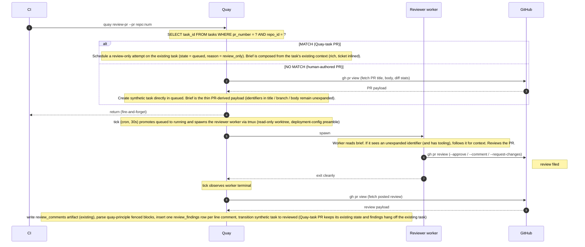
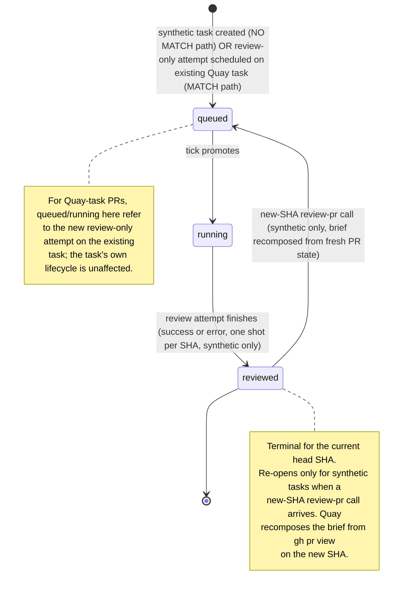

# Quay Spec: PR Review Capture (`quay review-pr` + findings storage)

**Status:** Draft. Not locked. Companion spec to `docs/quay-spec-ticket-validation.md`; second feature spec graduating from `docs/orchestrator-design-notes.md`.

**Implementation order / hard dependency.** This spec **MUST NOT be implemented before** `docs/quay-spec-deployment-adapters.md` (Linear + Slack deployment adapters) lands and is hooked into the task-creation path (`quay enqueue`). Reasoning: the synthetic-task review path needs rich brief composition (Linear ticket body + tags + Slack thread context) to produce reviews of comparable quality to Quay-task reviews. Without adapters, the synthetic path can only carry a thin brief from `gh pr view` and depends on the worker self-serving context per §7 contract piece #6 — acceptable as a fallback when adapters aren't enabled, but not as the primary v1 shape. The right shape on an adapter-enabled deployment is: dispatcher parses identifiers from the PR, calls the same `ticketContext.fetch(...)` primitive used by `quay enqueue --linear-issue`, composes a rich synthetic brief inline, and attaches Linear labels as `task_tags` rows at synthetic-task creation time. Sequencing rationale: the adapter abstraction needs to be proven on the existing enqueue flow (well-understood, narrow surface) before being trusted for the new synthetic-review flow. See §8 "Why no orchestrator hand-off for synthetic tasks" for how this spec accommodates both states (adapters present / adapters absent).

**Required reading:**
- `docs/quay-spec.md` — substrate spec (locked v1).
- `docs/quay-spec-deployment-adapters.md` — Linear + Slack adapter contract (must land first; enables rich synthetic-task brief composition).
- `docs/orchestrator-design-notes.md` §1, §3.1, §3.2, §5, §7 — full rationale, design conversation, and the broader feature shape this spec is a strict subset of.

---

## 1. Goal

Make CI-triggered PR review a first-class operation in Quay. Specifically:

1. CI calls a single Quay command (`quay review-pr --pr <repo>:<num>`) for any PR.
2. Quay dispatches internally between a Quay-task path (the PR has a matching `tasks` row by `pr_number`) and a synthetic-task path (no match — typical for human-authored PRs).
3. Quay spawns a reviewer worker on the appropriate substrate (worktree + tmux + supervisor lock, all unchanged from the v1 substrate spec) and the worker posts a standard GitHub PR review via `gh pr review`.
4. Tick observes the review at GitHub-side and writes structured findings into a queryable SQL table (`review_findings`) alongside the existing `review_comments` artifact.

That is the whole v1 contract of this spec. Findings are *captured* and *stored*; they are not yet *used* by Quay for anything downstream. Whether and how an external consumer eventually uses the stored findings (to enrich future task briefs, to drive a per-tag digest, to feed reviewer-improvement training data) is **explicitly out of v1 scope** — see §13.

This shape is a deliberate scope choice: ship the input pipeline now, defer the output pipeline. See `docs/orchestrator-design-notes.md` §9 for the rationale and the wider design context.

## 2. Scope and non-goals

### In scope (v1)

- `task_tags` table and `--tag` flag on `quay enqueue`. Tags are how findings get clustered later; without them the storage isn't usefully queryable.
- `review_findings` table — structured rows over the existing `review_comments` artifact, populated by tick at review-ingestion time. Includes the full `comment_body` text so workers (and any other consumer) can grep findings via SQL FTS5 without opening artifact files.
- `quay-principle` fenced-block contract from `docs/orchestrator-design-notes.md` §5: reviewers append a fenced block to comment bodies for generalizable rules; tick parses presence/absence and stores the prose in `review_findings.principle`. (Inclusion of this contract in v1 is the only open call — see §14.)
- `quay review-pr --pr <repo>:<num>` as the **single CI-callable entry point**. Fire-and-forget — returns once the review attempt is scheduled.
- Reviewer-as-Quay-worker, single per-PR worker (N=1).
- Reviewer preamble lives in deployment config (`~/.quay/config.toml`-style), git-versioned. No SQL `reviewer_preambles` table in v1.
- Synthetic-task path for human PRs is fully Quay-side: at `quay review-pr` time, Quay composes a thin synthetic brief inline from `gh pr view` (PR title + body + diff stats; identifiers in title / branch / body remain inline as-is, unexpanded). The orchestrator is **not** in this path; deployments without a Hermes orchestrator can review human PRs. The reviewer worker is responsible for following any unexpanded identifiers via available tooling (see §7 contract piece #6).
- One new task state (`reviewed`) and one new attempt reason (`review_only`). No `review_requested` state — there is no async hand-off to wait on, so synthetic tasks land directly in `queued`.
- `attempts.head_sha` column for re-trigger dedup at the attempts level.
- Cron cadence config (recommended 30 s for review-running deployments).
- `max_concurrent_review_runs` capacity config (default 15), independent of the existing `max_concurrent` for code workers.
- One unified read CLI over stored findings: `quay query-findings` with filters for file, directory, tag, repo, recency, principle-only, and FTS5 keyword match. The single self-serve interface for workers, humans, and any external consumer.

### Out of v1 scope

These are explicitly deferred to vNext, with full design captured in `docs/orchestrator-design-notes.md`:

- **Closing the loop.** Brief enrichment, principle injection into future tasks, `--enrich-principles` flag, the `task_enrichment_log` table, the `tasks.raw_brief`/`tasks.brief` split — *none of these are in v1*. Stored findings are queryable via `quay query-findings` (see §6); whoever wants to close the loop builds it as an external consumer over that read surface. The intended v1 consumer is the worker itself: it queries findings on the files it has touched (and/or by keyword) and folds the relevant ones into its own context before requesting review.
- **Multi-model panel review.** N=1 single reviewer only. `review_panelists`, `consolidator_preambles`, the `review_runs` table — all deferred.
- **Blocking mode (`--wait` / `--timeout`).** v1 is fire-and-forget. CI sees the review on GitHub when the reviewer posts it. Rationale: the agent reviewer's false-positive rate is unmeasured; making it a synchronous merge gate before that's known would block real work on bad calls. The state machine doesn't need it either — `pr-open → done` is already CI-driven (`classifyCi` in `src/core/ci_status.ts`), and review verdict has never gated task state. Revisit once a baseline is in hand.
- **Orchestrator-side synthetic-task brief enrichment.** Earlier drafts had Quay create a synthetic task in a `review_requested` state and wait for the orchestrator (push or pull) to compose the brief. v1 drops this entirely: Quay composes a thin synthetic brief inline at `quay review-pr` time, and the worker self-serves any external context it needs via §7 contract piece #6. No `review_requested` state, no `quay submit-review-brief` CLI, no Hermes HTTP receiver, no orchestrator pull-loop responsibility for synthetic tasks. Quay remains opaque to ticket systems; the worker (with its tooling) is where ticket-system knowledge lives. If quality measurements later show the worker's context-fetching discipline is insufficient, push-style enrichment can be added as a v2 graduation.
- **Reviewer-improvement loop.** No `agent_review` artifact, no `reviewer_kind`/`verdict`/`head_sha`/`panelist_id`/`reviewer_login` columns. The corpus that would feed prompt-tuning isn't built in v1.
- **Validation evidence on findings.** Already dropped from the design entirely (see `docs/orchestrator-design-notes.md` §7 "Why no validation step"). No `addressed_by_commit_sha` / `reviewer_re_reviewed_at` / `reviewer_final_verdict`.
- **Multi-repo principles.** Findings are scoped per-repo by their task's repo via JOIN; no cross-repo transfer logic.
- **Tag namespace governance, granularity heuristics.** Tags are opaque strings to Quay; whatever the orchestrator passes is what gets stored.
- **Auto-comment-back to GitHub on review failure.** Worker either posts a review or writes a blocker file; no automated GitHub comment loop.
- **Free-form PR comments and review-comment replies.** Quay observes only `gh pr review` payloads (review body + initial inline comments). PR conversation-tab comments (`gh pr comment` / `issue_comments`) and reply threads under inline review comments are **not ingested** in v1. The agent reviewer is contractually required to file findings via `gh pr review` (see §7); humans wishing to drive a Quay respawn must do the same. Conversation-thread bidirectionality (à la the Slack escalation loop) is not in v1's substrate for PRs.

## 3. Architecture



The dispatch decision lives **entirely inside Quay**. CI's job is exactly one command per PR — no branch-name sniffing, no Quay-vs-human guessing. This keeps CI uniform and decouples it from Quay's task-tracking conventions.

## 4. State machine delta

### New task states



- **`reviewed`** — terminal for synthetic tasks *for the current head SHA*. One shot per SHA: whether the reviewer succeeded or errored, the synthetic task transitions to `reviewed` once the run is logically done. **Re-opens on new-SHA arrival.** If a `quay review-pr` call arrives for the same synthetic task with a different `head_sha` than the most recent attempt, the task transitions `reviewed → queued` and a fresh review-only attempt is scheduled. Quay recomposes the synthetic brief from the new `gh pr view` (cheap; no external dependency). See "How new commits are handled" below for the full case table. This is the **only** transition out of `reviewed`, and it applies **only** to synthetic tasks; Quay-task PRs do not enter `reviewed` at all.

For Quay-task PRs, the existing task lifecycle is **unaffected**. The review attempt is just an additional `attempts` row hung off the task, distinguished by `attempts.reason = 'review_only'`. The task's main lifecycle (driven by code-worker attempts and PR-state transitions per the substrate spec) continues independently.

**No `review_requested` state.** Earlier drafts had synthetic tasks land in `review_requested` and wait for an orchestrator-composed brief. v1 drops this: the synthetic brief is composed inline by Quay from `gh pr view` at `quay review-pr` time, so there's no async hand-off to model. Synthetic tasks land directly in `queued` like any other.

### New attempt reason

`attempts.reason = 'review_only'` distinguishes review attempts from code-worker attempts. Review-only attempts:

- Do not own a worktree exclusively (the worktree is read-only for them; concurrent reads with code workers are not a concern because the substrate spec already serializes worktree-creating events).
- Exit by posting a review on GitHub, not by pushing code or opening a PR.
- Do not consume `max_concurrent` (the code-worker cap) — they consume `max_concurrent_review_runs` instead. See §10.

### `attempts.head_sha`

A new column on the existing `attempts` table:

```sql
ALTER TABLE attempts ADD COLUMN head_sha TEXT;
-- Populated only for review-only attempts. Captures the PR head SHA at the
-- time the review attempt was scheduled. Used by quay review-pr's re-trigger
-- dedup to avoid spawning a second review on the same SHA.
```

NULL for non-review attempts. Always populated for review-only attempts.

### Synthetic task identity

For human-authored PRs (no matching `tasks` row by `pr_number`), the synthetic task uses a **deterministic `task_id`** keyed on `(repo_id, pr_number)`:

```
task_id = "pr-review-" + slug(repo_id) + "-" + pr_number
```

`slug(repo_id)` follows the existing `external_ref_is_slugged_before_use` substrate convention (lowercase, alphanumerics + dashes only, multiple dashes collapsed). Example: `pr-review-inverternetwork-itry-monorepo-847`.

Properties of this choice:

- **One synthetic task per human PR, forever.** Multiple `quay review-pr` calls and multiple pushes against the same PR all resolve to the same `task_id`. New SHAs become new `attempts` rows on the same task.
- **Tags applied once per PR.** Whatever tags get attached to the synthetic task are stable across the PR's lifetime.
- **Findings across SHAs join to the same task.** `quay query-findings --task-id pr-review-...` returns the full review history of the PR.
- **v2-compatible.** When v2's `review_runs` (per-SHA) lands, the synthetic task remains the persistent identity; v2 just adds run-level rows underneath it.

### Re-trigger dedup logic

When `quay review-pr --pr <repo>:<num>` is invoked:

1. Fetch the PR's current head SHA via `gh pr view` (or use `--head-sha` if provided).
2. **Resolve the task_id**, in order:
   - Look up `tasks` for a Quay-task PR by `(repo_id, pr_number)`. If found → use that `task_id` (deterministic path).
   - Otherwise, compute the synthetic `task_id` using the format above. Look up by that `task_id`. If the row exists → use it. If not → fetch `gh pr view`, compose the thin synthetic brief inline, and create the synthetic task directly in `queued` with the review-only attempt staged at the resolved head SHA.
3. **Look up an existing review-only attempt** for `(task_id, head_sha)`:
   - **Found, terminal (any state)**: return its outcome metadata. Don't re-spawn.
   - **Found, non-terminal** (queued / running): return its current state. Don't re-spawn.
   - **Not found** (new SHA, or no prior attempt): branch on the path and current task state:
     - *Deterministic path (Quay-task PR):* schedule a fresh review-only attempt at the new SHA. Task state is unaffected (the task's main lifecycle is independent of review activity).
     - *Synthetic path, task does not yet exist:* fetch `gh pr view`, compose the thin brief inline, create the synthetic task in `queued` with the attempt staged.
     - *Synthetic path, task in `queued` / `running`:* schedule a fresh review-only attempt at the new SHA on top of the existing task. Task state is unaffected.
     - *Synthetic path, task in `reviewed`:* this is a new SHA arriving on a previously reviewed PR. Recompose the brief inline from `gh pr view` on the new SHA (cheap; reflects the current PR title / body / diff), transition `reviewed → queued`, and schedule a fresh review-only attempt at the new SHA. Reset `attempts_consumed = 0` so the new cycle gets its own one-shot budget (per `retry_budget = 1` on synthetic tasks); each SHA is genuinely new work, not a retry of the prior SHA.

The two-step lookup (task_id first, then attempt) is what makes synthetic-task identity stable across calls: step 2 is idempotent in `(repo_id, pr_number)`; step 3 is idempotent in `(task_id, head_sha)`.

This replaces the run-level `UNIQUE(repo_id, pr_number, head_sha)` constraint that the broader design plans for `review_runs` (a v2 table). v1 idempotency lives on `attempts` because `review_runs` is deferred. At v2 cutover, the synthetic task (deterministic `task_id`) stays as-is; new `review_runs` rows are added underneath, keyed `(repo_id, pr_number, head_sha)`.

### How new commits are handled

The trigger surface for re-review on a new commit is **the same as for the initial review**: a caller invokes `quay review-pr --pr <repo>:<num>`. Quay does not poll GitHub — detection is the caller's responsibility. The substrate boundary holds.

**CI is the recommended primary trigger.** A GitHub Actions workflow (one per repo) fires on `pull_request` events (`opened`, `synchronize`, `reopened`) and calls `quay review-pr` with the new head SHA. This works uniformly:

- **Quay-driven PRs.** Even though Quay knows when its own code worker pushed, the tick does **not** fire `review-pr` itself. CI is the single trigger surface — one trigger path, no duplication, Quay's role stays narrow.
- **Human PRs (synthetic tasks).** Same CI workflow runs on every human push; same call shape.

Webhooks, polling cron, and manual `review-pr` invocation are accepted alternatives. The dedup contract on `(task_id, head_sha)` makes repeated calls safe regardless of who triggers them.

#### Outcome by case (Quay-driven PR)

| Case | Action | Task state |
|---|---|---|
| First review for the PR | Schedule review-only attempt | unchanged (typically `pr-open` per substrate spec) |
| Re-trigger same SHA, attempt non-terminal | Return existing attempt id | unchanged |
| Re-trigger same SHA, attempt terminal | Return prior outcome | unchanged |
| Trigger on new SHA after push | Schedule fresh review-only attempt | unchanged |

The task's main lifecycle is driven by code-worker attempts and PR/CI state per the substrate spec — never by review activity. Review-only attempts are side attempts hung off the task; they do not transition it.

#### Outcome by case (synthetic task)

| Case | Action | Task state |
|---|---|---|
| First call ever | Compose thin brief inline (`gh pr view`); create synthetic task with the review-only attempt staged | `queued` |
| Subsequent call, task in `queued` / `running` | Find or schedule attempt for this SHA | unchanged |
| Same-SHA call, task in `reviewed` | Return prior attempt's outcome | `reviewed` |
| **New-SHA call, task in `reviewed`** | Recompose thin brief inline from `gh pr view` on the new SHA; transition `reviewed → queued`; schedule fresh attempt at the new SHA | `queued` (re-opened) |

The last row is the only transition out of `reviewed`. Brief recomposition is cheap (one `gh pr view` call) and reflects the current PR title / body / diff — there is no orchestrator re-brief round-trip because there was no orchestrator hand-off to begin with.

#### Force-pushes mid-review

If a PR is force-pushed while a review attempt is `running`, the worker's worktree no longer matches the new head SHA. Per the reviewer preamble, the worker writes `.quay-blocked.md` and exits without posting. The next `review-pr` call (CI fires on the force-push as a `synchronize` event) flows through the dedup chain normally and spawns a fresh attempt at the new SHA.

#### Storage view across SHAs

A PR reviewed at three SHAs ends up with: 1 task row, 3 `attempts` rows (each with its own `head_sha`), and N `review_findings` rows referencing those attempts.

Older findings from earlier SHAs **stay searchable** via FTS5 and `quay query-findings`. v1 does not mark them "stale" or filter them out — principles are SHA-agnostic, and locus-bearing findings on lines that have moved or been changed remain useful as historical context for future work in the same area. Stale-marking is a v2 concern, only if it becomes one.

#### No re-review-against-prior-review mode in v1

Each Quay review attempt is **fresh**. The reviewer worker reviews the PR as it stands at the supplied head SHA — it does not read its prior review, does not generate `✅ resolved` callouts, does not produce a delta against the previous review.

Practical consequences:

- If the author fixed three blocking issues from the prior review, the new review simply doesn't repeat them.
- If they fixed two of three, the new review re-raises the one they didn't fix.
- The interactive `/review-pr` skill's "Re-Review" block (with strikethrough resolved items) is **not** in v1; it's a v2 nicety.

This is intentional: the v1 reviewer is stateless across SHAs, which keeps the worker contract simple and avoids cross-attempt context-passing logic in v1.

## 5. Schema additions

### `task_tags`

```sql
CREATE TABLE task_tags (
  task_id TEXT NOT NULL REFERENCES tasks(task_id),
  tag TEXT NOT NULL,
  created_at TEXT NOT NULL,
  PRIMARY KEY (task_id, tag)
);
CREATE INDEX task_tags_by_tag ON task_tags(tag);
```

Tags are **opaque strings** to Quay. Quay does not interpret, validate (beyond charset enforced by the ticket-validation spec), or take action on tag values. Same shape as `external_ref` today.

### `review_findings`

```sql
CREATE TABLE review_findings (
  finding_id INTEGER PRIMARY KEY AUTOINCREMENT,
  task_id TEXT NOT NULL REFERENCES tasks(task_id),
  attempt_id INTEGER REFERENCES attempts(attempt_id),
  review_id TEXT NOT NULL,         -- GH review id (numeric, stringified)
  principle TEXT,                  -- prose extracted from quay-principle fenced block; NULL when absent
  comment_body TEXT NOT NULL,      -- full original comment body (or review body for review-body findings)
  file_path TEXT,                  -- from the GH line comment; NULL for review-body findings
  line_number INTEGER,             -- from the GH line comment; NULL for review-body findings
  source_url TEXT NOT NULL,        -- deep link to the comment / review
  captured_at TEXT NOT NULL
);
CREATE INDEX review_findings_by_principle ON review_findings(principle);
CREATE INDEX review_findings_by_task ON review_findings(task_id);
CREATE INDEX review_findings_by_file ON review_findings(file_path);

-- FTS5 virtual table over the searchable text columns. Workers query this via
-- `quay query-findings --match <fts-query>` (see §6). Triggers below keep it
-- in sync with the source table.
CREATE VIRTUAL TABLE review_findings_fts USING fts5(
  principle,
  comment_body,
  content='review_findings',
  content_rowid='finding_id'
);

CREATE TRIGGER review_findings_ai AFTER INSERT ON review_findings BEGIN
  INSERT INTO review_findings_fts(rowid, principle, comment_body)
  VALUES (new.finding_id, new.principle, new.comment_body);
END;
CREATE TRIGGER review_findings_ad AFTER DELETE ON review_findings BEGIN
  INSERT INTO review_findings_fts(review_findings_fts, rowid, principle, comment_body)
  VALUES ('delete', old.finding_id, old.principle, old.comment_body);
END;
CREATE TRIGGER review_findings_au AFTER UPDATE ON review_findings BEGIN
  INSERT INTO review_findings_fts(review_findings_fts, rowid, principle, comment_body)
  VALUES ('delete', old.finding_id, old.principle, old.comment_body);
  INSERT INTO review_findings_fts(rowid, principle, comment_body)
  VALUES (new.finding_id, new.principle, new.comment_body);
END;
```

This table is **structured rows + searchable text** — a deliberate small departure from the "pure index" framing in `docs/orchestrator-design-notes.md` §3.2. The earlier framing kept comment prose only in the artifact JSON to avoid duplication; this spec stores `comment_body` in SQL too so workers (and any other consumer) can issue a single keyword + filter query against SQLite via `quay query-findings`, without opening artifact files. The cost is ~2 KB of duplication per finding (rounding error at any reasonable corpus size); the benefit is **indexed full-text search at any corpus size** instead of linear scan over JSON files, plus a single-store read path for the worker workflow.

The `review_comments` artifact (existing in v1 substrate) is unchanged. It still snapshots the full GitHub review payload as JSON — including review-level body, verdict, all GitHub metadata, and the full ordered comment list. The artifact is the archival record (useful if SQL ever needs to be re-derived, or for full-context debugging); workers do not read it directly.

#### Source-of-truth invariant

The `review_comments` artifact is **authoritative**. The SQL columns (`comment_body`, `principle`) and the FTS5 index are **derived** views of the artifact, populated by tick at ingestion time.

- On any conflict between artifact and SQL (bug, partial write, manual fixup), the artifact wins.
- If schema or parsing changes, the SQL/FTS state can be re-derived by replaying tick ingestion against existing artifacts. No data is lost.
- Tick is the only writer of `review_findings` rows; nothing else mutates them. The artifact remains immutable once written (substrate-spec invariant, unchanged).

This invariant exists because the spec deliberately duplicates prose into SQL for grep ergonomics. Pinning the artifact as authoritative keeps the duplication a derived view rather than a divergent second copy.

#### About FTS5

FTS5 is SQLite's built-in full-text search module. Reference: <https://www.sqlite.org/fts5.html>. Quick orientation for readers new to it:

- **What it is.** A virtual-table type that stores an inverted index (word → list of rows containing that word). Queries are SQL: `... WHERE review_findings_fts MATCH 'retr*'`.
- **Why it instead of `LIKE '%retr%'`.** `LIKE` does a linear scan of the column. FTS5 does an indexed lookup. At small corpus sizes the difference is invisible; beyond ~1000 findings on broad keyword queries, FTS5 is orders of magnitude faster. Because the corpus grows monotonically, ship FTS5 from day 1.
- **Query syntax** (most-used subset): bare words (`retries`); prefix (`retr*`); phrase (`"with retries"`); Boolean (`auth AND cache`, `lint OR style`, `retries NOT timeout`); proximity (`NEAR(api network, 5)`); column-scoped (`{principle}: rule`). Full grammar at the link above.
- **Tokenizer.** This spec uses **the default `unicode61` tokenizer** (case-insensitive, Unicode-aware word splitting, no stemming). Switching to `porter` (English stemming, e.g. `running` matches `run`) or `trigram` (substring matching) is a deployment-config choice deferred to a future spec — the column declaration becomes `USING fts5(principle, comment_body, content='review_findings', content_rowid='finding_id', tokenize='<choice>')`. Default is correct for v1; the choice is reversible (drop and recreate the FTS table; data isn't lost because the source rows are in `review_findings`).
- **Triggers** (declared above) keep the FTS index in sync with the source table on every INSERT/UPDATE/DELETE. The FTS index is a *contentless* virtual table (`content='review_findings', content_rowid='finding_id'`): it stores only the index, not a second copy of the text. The text lives once in `review_findings.comment_body`.
- **Ranking.** FTS5 ships BM25 ranking via the `bm25(review_findings_fts)` function. v1 doesn't currently expose rank to `quay query-findings` callers (results come back in insertion order); adding `--rank-by relevance` is a small future addition if needed.

Row-population rules:

- One row per GH line comment, regardless of whether a `quay-principle` block is present (`principle IS NULL` then; `comment_body` always populated).
- One row per review-body if a `quay-principle` block is in the review body (`file_path` / `line_number` both NULL; `comment_body` set to the review body text).
- The full review's verdict, summary metadata, and other GitHub fields live only in the artifact JSON.

`review_id` aligns with the existing `last_review_id_acted_on` field on tasks, used by tick to dedup ingestion of the same review.

### Existing tables — what this spec changes

Verified against `migrations/0001_init.sql` (the locked v1 substrate migration). Listed precisely so an implementer knows exactly what's already there vs. what this spec adds.

**Already in `tasks` (used by this spec, no change needed):**

- `task_id TEXT PRIMARY KEY` — used as the synthetic task identity (per §4 "Synthetic task identity").
- `repo_id TEXT NOT NULL REFERENCES repos(repo_id)` — used by the dispatch SQL.
- `external_ref TEXT` — left NULL on synthetic tasks (the design's marker for "this isn't a Linear-driven task").
- `state TEXT NOT NULL` — substrate has no CHECK constraint, so adding the new value (`reviewed`) is **code-level only**, no migration.
- `pr_number INTEGER` — used by the dispatch SQL.
- `pr_url TEXT` — populated for synthetic tasks (the Linear-style task path uses it post-PR-open; review-only synthetic tasks set it at creation from `gh pr view`).
- `head_sha TEXT` — substrate field; populated on synthetic tasks at creation. Not used for review-only attempt dedup (see §4 — that uses `attempts.head_sha`).
- `branch_name TEXT NOT NULL` — substrate requires this. For synthetic tasks, set to the PR's source branch (read via `gh pr view --json headRefName`).
- `tmux_id TEXT NOT NULL` — substrate requires this. For synthetic tasks, derive from the synthetic `task_id` per the §13 substrate convention.
- `worktree_path TEXT NOT NULL` — substrate requires this. For synthetic tasks, set to `~/.quay/worktrees/<synthetic_task_id>/`. The worktree is created when the review attempt is promoted to `running` (read-only checkout of the PR's head SHA).
- `last_review_id_acted_on TEXT` — already used by the substrate for code-worker review respawns. Reused here for tick-ingestion dedup of review-only attempts.
- `retry_budget INTEGER NOT NULL` — set to 1 on synthetic tasks (one-shot review *per SHA cycle*). `budget_exhausted` and `attempts_consumed` follow standard substrate semantics within a cycle. On re-open via new SHA (§4 "How new commits are handled"), `attempts_consumed` is reset to 0 so the new cycle gets a fresh one-shot budget. `retry_budget` itself is left at 1 — each cycle is a one-shot, not a cumulative retry pool.

**Already in `attempts` (used by this spec, no change needed):**

- `attempt_id`, `task_id`, `attempt_number`, `preamble_id`, `template_id`, `tmux_session`, `spawned_at`, `ended_at`, `exit_kind`, `kill_intent` — all used as in the substrate spec, unchanged.
- `reason TEXT NOT NULL` — substrate has no CHECK constraint. Adding the new value `'review_only'` is **code-level only**, no migration. Note: the substrate already has `reason = 'review'` for code-worker respawns triggered by `CHANGES_REQUESTED` reviews — that's a *different* concept (a code worker re-running on the same task); `review_only` is for the reviewer worker itself. The two coexist.

**Added by this spec (require a new migration, e.g., `migrations/0002_pr_review.sql`):**

- `attempts.head_sha TEXT` (new column, NULL for non-review attempts; populated at scheduling time for review-only attempts; used for re-trigger dedup per §4).
- `task_tags` table (per §5).
- `review_findings` table (per §5).
- `review_findings_fts` virtual table + the three FTS5 sync triggers (per §5).

**Explicitly *not* added by this spec:**

No `tasks.raw_brief`/`tasks.brief` split, no `task_enrichment_log` table, no `reviewer_preambles` table, no `review_runs` table, no `review_panelists` table, no `consolidator_preambles` table, no validation-evidence columns.

## 6. CLI surface

### `quay review-pr` (CI-callable)

```
quay review-pr --pr <repo>:<num> [--head-sha <sha>]
```

- `--pr <repo>:<num>` — the PR to review. `repo` matches a configured repo; `num` is the PR number.
- `--head-sha <sha>` (optional) — pin to a specific SHA. Default: read current head SHA via `gh pr view`.

Behavior:

1. Resolve `(repo_id, pr_number, head_sha)`.
2. Apply re-trigger dedup logic (§4). If a matching attempt exists, return its status JSON and exit.
3. Look up `task_id` by `(repo_id, pr_number)`. Match → deterministic path; no match → synthetic-task creation directly in `queued`.
4. For deterministic path: compose brief from task context (existing brief, attempts history, ticket snapshot if present), schedule the review-only attempt with `head_sha` set.
5. For synthetic path: fetch `gh pr view` (title, body, diff stats); compose a thin synthetic brief inline (the brief carries identifiers from the PR title / branch / body verbatim, unexpanded — the worker is responsible for following them per §7 contract piece #6); create the `tasks` row with no `external_ref`, `pr_number` set, in `queued` state with the review-only attempt staged.
6. Return a JSON object describing the scheduled or attached attempt:

```json
{
  "task_id": "task-abc123",
  "attempt_id": 47,
  "head_sha": "9f3a...",
  "state": "queued",
  "path": "deterministic" | "synthetic"
}
```

Exit code `0` on successful scheduling (or successful attach to existing). Non-zero on infrastructure failure (including `gh pr view` failure during synthetic brief composition — Quay does not create a synthetic task without a brief).

**Idempotent.** Calling twice on the same SHA returns the same `attempt_id` both times.

### `quay enqueue --tag` (existing command, new flag)

```
quay enqueue ... --tag <name> [--tag <name> ...]
```

Repeatable. Each tag is stored in `task_tags`. Tags also end up embedded in the `ticket_snapshot` artifact (per the existing artifact convention) so the historical record survives later mutations of the live row.

### `quay query-findings` (read; the worker self-serve interface)

The single read surface over `review_findings`. All filters AND-combine; FTS5 keyword match is layered on top of the structural filters. Output is NDJSON, one finding per line, fields per the §5 schema.

```
quay query-findings \
  [--file <path>]            # exact file_path match (repeatable; OR-semantics within --file)
  [--dir <prefix>]            # file_path LIKE 'prefix%' (repeatable; OR-semantics within --dir)
  [--tag <name>]              # JOIN through task_tags (repeatable; AND-semantics within --tag)
  [--repo <repo_id>]          # only findings on tasks in this repo
  [--task-id <id>]            # all findings on a specific task (e.g., this attempt's prior attempts)
  [--since <YYYY-MM-DD>]      # captured_at >= ...
  [--principle-only]          # WHERE principle IS NOT NULL
  [--match <fts-query>]       # FTS5 query against principle + comment_body
  [--limit <n>]               # default: 100
  [--json]                    # default ON; reserved flag for future formats
```

Examples (the worker's typical patterns):

```bash
# All findings on the file the worker is editing
quay query-findings --file packages/auth/session.ts

# All findings under a directory subtree
quay query-findings --dir packages/auth/

# Keyword search across principle + comment text
quay query-findings --match 'retr* AND (api OR network)'

# Combine filters: tag + recent + keyword
quay query-findings --tag pricing --since 2026-01-01 --match 'cache OR stale'

# All findings on this task's prior attempts (retry-brief composition)
quay query-findings --task-id task-abc123
```

The CLI is also exposed as a library function (`queryFindings(options): Finding[]`) for in-process callers. Both surfaces wrap the same SQL.

### What's *not* on the v1 CLI

Explicitly not shipped in v1, even though earlier design drafts had them:

- `quay review-pr --wait` / `--timeout` (blocking mode — deferred).
- `quay enqueue --enrich-principles` (the splice flag — deferred; v1 has no auto-enrichment).
- A separate `quay query-principles` (subsumed by `quay query-findings --principle-only`).
- `quay artifact list --kind review_findings ...` and `quay task review-findings <task_id>` (earlier draft surfaces; consolidated into `quay query-findings --tag` and `quay query-findings --task-id` respectively).

## 7. Reviewer worker contract

The reviewer worker is a Quay-spawned worker just like a code worker, but with a different preamble and a different exit condition. Differences from the code-worker contract in `docs/quay-spec.md` §6:

- **Preamble source.** `~/.quay/config.toml` (or override via `QUAY_CONFIG_DIR`) has a `[reviewer]` section with a `name` field and a `preamble = "..."` field. Read at worker spawn time. Quay ships **one default named `reviewer-default`**, with prose pinned at `docs/quay-reviewer-preamble-default.md` (also installed at `<quay-install>/preambles/reviewer-default.md`). Deployments override the prose by replacing the `preamble` field in their config; the `name` field stays stable across deployments and is what v2 uses as the row key when it promotes preambles to a SQL table (§14). Loading the preamble goes through one function (`getReviewerPreamble(name)`) so v2's switch from config to SQL is a single swap point.

  The pinned default preamble enforces the six contract pieces below (read-only worktree, prefer line comments, `quay-principle` fenced block on generalizable findings, post via `gh pr review` and exit, `.quay-blocked.md` on blockers, follow external identifiers when tooling permits). Deployments overriding the prose are responsible for preserving these contracts; if any is dropped, downstream Quay behavior breaks (e.g., findings stop populating `review_findings.principle`, locus is lost, synthetic-task reviews lose their fallback path to ticket context, etc.). The contract requirements below are the minimum any preamble must satisfy.

##### Preamble contract requirements (every reviewer preamble must enforce these)

1. **Read-only on the worktree.** No code modifications, no commits, no pushes, no branch switches. (Exception: writing `.quay-blocked.md` per piece 5.)
2. **Prefer GitHub line comments over the review body.** Findings tied to specific code go as line comments (so `review_findings.file_path` and `line_number` populate). Review-body comments are accepted only for genuinely PR-wide observations.
3. **`quay-principle` fenced block on generalizable findings.** When a finding expresses a transferable rule, append a fenced block in the exact format ` ```quay-principle ` … ` ``` ` to the comment body containing the rule prose. One judgment per comment; block is optional; principle is prose, not a slug; no metadata.
4. **Post via `gh pr review` and exit.** The agent posts directly (autonomous; no human confirmation step). Verdict mapping: any blocking finding → `--request-changes`; only non-blocking → `--comment`; clean → `--approve` with body `lgtm!` (lowercase). After posting, exit cleanly.
5. **Use `.quay-blocked.md` if unable to proceed.** If the agent cannot complete the review (missing context, broken state, force-push mid-review, etc.), write `.quay-blocked.md` in the worktree root with a one-line summary and what's needed to proceed; exit without calling `gh pr review`.
6. **Brief is canonical context; only fetch identifiers the brief leaves unexpanded.** The brief is the source of truth for upstream context. If the brief contains a context section for a referenced identifier (a "Ticket Context" block, "Issue Context" block, etc. — Quay-task briefs always inline the originating ticket body this way), treat that as canonical and **do not re-fetch**. If the brief references identifiers that are *not* expanded inline (typical of synthetic-task briefs, which carry only PR title / body / diff stats; also possible on Quay-task briefs that mention a related ticket the orchestrator didn't follow), use available tooling to fetch them as additional context. Best-effort: missing or unavailable tooling is not a blocker. Rationale: avoids token-wasteful re-fetching of context the brief already provides, while still letting synthetic reviews acquire ticket context that Quay can't compose itself (Quay is opaque to ticket systems by design).

The shipped default preamble prose covers all six plus substantive review guidance (strict reviewer mindset, codebase-pattern check before flagging, domain watchlist, noise-comment guidance, line-number-accuracy verification). See `docs/quay-reviewer-preamble-default.md` for the full text — note that the default preamble doc itself needs a follow-up edit to add the external-identifier-following clause; spec is the contract, preamble is its prose realization.
- **Workspace boundary.** Read-only on the worktree. The reviewer reads files for context but does not modify them.
- **Exit condition.** Post a review **directly** via `gh pr review --request-changes` / `--comment` / `--approve` (with line-level comments where applicable), then exit cleanly. No PR creation, no push, no branch ownership, no commit. The worker writes the review to GitHub itself; v1 does **not** route through an output file or a separate post step. (v2's panelist+consolidator design splits this into "panelist writes file, consolidator posts" — that refactor is explicitly v2 work, see §14.)
- **Output convention.** For each line comment that expresses a generalizable rule, append a fenced ` ```quay-principle ` block to the comment body containing the principle prose. Per `docs/orchestrator-design-notes.md` §5: one judgment call per comment ("is there a transferable rule here, yes/no?"). No metadata, no scope, no booleans.
- **Blocker file (`.quay-blocked.md`)** still applies for "I can't review this for some reason" — same flow as code workers, routed through the orchestrator-pickup path.
- **Tmux session naming.** `quay-review-<task_id>-<attempt_id>` to distinguish from code-worker sessions (`quay-<task_id>-<attempt_id>`).

The reviewer's preamble is the only Quay-versioned contract enforcement point. v1 ships a default preamble that includes the `quay-principle` fenced-block instruction.

## 8. Trigger and dispatch

### Two paths, one entry point

CI's behavior is uniform: call `quay review-pr --pr <repo>:<num>` for every PR. No branch-name inspection, no Quay-vs-human conditional logic on the CI side.

```
                quay review-pr --pr <repo>:<num>
                         │
                         ▼
            SELECT task_id FROM tasks
              WHERE pr_number = ? AND repo_id = ?
                         │
                ┌────────┴────────┐
                │                 │
              MATCH            NO MATCH
                │                 │
                ▼                 ▼
    Deterministic path     Synthetic-task path
    ─────────────────      ──────────────────────────────
    Compose brief from     gh pr view → compose thin brief
      task context           inline (PR title + body +
      (existing brief,       diff stats); identifiers in
       attempts history,     title / branch / body remain
       ticket snapshot)      unexpanded — worker follows
    Schedule review-         them per §7 contract piece #6.
      only attempt with    Look up or create tasks row with
      head_sha set           deterministic task_id:
                               pr-review-<repo>-<num>
                               - external_ref: NULL
                               - pr_number: <num>
                               - state: queued
                             (only on first call; subsequent
                             calls find the existing row and
                             reuse it via the re-trigger
                             logic in §4).
```

Both paths converge at `state = queued` directly. From there, tick (at the configured cadence) promotes to `running` and spawns the worker.

#### Synthetic-task brief composition (adapter-aware)

Earlier drafts had Quay create the synthetic task in a `review_requested` state and wait for an orchestrator (push or pull) to compose an enriched brief. This spec drops that entirely. Synthetic-brief composition happens **inline at `quay review-pr` time**, using one of two paths depending on whether the deployment has Linear/Slack adapters enabled (per `docs/quay-spec-deployment-adapters.md`):

**Path A — adapters enabled (the canonical path; required by this spec's hard dependency on the adapter spec):**

- Dispatcher parses the PR's title / branch / body for identifiers (Linear keys, etc.).
- For each identifier, calls the same `ticketContext.fetch(...)` primitive used by `quay enqueue --linear-issue`.
- Composes a **rich** synthetic brief inline: PR title + body + diff stats, plus a Ticket Context block per fetched identifier (Linear ticket body, Slack thread context, etc.) — same brief format the orchestrator produces for Quay-task PRs at enqueue time.
- Inserts Linear labels as `task_tags` rows for the synthetic task at creation time. (Implies symmetric tag treatment with Quay-task PRs.)
- Worker reads the brief's Ticket Context blocks as canonical per §7 contract piece #6 — no re-fetching.

**Path B — adapters not enabled (fallback shape; documented for forward-compat and for non-Linear/Slack deployments):**

- Dispatcher composes a **thin** synthetic brief from `gh pr view` only: PR title + body + diff stats. Identifiers in the title / branch / body remain unexpanded.
- No `task_tags` rows on the synthetic task.
- Worker self-serves via §7 contract piece #6 — if it has Linear MCP / GitHub issues / internal RFC docs tooling in its environment, it fetches identifiers itself.

**Why this shape**

- **Quay-task briefs always inline ticket content** at enqueue time (whether composed by the orchestrator or by `quay enqueue --linear-issue` via adapters), so the worker reads the brief's Ticket Context block as canonical and skips re-fetching for the primary identifier. Path A makes synthetic briefs symmetric; Path B keeps the spec implementable in deployments that don't ship the adapters.
- **No `review_requested` state.** Brief composition is synchronous in both paths; no async hand-off to model.
- **No orchestrator dependency on the synthetic-task path.** Adapters live in Quay (per the adapter spec); Hermes shrinks to a watcher loop that calls `quay enqueue --linear-issue` for new tickets. Synthetic review needs neither the orchestrator nor any push-style mechanism.
- **Contract piece #6's brief-aware framing handles both paths uniformly.** The worker doesn't need to know whether the deployment runs adapters; it reads the brief's structure and acts accordingly (rich → don't re-fetch, thin → fetch what's missing).

The spec **assumes Path A at implementation time** (per the implementation-order dependency at the top of this doc); Path B is the documented fallback for deployments that don't enable adapters.

## 9. Tick ingestion

When tick observes that a review-only attempt has terminated, it ingests the review:

1. Call `gh pr view <pr> --json reviews` (or equivalent) to fetch the latest review payload.
2. Filter to the latest review by the Quay reviewer (matched by `gh` user). Skip if `latest_review_id == last_review_id_acted_on` for this task (existing dedup).
3. Write the full payload as a `review_comments` artifact. **No change to v1 substrate spec's existing artifact handling.**
4. **Parse `quay-principle` fenced blocks** and write `review_findings` rows. For every row, `comment_body` is the full original comment text (the FTS5 triggers populate the search index automatically):
   - Each line comment body — emit one `review_findings` row with `file_path`, `line_number`, `source_url`, `comment_body` set; `principle` populated from the fenced block (NULL if no block).
   - The review body — emit at most one `review_findings` row with `file_path`, `line_number` both NULL; `comment_body` set to the review body text; `principle` populated from the block. (Skip if the body has no fenced block; review-body findings without a principle are not stored — there's nothing actionable to index.)
5. Update `tasks.last_review_id_acted_on` to the ingested review's id.
6. For synthetic tasks: transition to `reviewed`. For Quay-task PRs: no task-state change; the existing task lifecycle is unaffected by the review.

The parser for `quay-principle` blocks is straightforward and deterministic (per `docs/orchestrator-design-notes.md` §5):

- Walk the comment body looking for ```` ```quay-principle ```` blocks.
- Extract the prose between the opening and closing fence.
- Trim leading/trailing whitespace.
- If multiple blocks exist in one comment, accept the first one and warn (multiple-principle-per-comment is undefined; the reviewer contract is one principle per comment).
- Empty fenced block → treat as absent (`principle = NULL`).

## 10. Capacity and cadence

### `max_concurrent_review_runs` (default 15)

Caps review-only attempts in any non-terminal state (`queued`, `running`). Independent of `max_concurrent`. Tick checks the cap when promoting a `queued` review attempt to `running`; if at the cap, the attempt waits for the next tick.

Why a separate cap (not the existing `max_concurrent`):

| | Code worker | Reviewer worker |
|---|---|---|
| Worktree | Owns one (heavy: clone + install) | Read-only on a shared worktree |
| Disk churn | `node_modules`, build artifacts, test outputs | None |
| Compute | `tsc`, builds, test runs | Read files, make LLM calls |
| Local resource cost | High | Low |
| Real bottleneck | Host hardware | LLM-API rate limits / budget |

`max_concurrent` (default 2) protects the host. `max_concurrent_review_runs` (default 15) is an LLM-quota / budget safety net. Operators with tight LLM budgets tighten it; with bigger budgets, raise it.

### Cron cadence (recommended 30 s)

Each tick-spacing in the review path waits up to one cron cycle. With Quay's default 5 min cron, worst-case latency stacks unacceptably; a review-running deployment should tighten cron to 30 s. This is a deployment-config change (`crontab` / `systemd timer` / `launchd`) — no Quay code change.

At 30 s cadence, end-to-end review latency is ~3.5 min average, ~8.5 min realistic worst case. See `docs/orchestrator-design-notes.md` §7 "Tick cadence" for the full table.

## 11. Worked example

A hypothetical Quay-task PR. Suppose Quay enqueued a task tagged `auth-session, cache` for a feature implementation; the worker pushed `pr_number = 847` to repo `iTRY-monorepo`.

### Step 1: CI calls Quay

After CI's normal checks pass, the workflow fires:

```yaml
- run: quay review-pr --pr InverterNetwork/iTRY-monorepo:847
```

### Step 2: Quay dispatches

```sql
SELECT task_id FROM tasks
  WHERE pr_number = 847 AND repo_id = 'iTRY-monorepo';
-- → task-abc123 (matches; deterministic path)
```

Quay composes a review brief from `task-abc123`'s context (ticket snapshot, prior attempts, code-worker brief, etc.), schedules a review-only attempt with `head_sha = 9f3a...`, and returns:

```json
{
  "task_id": "task-abc123",
  "attempt_id": 47,
  "head_sha": "9f3a...",
  "state": "queued",
  "path": "deterministic"
}
```

CI's call returns successfully (exit 0). The CI workflow moves on.

### Step 3: Tick promotes and spawns

Within 30 s (one cron cycle), tick sees `attempt 47` in `queued` and at-or-below the `max_concurrent_review_runs` cap. It:

- Reads the deployment-config reviewer preamble.
- Spawns a tmux session `quay-review-task-abc123-47` with the agent CLI invocation.
- Worker reads brief, reads worktree files, reads PR diff via `gh pr diff`.

### Step 4: Worker posts review

After several minutes, the worker invokes:

```bash
gh pr review 847 --request-changes \
  --body "..." \
  --comment "Wrap this fetch call with withRetries() ..." # at packages/.../yield-stats.service.ts:142
  ...
```

The line comment body includes a `quay-principle` fenced block:

````
This `fetch` call should be wrapped in `withRetries()`.

```quay-principle
External API calls in service code must use `withRetries()` because flaky
networks cause cascading failures across our async pipeline.
```
````

Worker exits cleanly.

### Step 5: Tick ingests

Next tick observes the worker's tmux session terminal:

- Calls `gh pr view 847 --json reviews`.
- Finds the new review (`review_id = 9876`).
- Writes a `review_comments` artifact with the full payload.
- Parses each line comment for a `quay-principle` block.
- Inserts into `review_findings`:

| finding_id | task_id      | attempt_id | review_id | principle                        | comment_body | file_path                                       | line_number | source_url                                              |
|-----------:|--------------|-----------:|-----------|----------------------------------|---|-------------------------------------------------|------------:|---------------------------------------------------------|
|         142 | task-abc123  |         47 | 9876      | "External API calls in service…" | "This `fetch` call should be wrapped in `withRetries()`. \`\`\`quay-principle …\`\`\`" | packages/app/src/services/yield-stats.service.ts |         142 | https://github.com/.../pull/847#discussion_r9876543      |
|         143 | task-abc123  |         47 | 9876      | NULL                              | "This variable name is confusing — consider `lastCompletedTimestamp`." | packages/app/src/services/yield-stats.service.ts |         87  | https://github.com/.../pull/847#discussion_r9876612      |

Two rows: one principle-bearing, one localized comment without a fenced block. Both have `comment_body` populated; only the first has `principle`. The FTS5 triggers automatically index both `principle` and `comment_body` for keyword queries.

### Step 6: A worker on a future task self-serves findings

Months later, an agent worker is implementing a new task touching `packages/app/src/services/yield-stats.service.ts`. As part of its workflow (per the deployment's worker preamble), it queries past findings on the file before requesting review:

```bash
quay query-findings --file packages/app/src/services/yield-stats.service.ts
```

Returns NDJSON of every past finding on that file, including the two rows above. The worker reads them, decides which apply to its current changes, and addresses or explicitly notes them in its PR description.

If the worker is unsure what to query for and wants keyword-style search across the corpus:

```bash
quay query-findings --tag pricing --match 'retr* OR (api AND flaky)' --since 2026-01-01
```

The FTS5 query hits both `principle` and `comment_body`. What the worker does with the results is its judgment call — Quay's contract ends at returning the rows.

## 12. Test plan (red tests)

Tests live under `tests/pr-review/`. Each name maps to one test.

### CLI dispatch

| Test name | Proves |
|---|---|
| `test_review_pr_deterministic_path_finds_quay_task` | `quay review-pr` with PR matching a `tasks` row schedules a review-only attempt against that task. |
| `test_review_pr_synthetic_path_creates_queued_task_with_inline_brief` | `quay review-pr` with PR matching no `tasks` row fetches `gh pr view`, composes a thin synthetic brief inline (PR title + body + diff stats; identifiers preserved verbatim, unexpanded), and creates the synthetic task directly in `queued` with the review-only attempt staged. No `review_requested` state. |
| `test_review_pr_synthetic_path_fails_closed_when_gh_pr_view_fails` | If `gh pr view` fails during synthetic brief composition, `quay review-pr` returns non-zero and creates **no** `tasks` row (Quay refuses to create a synthetic task without a brief). |
| `test_review_pr_returns_json_with_attempt_state` | Output is parseable JSON with `task_id`, `attempt_id`, `head_sha`, `state`, `path`. |
| `test_review_pr_idempotent_on_same_head_sha` | Two calls with same `(repo, pr, head_sha)` return the same `attempt_id`; only one review attempt is scheduled. |
| `test_review_pr_new_sha_spawns_fresh` | Call with a different `head_sha` (after a push) schedules a new review-only attempt. |
| `test_review_pr_resolves_head_sha_from_gh_when_not_specified` | Without `--head-sha`, Quay reads the current PR head from `gh pr view`. |

### State machine

| Test name | Proves |
|---|---|
| `test_reviewed_is_a_valid_task_state` | Synthetic tasks can be transitioned to `reviewed`; existing list/get queries handle the new state. |
| `test_review_only_attempt_carries_head_sha` | Review-only attempts populate `attempts.head_sha`; non-review attempts leave it NULL. |
| `test_synthetic_task_transitions_to_reviewed_on_terminal` | After review ingestion, the synthetic task is in `reviewed`. |
| `test_synthetic_task_reopens_to_queued_on_new_sha` | `quay review-pr` against a synthetic task in `reviewed` with a new `head_sha` recomposes the brief inline from `gh pr view`, transitions the task `reviewed → queued`, schedules a fresh review-only attempt at the new SHA, and resets `attempts_consumed = 0`. |
| `test_synthetic_task_same_sha_call_when_reviewed_returns_prior_outcome` | `quay review-pr` against a synthetic task in `reviewed` with the same `head_sha` as the prior attempt returns the prior outcome and does not re-spawn. |
| `test_quay_task_lifecycle_unaffected_by_review` | Quay-task PR's task does not change state because of review ingestion. |
| `test_quay_task_new_sha_schedules_fresh_review_only_attempt` | `quay review-pr` against a Quay-task PR with a new `head_sha` schedules a new review-only attempt without changing task state. |

### Tick + reviewer worker

| Test name | Proves |
|---|---|
| `test_tick_promotes_queued_review_attempt_to_running` | Tick observes a queued review-only attempt and spawns the reviewer worker. |
| `test_tick_respects_max_concurrent_review_runs` | When at cap, tick does not promote additional review attempts. |
| `test_tick_does_not_share_slot_with_max_concurrent` | A code-worker run and a review run can be concurrent without one starving the other. |
| `test_reviewer_worker_session_name_uses_review_prefix` | Tmux session name pattern is `quay-review-...`, distinct from code-worker session names. |
| `test_reviewer_worker_preamble_loaded_from_config` | Worker reads its preamble from the deployment config file. |
| `test_reviewer_worker_blocker_file_routes_to_orchestrator` | A `.quay-blocked.md` written by the reviewer surfaces via the existing orchestrator-pickup path. |

### Findings ingestion

| Test name | Proves |
|---|---|
| `test_tick_writes_review_comments_artifact_on_ingestion` | The full review payload is captured (existing v1 substrate behavior, unchanged). |
| `test_tick_inserts_one_review_finding_per_line_comment` | One row per GH line comment in the review. |
| `test_review_finding_comment_body_populated` | `comment_body` is the full original line-comment text, not just the principle. |
| `test_review_finding_principle_populated_from_fenced_block` | Comment body containing a ` ```quay-principle ` block → row's `principle` is the block prose. |
| `test_review_finding_principle_null_when_no_fenced_block` | Comment body without the block → row's `principle` is NULL. |
| `test_review_body_principle_inserted_with_null_locus` | Review body containing the block → one row with `file_path` and `line_number` both NULL, `comment_body` set to the review body text. |
| `test_review_body_without_principle_inserts_no_row` | Review body without the block → no row from the body (only line-comment rows). |
| `test_tick_dedup_skips_already_ingested_review` | If `latest_review_id == last_review_id_acted_on`, ingestion is skipped. |
| `test_tick_handles_empty_fenced_block_as_null_principle` | An empty `quay-principle` block → row stored with `principle` = NULL. |
| `test_fts_index_populated_on_insert` | After a `review_findings` insert, the FTS5 virtual table contains the row's `principle` and `comment_body` text. |
| `test_fts_index_updated_on_update` | Updating `principle` or `comment_body` updates the corresponding FTS row. |

### `quay query-findings` (read surface)

| Test name | Proves |
|---|---|
| `test_query_findings_filters_by_file_exact_match` | `--file <path>` returns only findings on that exact path. |
| `test_query_findings_filters_by_file_repeatable_or_semantics` | Multiple `--file` flags OR-combine (any matching). |
| `test_query_findings_filters_by_dir_prefix` | `--dir prefix/` matches every `file_path` starting with `prefix/`. |
| `test_query_findings_filters_by_tag_and_semantics` | Multiple `--tag` flags require all tags (AND-combine within `--tag`). |
| `test_query_findings_filters_by_repo` | `--repo <id>` returns only findings on tasks in that repo. |
| `test_query_findings_filters_by_task_id` | `--task-id <id>` returns every finding for the task. |
| `test_query_findings_filters_by_since` | `--since YYYY-MM-DD` returns only findings with `captured_at >=` that date. |
| `test_query_findings_principle_only_filter` | `--principle-only` excludes rows with NULL principle. |
| `test_query_findings_match_uses_fts5_over_principle_and_body` | `--match 'retr*'` returns rows where either `principle` or `comment_body` matches the FTS5 query. |
| `test_query_findings_match_combines_with_structural_filters` | `--match` AND-combines with `--file` / `--tag` / etc. |
| `test_query_findings_default_limit_100` | No `--limit` flag → at most 100 rows. |
| `test_query_findings_emits_ndjson_one_row_per_line` | Output is NDJSON: one JSON object per line, parseable independently. |
| `test_query_findings_library_function_matches_cli` | The library `queryFindings(options)` returns identical results to the CLI for the same arguments. |

### Worked-example regression

| Test name | Proves |
|---|---|
| `test_worked_example_section_11_end_to_end` | The §11 walkthrough is reproducible: enqueue a tagged task, simulate a PR with `pr_number = 847`, call `review-pr`, simulate a review with the example fenced block, verify exactly the two `review_findings` rows in §11 step 5 land in storage. |

## 13. Out of v1 scope (deferred — full design in `orchestrator-design-notes.md`)

The full design notes describe a much larger feature surface. Items deliberately deferred from this v1 spec, with cross-references to where each lives in the notes:

- **Closing the loop / brief enrichment** — design notes §3.3, §4. v1 captures findings; using them is left to external consumers.
- **Multi-model panel review** — notes §7 "Multi-model panel review (foundation)". v1 is N=1.
- **Blocking mode (`--wait`, `--timeout`, exit codes 0–4)** — notes §7 "Blocking mode (CI as a gate)". v1 is fire-and-forget.
- **Push-style orchestrator hand-off for synthetic tasks (Option A / Hermes RPC, or any orchestrator-driven enrichment variant)** — notes §7 "Trigger and latency". This spec drops orchestrator hand-off entirely. Synthetic-task brief enrichment is handled inline by the Linear/Slack adapters per `docs/quay-spec-deployment-adapters.md` (Path A in §8) when adapters are enabled, or by worker self-serve per §7 contract piece #6 (Path B in §8) when they aren't. Push-style hand-off would be reconsidered only if both paths prove insufficient — currently considered unlikely.
- **Reviewer-improvement loop** — notes §7 "Reviewer-improvement loop". v1 captures `principle` but does not measure miss rates.
- **Validation evidence on findings** — already dropped from the design entirely, see notes §7 "Why no validation step".
- **`reviewer_preambles` SQL table with named-versioning** — notes §7 "Reviewer prompt versioning". v1 uses deployment config.
- **`task_enrichment_log` table** — notes §3.3. v1 has no enrichment to log.
- **`tasks.raw_brief`/`tasks.brief` split** — notes §3.3. v1 stores a single `brief`.
- **`review_runs` table and run-level idempotency** — notes §7 "Multi-model panel review". v1 idempotency is at the attempts level via `attempts.head_sha`.
- **Multi-repo principle scope** — notes §8.

Each of these can be added in a future spec without invalidating v1 data: every deferred piece is an additive change to schema and code; v1's `review_findings` rows stay valid forever.

## 14. Forward-compatibility with multi-panelist review (v2)

This section is informative. It describes how v1 graduates into the multi-model panel review described in `docs/orchestrator-design-notes.md` §7, and what v1 implementations should and shouldn't do to keep that graduation cheap.

### Stance

**v1 ships a single reviewer that posts directly to the PR. No consolidator. No multi-panelist orchestration.** Forward-compatibility with the v2 panelist+consolidator pattern is preserved through schema additivity and internal naming — not by pre-splitting v1's flow into a panelist-writes-file + consolidator-posts shape.

Concretely: v1 spawns one reviewer worker; the worker calls `gh pr review` and exits. Tick observes the exit and ingests findings into `review_findings`. That is the entire v1 flow. v2's panelist+consolidator structure is a refactor that lands when the v2 spec graduates — *not* a workflow v1 simulates with N=1.

This is a deliberate scope choice. Pre-splitting v1 to "separate spawn from post" or "write to an output file then post under tick" would add v1 complexity for v2's benefit, with no v1 payoff. Defer the split.

**Where forward-compat actually lives.** Three places, none of which require v1 to do v2's work:

1. **Schema additivity** — every v2 table/column is additive; v1 data flows in via INSERTs and ALTERs at cutover. See the migration table below.
2. **Internal naming** — name v1 abstractions in v2-compatible terms (`ReviewRun`, `getReviewerPreamble()`, `findExistingReview()`) so swapping internals at v2 is a localized change.
3. **The preamble has an identity** — give the v1 deployment-config preamble a name (`reviewer-default`) so it has a stable key to migrate into the v2 SQL table.

That's the entire v1 forward-compat checklist. No v1 code does v2 work.

### Additive schema changes at v2

| v2 addition | Migration of v1 data |
|---|---|
| New `review_runs` table | Backfill: one INSERT per existing v1 review attempt (`task_id`, `pr_number`, `repo_id`, `head_sha`, `started_at`, `completed_at` all derivable from the v1 attempt row). Run-level SHA dedup graduates from `attempts.head_sha` to `review_runs.UNIQUE(repo_id, pr_number, head_sha)`. |
| New `review_panelists` table | Backfill: one INSERT per v1 review attempt (`panelist_name = 'default'`, `model_name` = the v1 deployment's configured model, `reviewer_preamble_id` = the migrated config-string's row in `reviewer_preambles`). |
| `reviewer_preambles` table | Backfill: one INSERT for the v1 deployment-config preamble at cutover (recommended name: `reviewer-default`). v1 attempts get NULL `reviewer_preamble_id` references — they predate versioning. |
| `consolidator_preambles` table | Empty at v2 launch; populated as deployments add a consolidator. v1 reviews had no consolidator; their `review_runs.consolidator_preamble_id` stays NULL. |
| `review_findings.run_id` column | NULL on v1 rows. New v2 rows populated. |
| `review_findings.panelist_id` column | NULL on v1 rows. v1 rows semantically map to "consolidated findings" (since there was only one reviewer = effectively the consolidated output) — which is exactly what `panelist_id IS NULL` means in v2 queries. |
| `review_findings.reviewer_kind`, `review_verdict`, `review_head_sha`, `reviewer_login` columns | NULL on v1 rows; populated for v2 rows. (These are the reviewer-improvement-loop columns, deferred per §13. Listed here for completeness because they may land at the same time as panel review.) |

**No v1 column is renamed, repurposed, or dropped at v2.** Migration is monotonic: data flows from old shape to new shape via INSERTs and ALTERs only.

### Code refactor points at v2

Not data migrations — code-shape changes. v1 data compatibility is preserved either way; these are about what code paths change when v2 lands. Listed for awareness; **none of them are work v1 should do preemptively.**

- **Spawn logic.** v1 spawns one reviewer worker per PR review. v2 spawns N panelists in parallel + 1 consolidator (after panelists finish). The spawn site changes from "promote one queued review-only attempt" to "promote one queued review run, which schedules N panelists." Refactor scope: the dispatcher inside `quay review-pr` and the tick promotion path.
- **Post logic.** v1's worker posts directly via `gh pr review` and exits. v2's panelists do *not* post; they write `.quay-review-output-<panelist_name>.json` and exit, and the consolidator posts the merged review under the supervisor lock. Refactor scope: the reviewer worker preamble (no longer instructed to post; instructed to write output file) plus a new consolidator worker plus a new tick-driven post step. v1 deliberately does not anticipate this split — it would be premature complexity.
- **Reviewer preamble lookup.** v1 reads from deployment config. v2 reads from `reviewer_preambles` SQL table by name. Refactor scope: one function swap (see implementation guidance below).
- **SHA-dedup lookup.** v1 queries `attempts.head_sha`. v2 queries `review_runs.UNIQUE(repo_id, pr_number, head_sha)`. Refactor scope: one function swap.
- **Tmux session naming.** v1: `quay-review-<task_id>-<attempt_id>`. v2: `quay-review-<run_id>-<panelist_name>`. Sessions are ephemeral; no migration of in-flight reviews. Drain the v1 review queue before cutover, or accept that any in-flight v1 review posts via the v1 code path on the old session name.

### v1 implementation guidance (recommended, not mandatory)

The whole guidance set is "name things v2-compatibly" — no behavior or flow changes. None of these introduce v1 complexity for v2's benefit; they are stylistic nudges that localize the v2 refactor to a few files.

1. **Internally name the abstraction `ReviewRun`, not `ReviewAttempt`.** Even though v1 has exactly one attempt per review, naming the v1 type `ReviewRun` (with `attempt_id` internal to it) makes the v2 promotion to N panelists per run a localized change inside that one type.
2. **Wrap the preamble lookup in one function** (`getReviewerPreamble(name): string`). Reads from deployment config in v1; from the SQL table in v2. Single swap point.
3. **Encapsulate SHA-dedup behind one function** (`findExistingReview(repo_id, pr_number, head_sha)`). v1 query uses `attempts.head_sha`; v2 swaps to `review_runs`.
4. **Give the v1 preamble a name in deployment config.** Suggested: `[reviewer]\nname = "reviewer-default"\npreamble = "..."`. At v2 cutover, that name becomes the row key in `reviewer_preambles`. Without an explicit name, the migration has to invent one.

A v1 implementation that ignores all four still graduates cleanly; the v2 refactor just touches more files.

### What v1 deliberately does *not* do

For clarity, since "forward-compatible" can be misread as "anticipate v2 in v1":

- **v1 does not pre-split spawn from post.** The reviewer worker calls `gh pr review` directly and exits. v1 does *not* write to an output file for tick to post later. That split is v2 work — premature in v1.
- **v1 does not introduce a `review_runs` table or a `panelists` table.** Those are v2 schema. v1's review attempt lives in the existing `attempts` table with `reason = 'review_only'`.
- **v1 does not maintain a SQL `reviewer_preambles` table.** The preamble is a string in deployment config. v2 promotes it to a table, with a one-row backfill at cutover.
- **v1 does not have a consolidator worker, output-file convention, or supervisor-lock-protected post step.** All of that lands at v2.

### What v1 should not do (anti-patterns that hurt v2)

To preserve forward-compat, v1 implementations should avoid:

- **Hardcoding "one attempt per PR review forever"** in queries, types, or external APIs. Even though v1 only ever produces one, code that *requires* exactly one breaks under v2 panelists.
- **Embedding the reviewer preamble as a string literal** in source files (rather than a config-loaded value). The cutover to a SQL-versioned preamble is harder when the v1 preamble has no identity.
- **Coupling SHA-dedup to attempt-internal details** (e.g., `WHERE attempts.attempt_id = (SELECT MAX(attempt_id) ...)`). v2 dedup is at the run level; coupling v1 to attempt internals leaves orphan SQL at v2.

### v2 graduation triggers

Recapped from `docs/orchestrator-design-notes.md` §9 deferred table:

- Single-reviewer accuracy plateaus, OR
- Team wants per-focus specialization (security, perf, style), OR
- Reviewer-improvement loop lands and needs per-version miss-rate analysis.

None of these trigger v2 automatically. v2 is a deliberate spec graduation, with its own spec doc when the time comes.

## 15. Open questions

These are calls the spec does not lock. Decisions can land before or during implementation; the spec gets updated when they do.

- **Keep the `quay-principle` fenced-block contract in v1?** The design conversation flagged this as the only undecided call from the pragmatism pass. The spec currently says yes (default-on). Cost of inclusion is one sentence in the reviewer preamble; benefit is richer storage that future consumers can filter on `principle IS NOT NULL` deterministically. Drop only if simplicity > forward-compat. **My recommendation: keep.**
- ~~**Reviewer preamble default text.**~~ Resolved: pinned at `docs/quay-reviewer-preamble-default.md`. Adapted from the existing interactive `/review-pr` Claude Code skill; preserves substantive review approach while enforcing the six contract pieces above. Deployments may override via `~/.quay/config.toml` `[reviewer].preamble`. **Follow-up:** the default-preamble doc itself needs an edit to add prose for contract piece #6 (brief-aware identifier-following); spec is the contract, preamble is its prose realization.
- **`gh` CLI as the v1 dependency.** The reviewer worker invokes `gh pr review`; tick invokes `gh pr view`. The substrate spec already establishes `gh` as a substrate dependency; this spec assumes that. If a deployment without `gh` ever needs to be supported, that's a separate decision.
- **Concurrent reads on the worktree.** The reviewer reads the worktree while a code worker may concurrently be modifying it (in some edge cases — typically the code worker is done by the time CI fires). Substrate spec's existing concurrency rules apply; this spec does not introduce new locking. If contention shows up in practice, revisit.
- **`max_concurrent_review_runs = 15` default.** Sized to "high enough that team velocity never hits the cap, low enough that runaway bursts are bounded." Adjust based on real deployment data.
- **FTS5 tokenizer choice.** v1 uses `unicode61` (Unicode-aware word splitting, no stemming). Alternatives are `porter` (English stemming — `running` matches `run`) and `trigram` (substring matching — `retr` matches `retries`, `withRetries`). Switching is reversible (drop + recreate the FTS virtual table; data is preserved in `review_findings`). Revisit if real worker-grep usage shows the default missing relevant findings.
- **Exposing BM25 ranking to `quay query-findings`.** FTS5 supports relevance ranking via `bm25(review_findings_fts)`. v1 returns results in insertion order; adding `--rank-by relevance` is a small additive change worth doing if the worker ever needs to triage many matches.

## 16. References

- `docs/quay-spec.md` — substrate spec (locked v1).
- `docs/quay-spec-ticket-validation.md` — companion feature spec (ticket validator). Orthogonal to this spec; both can be implemented independently.
- `docs/quay-reviewer-preamble-default.md` — the pinned default reviewer preamble prose. Deployments override via `~/.quay/config.toml` `[reviewer].preamble`.
- `docs/orchestrator-design-notes.md` — full design rationale, deferral triggers, and v2+ shape for everything mentioned in §13 and §14.
- `docs/orchestrator-design-notes.md` §1, §3.1, §3.2, §5, §7 — primary sources for this spec.
- `https://www.sqlite.org/fts5.html` — SQLite FTS5 reference, for the `--match` query syntax and tokenizer choices.
- `migrations/0001_init.sql` — substrate v1 schema; this spec adds a `0002_pr_review.sql` migration on top (per §5 "Existing tables — what this spec changes").

---

## Status of this document

- **Draft.** Second feature spec extracted from the design notes. Pending review.
- **Lockable** when: §14 is resolved (most importantly the `quay-principle` keep/drop call), the default reviewer preamble text is pinned, and the §11 worked example reproduces faithfully against an implementation.
- **Source of truth for** the v1 PR-review-capture feature: CI entry point, dispatch, reviewer worker contract, `review_findings` storage shape, and the small read CLIs over findings. Anything else this spec touches (brief enrichment, panel review, blocking mode) is referential — see the design notes for the broader designs.
