# Quay Spec: Ticket Validation (`quay validate-ticket`)

**Status:** Draft. Not locked. First feature spec graduating from `docs/orchestrator-design-notes.md`.

**Required reading:**
- `docs/quay-spec.md` §3 (substrate boundary).
- `docs/orchestrator-design-notes.md` §2 (rationale and the design conversation that produced this spec).

---

## 1. Goal

Quay ships a deterministic validator that the orchestrator calls on a **ticket draft** (a structured JSON object of proposed field values) to confirm it carries every field downstream Quay code reads as required. The validator is a **pre-write gate**: an LLM ticket-creation skill drafts a parameter set as JSON, calls the validator, iterates on validation failures, only writes to Linear (or any other source system) once valid. Drafts that fail validation never reach Linear, and therefore never reach `quay enqueue`.

The validator's purpose is to validate **parameters before a ticket is created** — not to re-check tickets that already exist. The primary call site is therefore *upstream of any source system*. The validator does not know what Linear is, what tickets look like in Linear, or how a ticket gets created. It validates a JSON object against a TOML schema; what the orchestrator does with a valid result is its own concern.

A **secondary call site** is the cron / hand-filed path: a polling adapter encounters a ticket that was filed directly by a human (not via Hermes), extracts fields into the same JSON shape, and runs the validator as a sanity check before `quay enqueue`. Tickets that fail at this stage are logged and skipped. This is a v1 fallback for the ~5% of tickets filed outside Hermes (per `docs/orchestrator-design-notes.md` §2 "Hand-filed tickets"). Once an organization standardizes on Hermes for all ticket creation, the cron can stop calling the validator without any change to Quay code; pre-write validation is by then the only validation the system needs.

The validator itself is identical for both call sites — the call site is invisible to the validator.

## 2. Scope and non-goals

### In scope

- **CLI:** `quay validate-ticket` with structured JSON input/output and stable exit codes.
- **Library:** a function exported for in-process Quay callers (e.g., a Quay-shipped TypeScript adapter).
- **Schema configuration:** a TOML file (`~/.quay/ticket_schema.toml` by default, overridable) declaring required and optional fields.
- **Validation rules** for the field types this spec defines.
- **Structured error output** suitable for an LLM rewrite loop.

### Out of scope

- **Reading Linear** (or any other source system). The orchestrator extracts fields from Linear's native shape (description prose, attachments, labels, custom fields) and builds the JSON ticket draft. Quay does not know what Linear is.
- **Writing back to source** (e.g., commenting on malformed Linear tickets). Per `docs/orchestrator-design-notes.md` §2, hand-filed malformed tickets are skipped silently in v1; humans notice and fix manually.
- **Deciding what fields *should* be required.** The schema is per-deployment config. Quay validates against whatever the schema says.
- **Creating Quay tasks.** That's `quay enqueue`. The validator is upstream of enqueue and does not touch Quay state.
- **Semantic validation** — checking whether a Slack thread reference *resolves*, whether a Slack handle *exists*, whether tag values *make sense*. Validation is structural only (presence + format + charset + pattern). Semantic validation requires network calls and lives outside the validator.

## 3. Architecture

The validator runs at *one* fixed point regardless of call site: between *"some upstream has a ticket draft as JSON"* and *"the system commits the ticket forward."*

- For **Hermes (primary, pre-write)**: "commit forward" means write the validated draft to Linear via the Linear API. Once written, the ticket is known good.
- For **`quay enqueue --linear-issue` (new, post `docs/quay-spec-deployment-adapters.md`)**: "commit forward" means insert the task row. The Linear adapter has fetched the ticket, parsed its `quay-config` block, and assembled the JSON the validator expects. The validator runs as a child process from inside `quay enqueue --linear-issue`; the validator itself stays oblivious to where the JSON came from.
- For **the cron's hand-filed-ticket fallback (legacy path)**: "commit forward" means call `quay enqueue --brief-file` against an already-existing Linear ticket. The cron has extracted fields from Linear's native shape into the JSON form the validator expects. Once the deployment adopts the adapter (`quay enqueue --linear-issue`), this legacy path becomes redundant for Linear-using deployments; it remains relevant for non-Linear sources.

In every case, the validator sees a JSON object and returns a structural verdict. The call site is invisible to it.

```mermaid
flowchart TD
    subgraph A["Path 1 — Hermes pre-write (primary)"]
        A1[LLM ticket-creation skill drafts ticket JSON] --> A2[quay validate-ticket]
        A2 -->|valid: true| A3[write to Linear via Linear API]
        A2 -->|valid: false| A4[LLM re-drafts] --> A2
    end

    subgraph B["Path 2 — quay enqueue --linear-issue (post adapter spec)"]
        B1[Hermes calls quay enqueue --linear-issue ENG-1234] --> B2[Linear adapter fetches ticket + parses quay-config block]
        B2 --> B3[ticketContext.fetch assembles JSON]
        B3 --> B4[quay validate-ticket as child process]
        B4 -->|valid: true| B5[enter existing enqueue core function]
        B4 -->|valid: false| B6[error JSON; no DB writes]
    end

    subgraph C["Path 3 — Legacy cron / non-Linear sources"]
        C1[Cron extracts ticket fields manually] --> C2[quay validate-ticket]
        C2 -->|valid: true| C3[quay enqueue --brief-file]
        C2 -->|valid: false| C4[log + skip]
    end
```



In every path, the validator sees the same JSON shape and returns the same `{valid, errors}` verdict. The validator is oblivious to the call site.

**Determinism.** The validator is pure: same `(ticket JSON, schema TOML)` → same `(valid, errors[])`. No clock, no random, no network, no Quay-state reads. This is what makes it safe to ship as a library used by both an LLM-iterating skill and a CI test.

**Substrate boundary preserved (with a nuance).** The *validator* validates ticket-shaped input against a declared schema. It does not know what Linear is, what fields mean semantically, or what the upstream caller should do on failure. Symmetric with the `quay-principle` fenced-block contract (per `docs/orchestrator-design-notes.md` §5): Quay codifies a small declarative format and provides parsing/validation; interpretation lives outside the validator. The Linear adapter (per `docs/quay-spec-deployment-adapters.md`) does know about Linear, but it is a *separate component* that produces the JSON the validator consumes — the validator's purity is not affected.

## 4. CLI surface

### Synopsis

```
quay validate-ticket [--ticket-json <path|->] [--schema-file <path>] [--quiet]
```

### Input

The ticket draft is supplied as JSON:

- `--ticket-json <path>` — read JSON from a file.
- `--ticket-json -` — read JSON from stdin.

If neither flag is provided, stdin is the default input source. The JSON must be a single object (not an array, not a primitive).

### Schema source

- Default: `${QUAY_CONFIG_DIR:-$HOME/.quay}/ticket_schema.toml`.
- Override: `--schema-file <path>`.
- If neither the default nor an override is found: exit code `2` (schema error), regardless of input validity.

### Output

JSON object on stdout, one of two shapes:

**On valid input:**

```json
{ "valid": true }
```

**On invalid input:**

```json
{
  "valid": false,
  "errors": [
    {
      "field": "tags",
      "code": "MIN_COUNT",
      "message": "tags must have at least 1 item, got 0"
    },
    {
      "field": "authors[0].slack_id",
      "code": "PATTERN",
      "message": "authors[0].slack_id does not match the configured pattern"
    }
  ]
}
```

`--quiet` suppresses stdout entirely; the caller relies solely on the exit code.

The validator is **not fail-fast.** All structural and format errors across all fields are collected and reported in a single response. The LLM rewrite loop benefits from seeing every problem at once; the cron's logging is more useful.

### Exit codes

| Exit | Meaning | stdout |
|---|---|---|
| `0` | Valid input | `{ "valid": true }` |
| `1` | Invalid input (schema-level or format-level errors) | `{ "valid": false, "errors": [...] }` |
| `2` | Schema configuration error (file missing, malformed TOML, schema itself invalid) | error JSON on **stderr** |
| `3` | Input error (input file missing, malformed JSON, JSON is not an object) | error JSON on **stderr** |

Exit `0` and `1` are the only "normal" outcomes; `2` and `3` indicate a misconfiguration upstream and should fail the caller loudly.

### Examples

**Valid ticket from stdin:**

```bash
echo '{"body":"...", "tags":["auth"], ...}' | quay validate-ticket
echo $?  # 0
```

**Invalid ticket from file:**

```bash
quay validate-ticket --ticket-json ./draft.json
# stdout: {"valid":false,"errors":[{"field":"tags",...}]}
echo $?  # 1
```

**Schema override (e.g., for testing):**

```bash
quay validate-ticket --schema-file ./test-schema.toml --ticket-json -
```

## 5. Library surface

**v1 reality check:** all production callers invoke the validator as a child process via the `quay validate-ticket` CLI (per `docs/quay-spec-deployment-adapters.md` §11 for the adapter path; pipe-style for the legacy cron path). The library surface below exists as a TypeScript-import escape hatch for in-process callers (Bun-runtime tests, future Quay-internal consumers), but is **not** the primary integration path in v1.

For in-process callers, the same logic is exposed as a function:

```typescript
// In Quay's TypeScript source
import { validateTicket, loadSchema, TicketDraft, TicketSchema, ValidationResult } from "quay/ticket-validator";

const schema: TicketSchema = await loadSchema("/path/to/ticket_schema.toml");

const result: ValidationResult = validateTicket(ticketDraft, schema);

if (!result.valid) {
  for (const err of result.errors) {
    console.error(`${err.field}: ${err.message} (${err.code})`);
  }
}
```

```typescript
interface ValidationError {
  field: string;     // dotted path: "authors[0].slack_id"
  code: string;      // machine-readable: "MIN_COUNT" | "PATTERN" | "MISSING" | ...
  message: string;   // human-readable, suitable for LLM feedback or operator log
}

interface ValidationResult {
  valid: boolean;
  errors: ValidationError[];   // empty when valid: true
}

type TicketDraft = Record<string, unknown>;     // free-shape JSON object

interface TicketSchema {
  required: Record<string, FieldSchema>;
  optional: Record<string, FieldSchema>;
}
```

The CLI is a thin wrapper around `loadSchema` + `validateTicket`.

**Library callers in v1:** none in production. The library exists for tests and is available for future Quay-internal callers (e.g., a hypothetical `quay refresh-ticket-context`) if needed. Production code paths use the CLI.

## 6. Configuration: `ticket_schema.toml`

The schema declares which fields are required and what shape each must have. Per-deployment config; one team requires `service` tags, another requires a compliance label, another runs the lowest-common-denominator default.

### Top-level structure

```toml
[required.<field>]
type = "..."
# type-specific options

[optional.<field>]
type = "..."
# type-specific options
```

`[required.<field>]` entries must be present in the input. `[optional.<field>]` entries are only validated if present.

### Field types

#### `string`

```toml
[required.body]
type = "string"
min_length = 10
max_length = 50000
pattern = '^.+$'                          # optional regex
charset = "any"                            # "any" | "lowercase_alphanum_dash" | "ascii_printable"
description = "Free-form prose body of the ticket."
```

Validation produces error codes: `MISSING`, `TYPE`, `MIN_LENGTH`, `MAX_LENGTH`, `PATTERN`, `CHARSET`.

#### `list`

```toml
[required.tags]
type = "list"
item_type = "string"
min_count = 1
max_count = 10
unique = true                              # optional, default false
charset = "lowercase_alphanum_dash"         # applies to each item if item_type = "string"
```

`item_type` is `"string"` or `"object"`. For `"object"`, see "nested object schema" below.

Error codes: `MISSING`, `TYPE`, `MIN_COUNT`, `MAX_COUNT`, `DUPLICATE`, plus per-item errors with field paths like `tags[0]` and `tags[2]`.

The `tags` field also has an additional opt-in **per-repo vocab enforcement
layer** — see §6.1 below for the codes (`TAG_UNKNOWN_NAMESPACE`,
`TAG_UNKNOWN_VALUE`, `TAG_REQUIRED_MISSING`) and the gate semantics.

#### `object`

```toml
[required.author]
type = "object"

[required.author.fields.name]
type = "string"
min_length = 1

[required.author.fields.slack_id]
type = "string"
pattern = '^U[A-Z0-9]+$'
```

Nested fields get dotted paths in errors: `author.slack_id`. Nesting depth is unlimited but two levels is the v1 expected ceiling.

#### `enum`

```toml
[required.priority]
type = "enum"
allowed = ["urgent", "high", "medium", "low"]
case_sensitive = false                     # optional, default true
```

Error code: `ENUM` for invalid values.

### Built-in `charset` values

- `"any"` — no restriction (default for strings).
- `"lowercase_alphanum_dash"` — `[a-z0-9-]+`. Suitable for tags, slugs.
- `"ascii_printable"` — `[\x20-\x7E]+`.

Custom charsets are not v1; use `pattern` for anything more specific.

### 6.1 Per-repo tag-vocab enforcement (opt-in)

When the ticket payload's `repo` is registered with Quay AND has at least one
per-repo tag namespace configured (`quay repo set-tags` / `apply-tags`), the
validator runs an additional layer over the schema's `tags` field:

- Each tag is parsed as `<namespace>-<value>` by splitting on the first `-`.
  Namespace labels are constrained to `[a-z0-9]+` (no dashes); values may use
  the full `[a-z0-9-]+` charset.
- Each `(namespace, value)` pair must appear in the merged vocab
  (deployment ∪ per-repo). Required namespaces (from either layer; deployment
  wins on conflict) must have at least one matching tag in the list.

**Opt-in gate:** repos with no per-repo vocab keep the v0 behavior
(charset/min/unique only). Deployment-level `required` namespaces only bind
repos that have opted in by configuring at least one per-repo namespace.

**New error codes:**

- `TAG_UNKNOWN_NAMESPACE` — tag is unparseable (no dash, leading/trailing
  dash, empty), or its namespace prefix isn't in the merged vocab.
- `TAG_UNKNOWN_VALUE` — namespace is known but the value isn't in its
  permitted set.
- `TAG_REQUIRED_MISSING` — a required namespace has no representative tag.

Codes use the standard `{field, code, message}` envelope. Per-tag codes use
`tags[i]` paths; `TAG_REQUIRED_MISSING` uses the bare `tags` path (matching
`MISSING`).

**Vocab invariant: required namespaces are never empty.** `quay repo
apply-tags`, `quay tags apply-deployment`, and `quay tags import` reject
any namespace with `required = true` and `values = []` at write time
(would otherwise emit `TAG_REQUIRED_MISSING` on every validation with no
satisfying tag possible). `quay repo unset-tags --value <last>` cascades
to clearing the required flag in the same transaction so the namespace
converges to "removed" rather than "bricked".

### Default schema (shipped)

Quay ships a default schema reflecting the load-bearing fields from `docs/orchestrator-design-notes.md` §2:

```toml
# Quay default ticket_schema.toml
# Override at ${QUAY_CONFIG_DIR:-$HOME/.quay}/ticket_schema.toml.
# Field set is aligned 1:1 with the quay-config block (per
# docs/quay-spec-deployment-adapters.md §10) plus body length sanity.

[required.body]
type = "string"
min_length = 10
max_length = 50000

[required.tags]
type = "list"
item_type = "string"
min_count = 1
charset = "lowercase_alphanum_dash"
unique = true

[optional.slack_thread]
type = "string"
pattern = '^[A-Z0-9]+:\d+\.\d+$'
description = "Slack thread reference: <channel_id>:<message_ts>. Optional: tickets without an originating Slack discussion can omit it. Escalation degrades cleanly to a no-op when absent (per substrate spec, src/core/tick.ts:1019)."

[required.repo]
type = "string"
min_length = 1
pattern = '^[A-Za-z0-9._-]+$'
description = "Target repo ID. Must match a repo registered with `quay repo add`. Mirrors the quay-config block's `repo:` field 1:1, and the charset matches `repoIdSchema` in src/core/repos/schema.ts so existing deployments with uppercase, `.`, or `_` repo IDs are not silently locked out."

[required.authors]
type = "list"
item_type = "object"
min_count = 1
description = "Humans associated with the ticket, ordered by involvement (most-involved first). Mirrors the quay-config block's `authors:` list 1:1."

[required.authors.fields.name]
type = "string"
min_length = 1

[required.authors.fields.slack_id]
type = "string"
pattern = '^U[A-Z0-9]+$'
description = "Bare Slack user ID, e.g. U06TDC56VJB. Same format as the block."

[optional.external_ref]
type = "string"
description = "Source-system identifier (e.g., 'ITRY-1276'). Stored opaquely by Quay as tasks.external_ref."
```

**On `quay_marker`.** Earlier drafts of this schema required a `quay_marker = "ready"` field as an explicit "process this ticket via Quay" signal — derived from a dedicated Linear label like `quay:ready`. The shipped default no longer requires it: with the Linear adapter (per `docs/quay-spec-deployment-adapters.md`), the canonical Quay-eligibility signal is the **presence of a parseable `quay-config` block in the Linear ticket body**, and the adapter is responsible for not even invoking the validator for tickets that lack one. Deployments still using the legacy cron path (manual extraction → `quay enqueue --brief-file`) and wanting an explicit marker can re-add the field by overriding the schema:

```toml
[required.quay_marker]
type = "enum"
allowed = ["ready"]
description = "Explicit Quay-eligibility marker for legacy cron paths."
```

Deployments override individual fields, add new required fields, or relax constraints by replacing the file.

**On Linear comments.** The adapter spec carries Linear ticket comments through to the brief (per `docs/quay-spec-deployment-adapters.md` §6.1 "Ticket Comments" section), but the validator schema deliberately does **not** require or validate comments. They're free-form prose that adds context for the worker, not structural data the validator can sensibly check. Comments arrive in the brief, are archived in `ticket_snapshot`, and never touch the validator payload.

## 7. Validation rules

### Order of evaluation

For each field declared in the schema:

1. **Presence check.** Is the field present in the input?
   - Required field absent → emit `MISSING` error; do not evaluate further checks for this field.
   - Optional field absent → skip remaining checks for this field; not an error.
2. **Type check.** Is the value's JSON type compatible with the declared schema type?
   - Mismatch → emit `TYPE` error; do not evaluate further checks for this field.
3. **Type-specific checks.** Length, count, pattern, charset, enum, etc., per the rules in §6.
4. **Recursive checks** for nested objects and lists of objects.

### Field path notation

Errors use dotted paths with bracket notation for list indices:

- `tags`
- `tags[2]`
- `authors[0].slack_id`
- `authors[1].name`

Paths are stable across reorderings — they reference structural location, not declaration order.

### Multiple errors

The validator collects all errors before returning. If `tags` is missing AND `authors[0].name` is too short AND `authors[2].slack_id` doesn't match the pattern, all three appear in the response. Order matches schema declaration order, then field path lex order for nested errors.

### Unknown fields

By default, unknown fields in the input (fields not declared in `[required]` or `[optional]`) are **silently ignored**. This is deliberate: orchestrators may carry source-specific metadata in the ticket draft (e.g., Linear's `gitBranchName`) that Quay has no opinion on. A future `strict_mode = true` schema option could flag unknown fields if needed — deferred until a real use case appears.

## 8. Worked examples

Two examples grounded in real shapes. The primary case (§8.1) is the Hermes pre-write loop — the validator's main reason for existing. The secondary case (§8.2) shows the cron's hand-filed-ticket fallback.

### 8.1 Primary: Hermes pre-write iteration

A user asks Hermes (in Slack): *"Hermes, please file a ticket for refactoring the auth-session cache to drop stale entries on logout."*

The ticket-creation skill drafts parameters from the conversation context. The first draft is incomplete — the LLM forgot to assign tags:

```json
{
  "body": "Refactor the auth-session cache to evict entries when a user logs out.\n\nContext: the cache currently retains entries for 30 minutes regardless of session lifecycle, which means revoked sessions can still grant access until the entry expires naturally.",
  "tags": [],
  "slack_thread": "C0AEN8KDRT2:1777622349373109",
  "authors": [{ "name": "Fabian Scherer", "slack_id": "U06TDC56VJB" }]
}
```

Skill calls:

```bash
echo "$draft" | quay validate-ticket
```

Validator returns:

```json
{
  "valid": false,
  "errors": [
    {
      "field": "tags",
      "code": "MIN_COUNT",
      "message": "tags must have at least 1 item, got 0"
    }
  ]
}
```

Exit code `1`. The skill feeds the structured error back into its prompt: *"Your previous draft failed validation: tags must have at least 1 item. Please re-draft with appropriate tags."* The LLM produces a corrected draft:

```json
{
  "body": "...",
  "tags": ["auth-session", "cache"],
  "slack_thread": "C0AEN8KDRT2:1777622349373109",
  "authors": [{ "name": "Fabian Scherer", "slack_id": "U06TDC56VJB" }]
}
```

Validator returns `{"valid": true}`. Exit code `0`.

The skill now writes the validated draft to Linear via the Linear API — populating `description` (which includes the `quay-config` fenced block per `docs/quay-spec-deployment-adapters.md` §10, carrying `tags` and `slack_thread`), and any Linear-native fields the deployment maintains separately (assignee, project, etc. — irrelevant to Quay). The Linear ticket comes into existence in a known-good state, ready for `quay enqueue --linear-issue` to fetch.

When `quay enqueue --linear-issue` later runs against this ticket, the validator re-runs against the adapter-assembled JSON (always-on, per `docs/quay-spec-deployment-adapters.md` §17). Defense-in-depth catches any post-write hand-edits to the Linear ticket body that would have broken the block.

### 8.2 Secondary: cron-pickup via the Linear adapter

This case illustrates the path for tickets filed directly in Linear without going through Hermes, using `quay enqueue --linear-issue` (per `docs/quay-spec-deployment-adapters.md`). The example is a real ticket: `https://linear.app/inverter/issue/ITRY-1276/...`. The ticket carries Linear labels for the team's project-management view; what determines Quay-eligibility is whether a `quay-config` block is present in the ticket body.

#### Case A: ticket has a `quay-config` block

The ticket body includes:

````markdown
## Summary
Refine /yield-stats APY to vesting-aware shifted-base approximation.

## Acceptance Criteria
- [ ] APY accounts for vesting schedule offsets.
- [ ] Behavior under partial vesting matches the spec.

```quay-config
tags:
  - apy
  - yield-stats
slack_thread: https://inverternetwork.slack.com/archives/C0AEN8KDRT2/p1777622349373109
```
````

The cron polls Linear, finds ITRY-1276, calls:

```bash
quay enqueue --repo iTRY-monorepo --linear-issue ITRY-1276
```

Inside that call (per the adapter spec §13):

1. Linear adapter fetches the ticket.
2. `quay-config` block parser extracts `{tags: ["apy", "yield-stats"], slack_thread: "..."}`.
3. Slack adapter fetches the thread context.
4. `ticketContext.fetch` assembles the JSON the validator expects (body + tags + slack_thread + authors — all sourced from the parsed `quay-config` block).
5. Validator runs as a child process, returns `{valid: true}`.
6. Existing `enqueue` core function commits the task and `task_tags` rows in one transaction.

The cron logs success and moves on.

#### Case B: ticket lacks a `quay-config` block (legacy / hand-filed)

The Linear ticket body is pure prose with no fenced block. `quay enqueue --linear-issue ITRY-1276` fails:

```json
{
  "error": "ticket_block_invalid",
  "detail": "no quay-config block found in ticket body",
  "external_ref": "ITRY-1276"
}
```

Exit code non-zero. No DB writes (per the adapter spec's atomicity rule). The cron logs:

```
ITRY-1276 skipped: no quay-config block
```

A human (or Hermes, in a different flow) eventually adds the block to the Linear ticket; next cron tick picks it up and Case A runs.

#### Note on the legacy manual-extraction path

Deployments that haven't adopted the Linear adapter yet, or that source tickets from non-Linear systems, can still use the older path: extract fields manually from the source, build the ticket-draft JSON, pipe it to `quay validate-ticket`, and call `quay enqueue --brief-file` on success. That path's contract is exactly what it was — Quay's only change is that one new component (the Linear adapter) now does the JSON-assembly step automatically when invoked. Quay's ingest contract ends at the validator boundary in either path.

## 9. Test plan (red tests)

Tests live under `tests/ticket-validator/`. Each test name below maps to one assertion-style test.

| Test name | Proves |
|---|---|
| `test_validate_ticket_passes_well_formed_input` | Valid input + default schema → `{valid: true}`, exit 0. |
| `test_validate_ticket_fails_on_missing_required_field` | Missing required field → `MISSING` error, exit 1. |
| `test_validate_ticket_fails_on_type_mismatch` | Wrong JSON type for a field → `TYPE` error, exit 1. |
| `test_validate_ticket_fails_on_pattern_mismatch` | String fails its regex → `PATTERN` error, exit 1. |
| `test_validate_ticket_fails_on_charset_violation` | String fails charset → `CHARSET` error, exit 1. |
| `test_validate_ticket_fails_on_min_count` | Empty list where min_count > 0 → `MIN_COUNT` error, exit 1. |
| `test_validate_ticket_fails_on_duplicate_when_unique` | Duplicate items in unique list → `DUPLICATE` error, exit 1. |
| `test_validate_ticket_fails_on_enum_invalid_value` | Value outside enum → `ENUM` error, exit 1. |
| `test_validate_ticket_reports_multiple_errors_simultaneously` | Three independent field violations → all three errors in one response, exit 1. |
| `test_validate_ticket_emits_dotted_field_paths_for_nested_errors` | Nested object/list error → field path includes `.` and `[i]` correctly. |
| `test_validate_ticket_optional_field_absent_does_not_error` | Optional field omitted → no error. |
| `test_validate_ticket_optional_field_present_is_validated` | Optional field present but malformed → error, exit 1. |
| `test_validate_ticket_unknown_field_is_silently_ignored` | Input contains a field not in the schema → no error (default mode). |
| `test_validate_ticket_loads_schema_from_default_path` | No `--schema-file` flag → reads `${QUAY_CONFIG_DIR}/ticket_schema.toml`. |
| `test_validate_ticket_accepts_schema_file_override` | `--schema-file <path>` → loads from override path. |
| `test_validate_ticket_supports_ticket_json_stdin` | `--ticket-json -` (or no flag) → reads stdin. |
| `test_validate_ticket_supports_ticket_json_file` | `--ticket-json <path>` → reads file. |
| `test_validate_ticket_exits_2_on_missing_schema_file` | Schema file does not exist → exit 2, error JSON on stderr. |
| `test_validate_ticket_exits_2_on_malformed_schema_toml` | Schema TOML is unparseable → exit 2, error JSON on stderr. |
| `test_validate_ticket_exits_3_on_malformed_input_json` | Input is not valid JSON → exit 3, error JSON on stderr. |
| `test_validate_ticket_quiet_flag_suppresses_stdout` | `--quiet` set → no stdout output, exit code unchanged. |
| `test_validate_ticket_library_pure_for_same_inputs` | Library function returns identical results for identical inputs (no mutation, no I/O). |
| `test_validate_ticket_hermes_first_draft_missing_tags_fails` | The §8.1 first-draft input → exactly one `tags(MIN_COUNT)` error, then the corrected draft passes. Asserts the primary-use-case loop end-to-end. |
| `test_validate_ticket_itry_1276_via_adapter_block_passes` | The §8.2 Case A flow (ticket has `quay-config` block with `tags: [apy, yield-stats]`) → adapter assembles JSON → validator returns `{valid: true}`. End-to-end against fakes for Linear + Slack. |
| `test_enqueue_linear_issue_fails_when_ticket_has_no_quay_config_block` | The §8.2 Case B flow (ticket body has no fenced block) → `quay enqueue --linear-issue` returns `ticket_block_invalid` error and writes no DB rows. Validator is not invoked. |

The last two tests are closed-loop assertions: the spec's §8 worked examples must be reproducible by the implementation.

## 10. Implementation notes

These are guidance, not contract. Implementations are free to differ as long as the CLI/library/output contracts above are honored.

- **Language:** Quay's runtime is Bun + TypeScript. Implement in TypeScript.
- **Parser:** use a TOML parser (e.g., `@iarna/toml` or Bun's built-in if available). Schema parsing happens once per CLI invocation; the library function takes a pre-loaded `TicketSchema`.
- **Regex compilation:** compile `pattern` regexes once when loading the schema, not per validation call.
- **Error messages:** keep them human-readable. Include the field path, the code, and the value-or-constraint that triggered the failure ("tags must have at least 1 item, got 0").
- **No side effects.** No logging, no file writes, no network calls during `validateTicket()`. The CLI wrapper is the only place stderr is written (for exit-2/3 errors).

## 11. Out of scope (not in this spec)

These are mentioned only to make the boundary explicit:

- **Linear API integration.** Out of *this spec*; the validator is a pure JSON-in/JSON-out function. Linear API integration is the subject of `docs/quay-spec-deployment-adapters.md` and lives in the Linear adapter, which produces the JSON the validator consumes.
- **Auto-comment-back on malformed Linear tickets.** Out per design notes §2 ("Hand-filed tickets" subsection).
- **Re-validating known-good tickets.** Tickets that passed the validator pre-write are by construction valid; the cron *may* re-validate them as defense-in-depth, but doing so is optional and does not buy correctness — only protection against post-write hand-edits in Linear. The validator is designed for pre-write parameter checking; the secondary post-write call site is a v1 fallback for hand-filed tickets, not the primary use case.
- **Schema migration / versioning across deployments.** Schema is per-deployment config; if it grows, it grows. No multi-version support.
- **LLM-assisted ticket repair.** When a draft fails, the LLM rewrites and re-validates; that loop lives in the orchestrator (Hermes skill), not in Quay.
- **Custom charset definitions.** Use `pattern` instead.
- **Conditional/dependent field validation** (e.g., "if `tags` includes `urgent`, then `priority` must be present"). Defer until a real use case appears.
- **Strict-mode rejection of unknown fields.** Defer; current default is silent ignore.

## 12. Open questions

These are items the spec does *not* lock down. Decisions can land before or during implementation; the spec gets updated when they do.

- ~~**Field name for the Quay-eligibility marker.**~~ Resolved by the deployment-adapters spec: the canonical Quay-eligibility signal is the presence of a parseable `quay-config` fenced block in the Linear ticket body, not a discrete schema field. The shipped default schema no longer requires `quay_marker`; legacy deployments can re-add it via override (see §6).
- ~~**Re-validation at cron pickup: required, optional, or off?**~~ Resolved by the deployment-adapters spec: `quay enqueue --linear-issue` always re-runs the validator (per `docs/quay-spec-deployment-adapters.md` §17 "Always-validate"). Defense-in-depth against post-write hand-edits in Linear; the subprocess cost is negligible against the network round-trip. The legacy `--brief-file` path is governed by whatever the orchestrator wants to run (validator is optional there, but typically piped: `... | quay validate-ticket | quay enqueue --brief-file ...`).
- ~~**`originator` and `assignee`.**~~ Resolved by the schema realignment to `authors[]`. The block (and thus the validator's required `authors` list) ranks contributors by involvement; `authors[0]` plays the role the old `originator` played, but as a single uniform field rather than a separate one. Linear's `assignee` is not consulted (the worker is Quay; assignee only matters for human PRs and is irrelevant on the Quay-task path).
- ~~**Slack handle format.**~~ Resolved by the schema realignment to `authors[].slack_id`: the default schema now requires bare Slack user-ID format (`^U[A-Z0-9]+$`). No `@username` or mention-link shapes accepted. Mention construction (`<@U...>`) happens at consumption time (e.g., in tick's escalation post), not in the stored field.
- **Length limits.** The defaults (`body.max_length = 50000`, `tags.max_count = 10`) are guesses, not measurements. Tighten or relax based on real-deployment experience.

## 13. References

- `docs/quay-spec.md` — substrate spec (locked v1).
- `docs/quay-spec-deployment-adapters.md` — Linear + Slack adapter spec. Defines the `quay-config` fenced-block contract that the new shipped default schema (§6) is aligned with, and the new in-process consumer of this validator (`quay enqueue --linear-issue`, §11 of that spec).
- `docs/orchestrator-design-notes.md` §2 — full rationale, design conversation, and the "do not own ticket semantics" boundary stance.
- `docs/orchestrator-design-notes.md` §6 — bullet form of the decisions captured here ("Quay ships the ticket-schema validator; Quay does not own ticket semantics").

---

## Status of this document

- **Draft, implementation-ready.** First feature spec extracted from `docs/orchestrator-design-notes.md`. Aligned with the deployment-adapters spec: schema realigned to `authors[]`, `slack_thread` optional, three call-paths documented in §3 mermaid.
- **Lockable** when: implementation starts, the schema field names and CLI shape are confirmed against a prototype, and the §8.1 / §8.2 examples reproduce faithfully.
- **Source of truth for** the `quay validate-ticket` CLI/library and its TOML schema. Anything else this spec touches (Linear extraction, Quay enqueue, ticket creation flow) is referential — see the deployment-adapters spec or the design notes.
